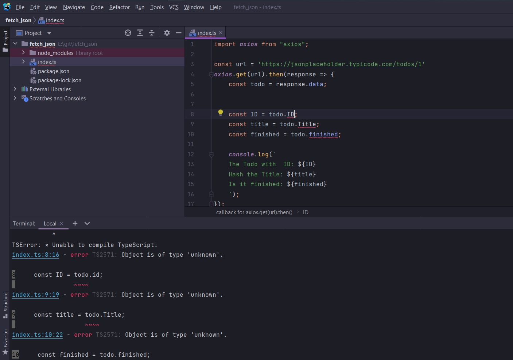

# Небольшое изменение кода


  ```ts
import axios from "axios";

const url = 'https://jsonplaceholder.typicode.com/todos/1'
axios.get(url).then(response => {
    const todo = response.data;


    const ID = todo.map();
    const title = todo.Title;
    const finished = todo.finished;

    console.log(`
    The Todo with  ID: ${ID}
    Hash the Title: ${title}
    Is it finished: ${finished}
    `);
});
```

Кароче он написал вот такой код он не привильный.



 У меня как миним IDE не пропускает. У него же в терминале данные костанты undefined. Т.е. как я правильно помню переменные определены, но в них нет значений.