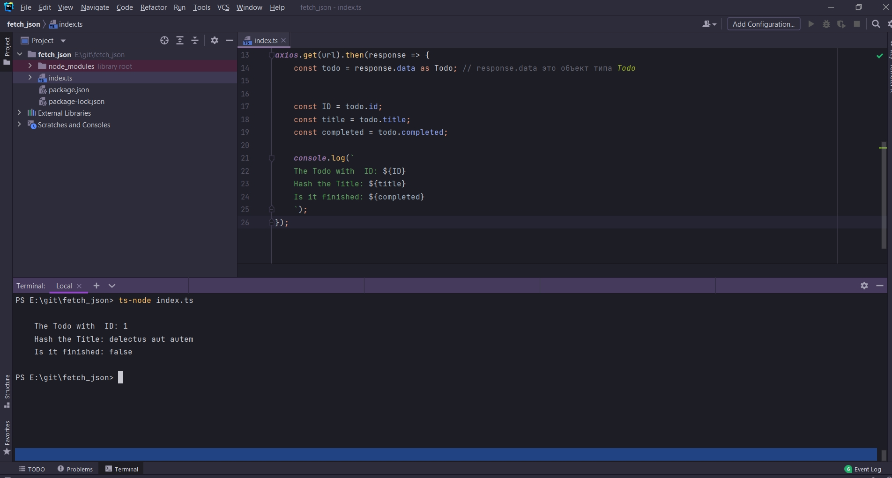

# Выявление шибок при помощи TypeScript

```ts
import axios from "axios";

const url = 'https://jsonplaceholder.typicode.com/todos/1';

//Определяю структуру объекта
interface Todo {
    id: number
    title: string
    completed: boolean
}


axios.get(url).then(response => {
    const todo = response.data as Todo; // response.data это объект типа Todo


    const ID = todo.id;
    const title = todo.title;
    const completed = todo.completed;

    console.log(`
    The Todo with  ID: ${ID}
    Hash the Title: ${title}
    Is it finished: ${completed}
    `);
});
```



