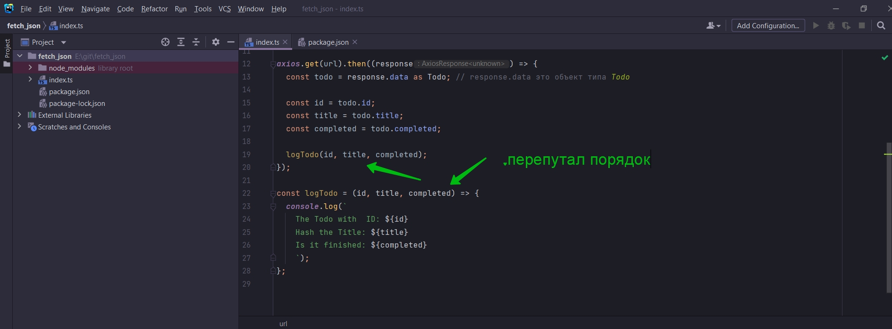
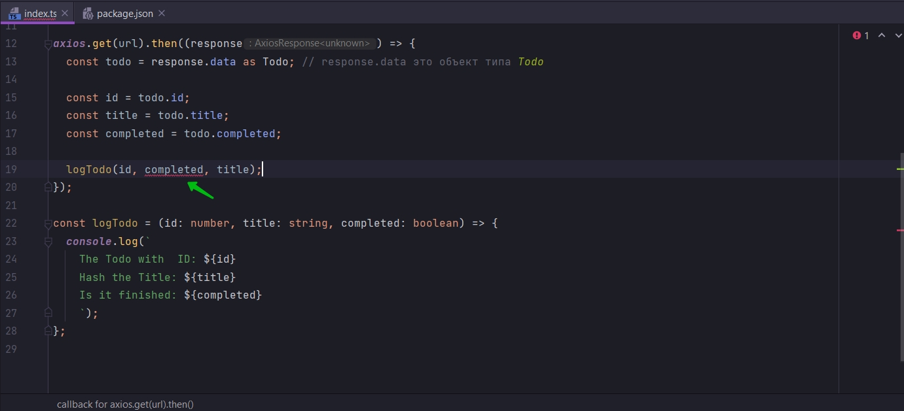
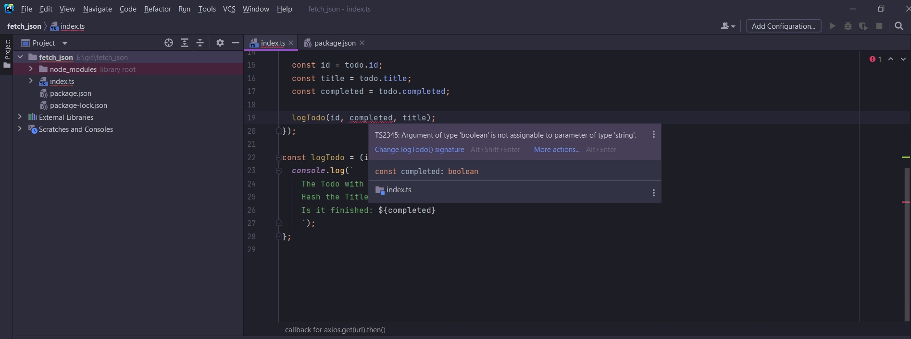
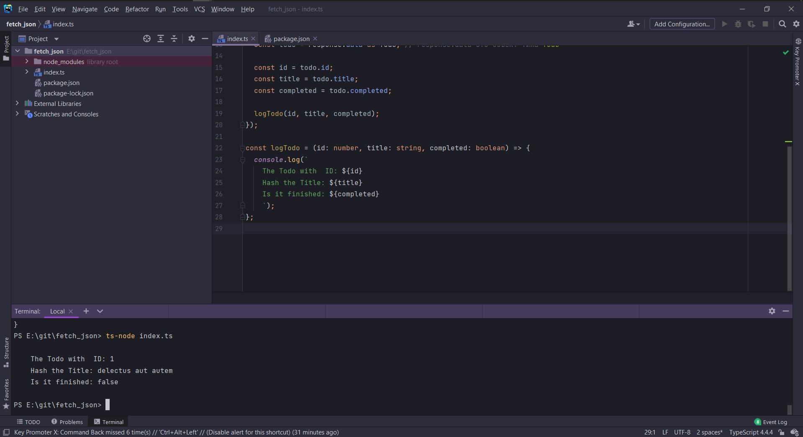

# Выявляем ещё больше ошибок

Я хочу поместить console.log в отдельную функцию. Это позволит сделать тело промиса немного более компактным.



Если typescript написан не корректно он не позволяет отлавливать все ошибки.

В парамтры функции мы можем еще передать и типы параметров





Нас предупреждает что boolean тип не может быть присвоен туда где должен быть тип string.

```ts

import axios from "axios";

const url = "https://jsonplaceholder.typicode.com/todos/1";

//Определяю структуру объекта
interface Todo {
    id: number;
    title: string;
    completed: boolean;
}

axios.get(url).then((response) => {
    const todo = response.data as Todo; // response.data это объект типа Todo

    const id = todo.id;
    const title = todo.title;
    const completed = todo.completed;

    logTodo(id, title, completed);
});

const logTodo = (id: number, title: string, completed: boolean) => {
    console.log(`
    The Todo with  ID: ${id}
    Hash the Title: ${title}
    Is it finished: ${completed}
    `);
};

```



Это очень распостраненная ошибка указания не правильных свойств в объекте.

Так же мы просмотрели вызов функции с неправильным указанием аргументов.