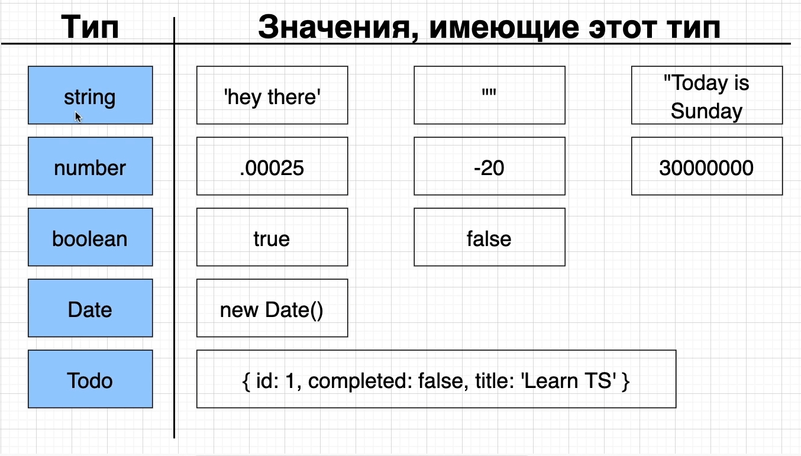
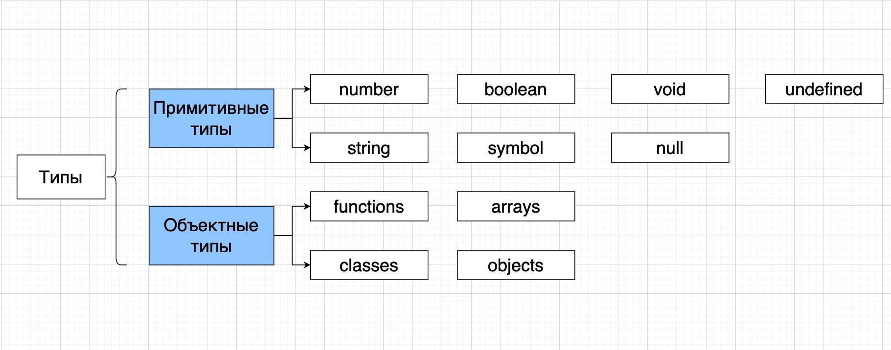
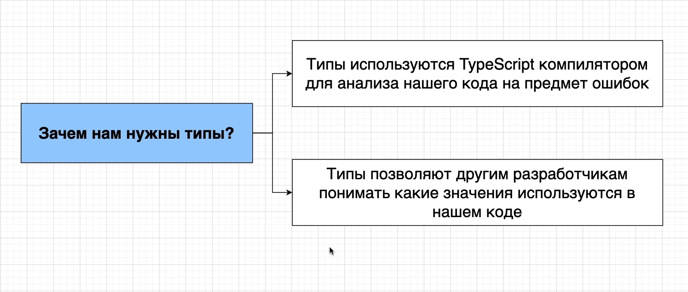
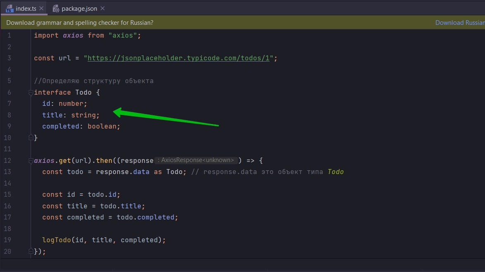
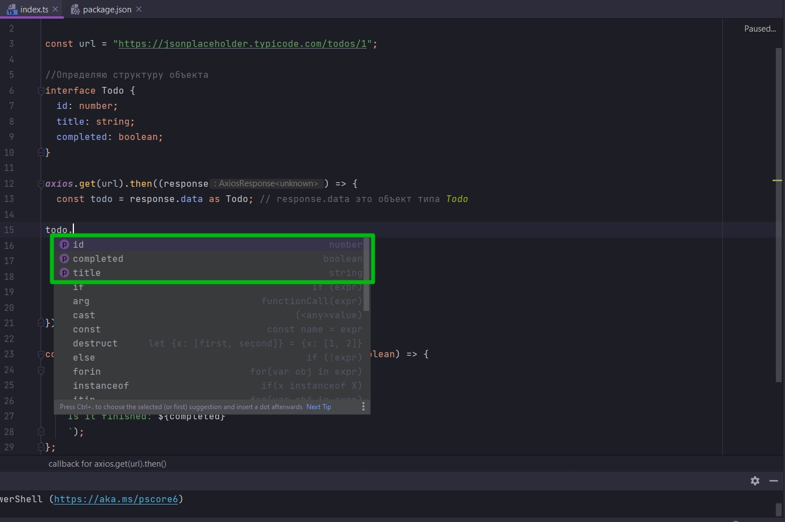
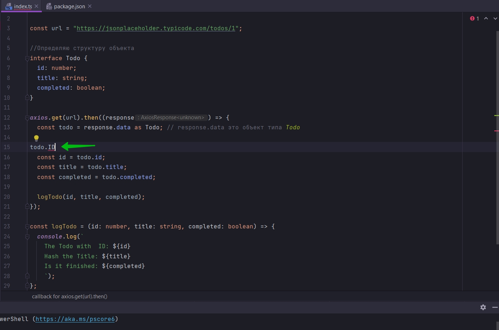

# Больше о типах

Самые простые примеры типов.



Не только примитивные типы являются типами. Любое значение в JS имеет тип. Нарпимер если у нас есть объект new Data.
Этот объект будет иметь тип Date.

И если у нас есть объект который имеет свойства id, completed, title. То мы можем сказать что у нас есть объект типа
Todo.

И мы сможем говорить об этом только в том случае когда мы работаем с кодом в котором мы уже определили такой тип.
Например Todo.

```ts

import axios from "axios";

const url = "https://jsonplaceholder.typicode.com/todos/1";

//Определяю структуру объекта
interface Todo {
    id: number;
    title: string;
    completed: boolean;
}

axios.get(url).then((response) => {
    const todo = response.data as Todo; // response.data это объект типа Todo

    const id = todo.id;
    const title = todo.title;
    const completed = todo.completed;

    logTodo(id, title, completed);
});

const logTodo = (id: number, title: string, completed: boolean) => {
    console.log(`
    The Todo with  ID: ${id}
    Hash the Title: ${title}
    Is it finished: ${completed}
    `);
};

```

Теперь рассмотрим на какие ва вида мы можем разделить типы.

- Приметивные типы
- Объектные типы



C примитивными в се понятно.

Объектные типы. К ним относятся те типы которые встроены в язык JS. и так же к ним относятся те типы которые мы с вами
создаем.

Например все функции которые мы с вами создадим, например функции, будут так же иметь свой тип.

Зачем же мы разделили на такие две категоии?

При помощи категории объектых типов мы можем с вами написать какой-то код который заставляет TS поверить что значение
какого-то другого типа. Мы можем это делать только при помощи объектных типов.



Если взглянуть на код

```ts

import axios from "axios";

const url = "https://jsonplaceholder.typicode.com/todos/1";

//Определяю структуру объекта
//Определяю новый тип
interface Todo {
    id: number;
    title: string;
    completed: boolean;
}

axios.get(url).then((response) => {
    const todo = response.data as Todo; // response.data это объект типа Todo

    const id = todo.id;
    const title = todo.title;
    const completed = todo.completed;

    logTodo(id, title, completed);
});

const logTodo = (id: number, title: string, completed: boolean) => {
    console.log(`
    The Todo with  ID: ${id}
    Hash the Title: ${title}
    Is it finished: ${completed}
    `);
};

```

С помощью interface Todo определяю новый тип. После чего в сонтстанту todo помещаю объект типа Todo. Т.е. const todo =
response.data as Todo;

Любой объект который будет хрантится в переменной будет иметь свойства id, title, completed.



И TS может использовать эту информацию. После того как я пропишу название объекта todo и попытаюсь обратиться к какому
нибудь из его свойств, то TS мне их подскажет. А если я введу не правильное свойство он уведомит меня о том что такого
свойства у объекта нет.





TS знает что переменная todo соотносится с объектом который имеет свойства id, title, completed. Т.е. у этого объекта
больше нет других свойств. И если мы будем ображаться к какому-нибудь другому свойству. Это основная причина почему нам
нужны типы.

Вторая причина почему нам нужны типы. Типы позволяют другим разработчикам понимать какие значения используются в нашем
коде.

Я думаю у каждого была ситуация когда вы открываете какую-то функцию и становится не понятно для чего она используется.
Не понятны ее параметры, какие аргументы туда передают. Например они могут обозначаться просто какими-то буквами. В
больших проектах это может быть очень сложным для понимания что же все таки эта функция делает.

Когда мы указываем типы для параметров функции, это говорит другим разработчикам какого типа объект тут используется.

