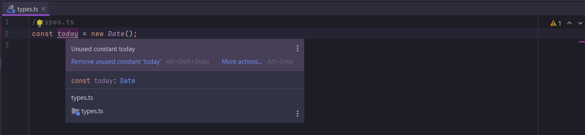

# Примеры типов

Напишем не большой код для того что бы понять для чего нужны типы.

Создам проект features в котором буду изучать фишки TS.

```shell
npm init -y

```

```json

{
  "name": "features",
  "version": "1.0.0",
  "description": "",
  "main": "index.js",
  "scripts": {
    "test": "echo \"Error: no test specified\" && exit 1"
  },
  "keywords": [],
  "author": "",
  "license": "ISC",
  "dependencies": {
    "axios": "^0.23.0",
    "prettier": "^2.4.1",
    "ts-node": "^10.3.0",
    "typescript": "^4.4.4"
  },
  "devDependencies": {
    "@types/node": "^16.10.9"
  }
}

```

```ts
//types.ts
const today = new Date();

```

Если я наведу на переменную today курсор, то я увижу тип данной переменной.



TS теперь может использовать эту информацию что бы решить что мы можем делать с этой переменной. Если я сейчас наберу
имя переменной и нажму точку то я увижу список различных свойств и методов которые есть у объекта Date.


TS может это показать потому что у него есть внутренне определение того что какие свойства и методы имеет объекты типа
Date.

```ts
//types.ts
const today = new Date();
today.getMonth();

const person = {
    age: 21,
};

```

Если наведу курсор на person то я не увижу его типа, а увижу свойства объекта.


Мы явно не указали TS какого типа является объект person.

Теперь создам класс.

```ts
//types.ts
const today = new Date();
today.getMonth();

const person = {
    age: 21,
};

class Color {
}

```

Теперь после того как я создал class Color я могу создать объект этого класса

```ts
//types.ts
const today = new Date();
today.getMonth();

const person = {
    age: 21,
};

class Color {
}

const red = new Color();

```


Теперь переменная red имеет доступ ко всем свойсвам и методам которые имеют объекты класса Color.