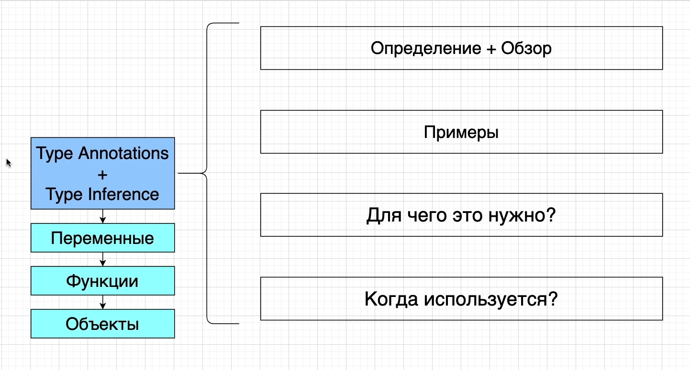
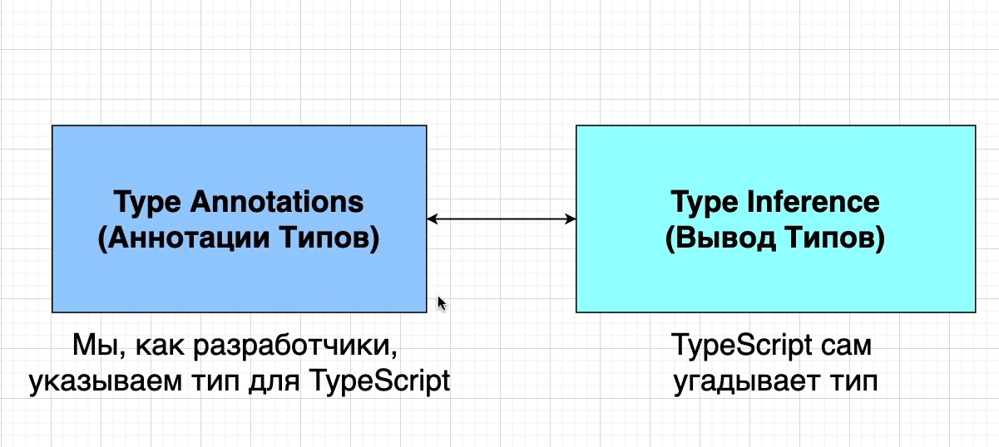

# Аннотации Типов и Вывод Типов

В TS Существует две разных системы.

- Type Annotations
- Type Inference

Применяются они немного по разному. При декларации переменных функций и объектов.

Прежде всего мы поговорим об Аннотации типов(Type Annotations) и выводе типов(Type Inference) для переменных.

Потом поговорим о применении их для функций.

И так же об их применении для объектов.

Аннотация типов(Type Annotations) - Код, который мы добавляем для Typescript, что бы он понял, значения какого типа
будут содержаться в переменной.

Вывод типов(Type Inference)- Typescript пытается сам определить, значения какого типа будут содержаться в переменной.

Эти две фитчи дополняют друг друга.

