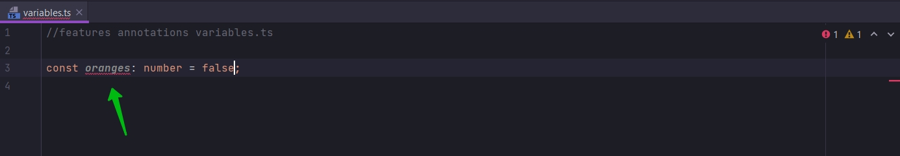
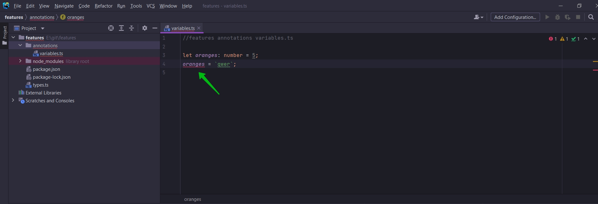
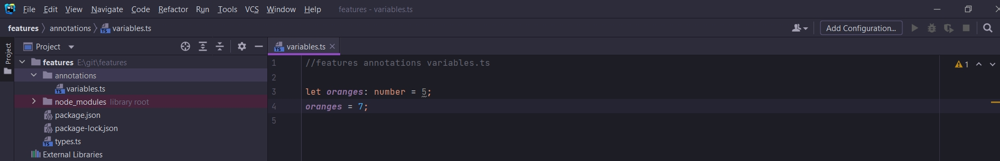

# Аннотации для переменных

В проекте создам новую папку annotations и в ней variables.ts.

И здесь мы впервые напишем декларацию переменной т.е. объявим переменную с анотацией типов.

```ts
//features annotations variables.ts

const oranges: number = 5;

```

- :number это и есть аннотация типов. Т.е. в данном случае аннотация типа number. Эта аннотация говорит что мы будем
  присваивать переменной oranges только значения типа number.

Если я захочу присвоить значение какого-нибудь другого типа этой переменной, то я сразу же получу ошибку.



И тоже самое если я const мменяю на let. В данном случае я могу менять данную переменную. Но присваивать ей я могу
значение только числового типа.

```ts
//features annotations variables.ts

let oranges: number = 5;

```





<br/>
<br/>
<br/>

Посмотрим на другие аннотации.

```ts
//features annotations variables.ts

// Примитивные типы
let oranges: number = 5;
let speed: string = "fast";
let hasDog: boolean = false;

let nothing: null = null;
let nothing1: undefined = undefined;

// build-in object встроенные типы
let now: Date = new Date();

```