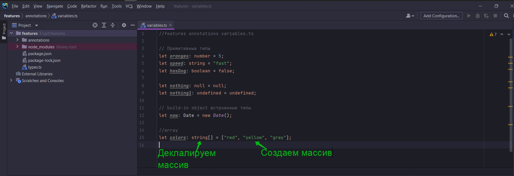
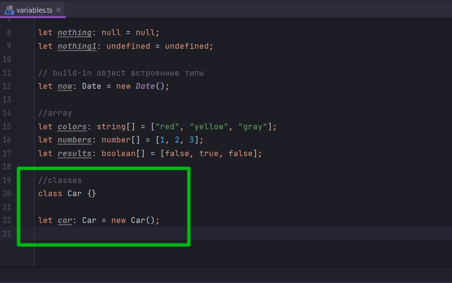

# Аннотации для объектных литералов

Запишем примеры с более сложным синтаксисом.

Давайте попробуем добавить type annotation для массива.

```ts
//features annotations variables.ts

// Примитивные типы
let oranges: number = 5;
let speed: string = "fast";
let hasDog: boolean = false;

let nothing: null = null;
let nothing1: undefined = undefined;

// build-in object встроенные типы
let now: Date = new Date();

//array
let colors: string[] = ["red", "yellow", "gray"];

```

Аннотация типа string[] не создает массива. Она просто говорит что мы будем присваивать переменной colors что-то, что
является массивом из строк.

Это одна из самых сложных вещей в Typescript различать когда мы собственно говоря создаем
массив ["red", "yellow", "gray"], и когда мы декларируем массив string[].



На данный момент нам нужно уяснить что такой синтаксис. Для обозначения аннотаций типа переменной в которой будет
содержаться массв.

Ну и конечно же мы можем создавать массивы разных типов.

```ts
//features annotations variables.ts

// Примитивные типы
let oranges: number = 5;
let speed: string = "fast";
let hasDog: boolean = false;

let nothing: null = null;
let nothing1: undefined = undefined;

// build-in object встроенные типы
let now: Date = new Date();

//array
let colors: string[] = ["red", "yellow", "gray"];
let numbers: number[] = [1, 2, 3];
let results: boolean[] = [false, true, false];

```

<br/>
<br/>
<br/>

Аннотации типов для классов.



```ts
//features annotations variables.ts

// Примитивные типы
let oranges: number = 5;
let speed: string = "fast";
let hasDog: boolean = false;

let nothing: null = null;
let nothing1: undefined = undefined;

// build-in object встроенные типы
let now: Date = new Date();

//array
let colors: string[] = ["red", "yellow", "gray"];
let numbers: number[] = [1, 2, 3];
let results: boolean[] = [false, true, false];

//classes
class Car {
}

let car: Car = new Car();

```

Тут конечно есть небольшое отличие. В Аннотации Car с большой буквы т.к. это класс. Когда вы в аннотации типов видите
запись с большой буквы - это значит что это тим класса.

Т.е. в данной переменной car содержаться объекты класса Car.

И далее мы создаем объект этого класса new Car.

<br/>
<br/>
<br/>

Рассмотрим доавление аннотации типов к объектным литералам.

В первую очередь я создаю объектный литерал.

```ts

//object literal
let point = {
    x: 10,
    y: 20,
};
```

И так как же я могу добавить типовую аннотацию? Опять же мы должны поместить двоеточие после названия переменной. И
далее мы хотим указать какой тимп мы хотим присваивать этой переменной. И это немного сложнее так как нам нужно
перечислить свойства этого объектного литерала и его типы. Т.е. после двоеточия мы должны открыть фигурные скобки в
которых мы будем указывать свойства объекта и их типы.

```ts
//object literal
let point: { x: number; y: number } = {
    x: 10,
    y: 20,
};

```

Мы должны разделять аннотацию типов свойств объектного литерала ;