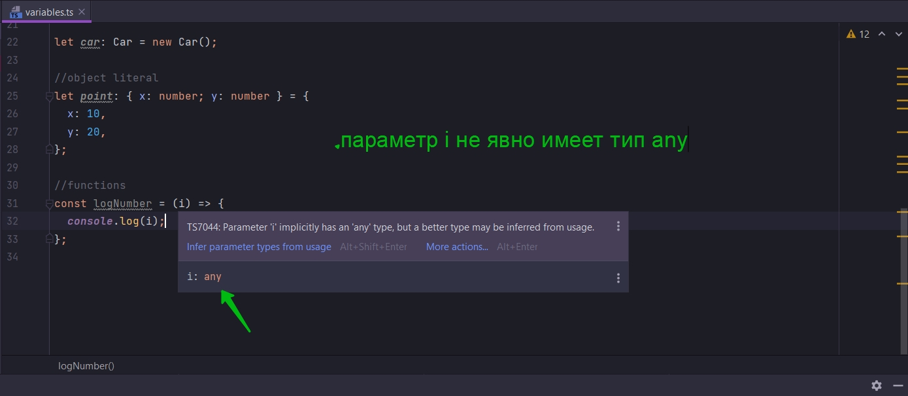
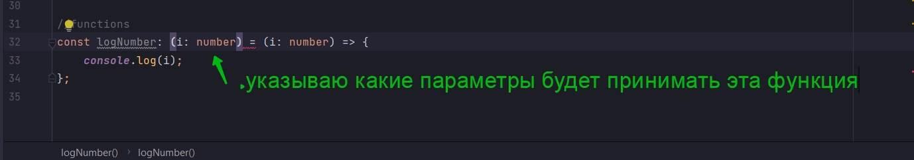
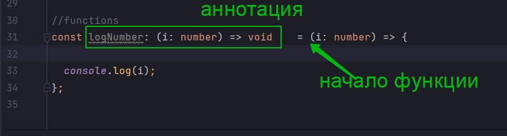

# Аннотации для функций

К сожалению для functions анотация типов немного сложновата.



```ts
//features annotations variables.ts

// Примитивные типы
let oranges: number = 5;
let speed: string = "fast";
let hasDog: boolean = false;

let nothing: null = null;
let nothing1: undefined = undefined;

// build-in object встроенные типы
let now: Date = new Date();

//array
let colors: string[] = ["red", "yellow", "gray"];
let numbers: number[] = [1, 2, 3];
let results: boolean[] = [false, true, false];

//classes
class Car {
}

let car: Car = new Car();

//object literal
let point: { x: number; y: number } = {
    x: 10,
    y: 20,
};

//functions
const logNumber = (i) => {
    console.log(i);
};

```

Для того что бы избавиться от any в параметрах явно задам тип.

```ts
//functions
const logNumber = (i: number) => {
    console.log(i);
};
```

Сейчасмы просто рассматриваем не большие примеры. Более глубоко функции будут изучаться в отдельном разделе.

Рассмотрим как добавить пнотацию типов к названию функции.

Напоминаю что анотацию типов мы используем для того что бы понимать какие значения, каких типов мы можем присваивать
переменным. В данном случае переменной logNumber.

По-этому мне надо добавить какой-то код который будет объяснять Typescript ту какую-то информацию о коде.

Для функции, для нас как для разработчиков важны две вещи.

- Параметры которые принимает функция
- Возвращаемое значение из этой функции

Именно эту информацию мы должны записать в этой аннотации типа.

И так мы должны указать какие различные параметры будет принимать функция.И какие различные значения она будет
возвращать.

В круглых скобках указываю какие параметры будет принимать эта функция.



После параметров мне нужно указать какие значения будет возвращать эта функция. И это мы должны указать после стрелки.
Эта стрелка похожа ну стрелку которую мы используем в Arrow function.

И так как наша функция ничего не возвращает я укажу специальный тип void т.е. пустой.

```ts
//functions
const logNumber: (i: number) => void = (i: number) => {
    console.log(i);
};
```

Это довольно сложный синтаксис. Тут очень сложно понять где начинается аннотация, где она заканчивается. Гда начинается
функция



И эта анотация говорит какой тип в значении мы будем присваивать переменной logNumber.

После знака равно идет имплементация функции т.е. та честь кода которая будет запускаться.