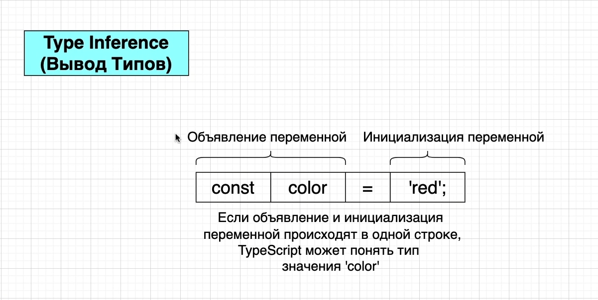
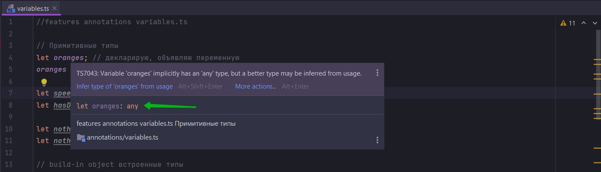
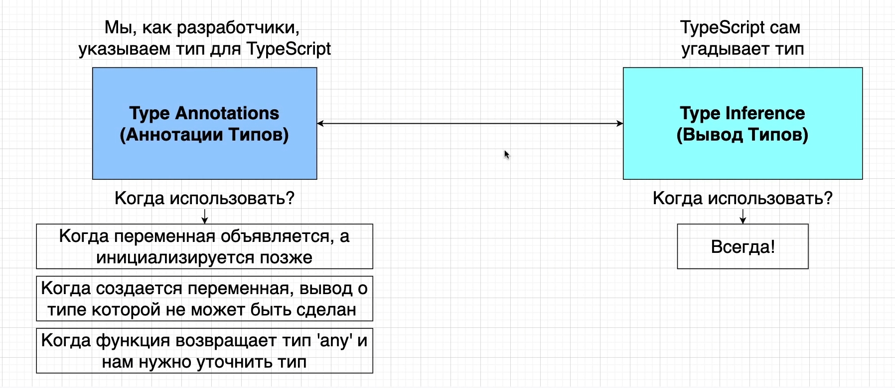

# Что такое вывод типов

Если я возьму предыдущий пример

```ts
//features annotations variables.ts

// Примитивные типы
let oranges: number = 5;
let speed: string = "fast";
let hasDog: boolean = false;

let nothing: null = null;
let nothing1: undefined = undefined;

// build-in object встроенные типы
let now: Date = new Date();

//array
let colors: string[] = ["red", "yellow", "gray"];
let numbers: number[] = [1, 2, 3];
let results: boolean[] = [false, true, false];

//classes
class Car {
}

let car: Car = new Car();

//object literal
let point: { x: number; y: number } = {
    x: 10,
    y: 20,
};

//functions
const logNumber: (i: number) => void = (i: number) => {
    console.log(i);
};

```

И удалю все анотации типов, то все будет работать точно так же. Когда я навожу курсор на переменную TS понимает к какому
типу принадлежит переменная. Т.е. какой тип мы будем присваивать переменной.

И то что мы здесь видим это система вывода в действии.

Начнем с основ вывода типов.



Каждый раз когда когда мы объявляем переменную в нашем приложении. Это разбивается на два шага.

То что находится слевой стороны от знака равно

- const
- color

const и color называется объявлением переменных. Здесь мы говорим нашей программе что мы создаем новую переменную внутри
нашего приложения и даем ей какое-то имя.

Справа от знака равно мы инициализируем переменную т.е. присваиваем ей какое-то значение.

Т.е. у нас есть два шага.

1. Объвление переменной
2. Инициализация переменной

Если мы делаем объявление переменной и инициализацию переменной в одной строке, то TS догадывается какой тип значений
будет храниться в этой переменной.

Но если я сначало задекларирую переменную т.е. ее сначало объявлю. А потом присвою ей какое-то значение, то это больше
не работает.

```ts
// Примитивные типы
let oranges; // декларирую, объявляю переменную
oranges = 5; // Инициализирую, присваиваю значение переменной
```



Как видим это больше не работает. TS больше не знает ничего о типе данной переменной.

Вместо number появляется другой тип аннотации, тип any.

Тип any означает любой т.е. любой тип аннотации.

Когда следует использовать аннотации?



Каждый раз когда мы делаем декларацию и инициализацию в одной строке, нам не нужно добавлять анотацию типов.

Но есть три случая когда нам нужно использовать аннотацию типов.

- Когда переменная декларируется, объявляется, а инициализируется позже.
- Когда создается переменная, вывод о типе которой не может быть сделан.
- Когда функция возвращает тип any и нам нужно уточнить тип.
