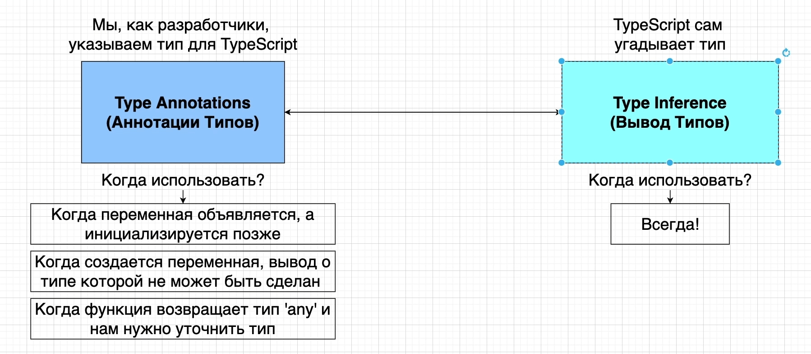
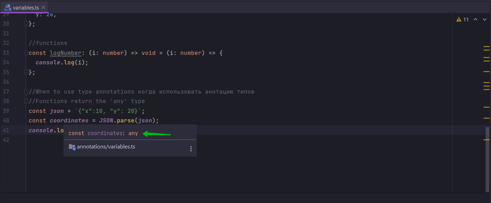
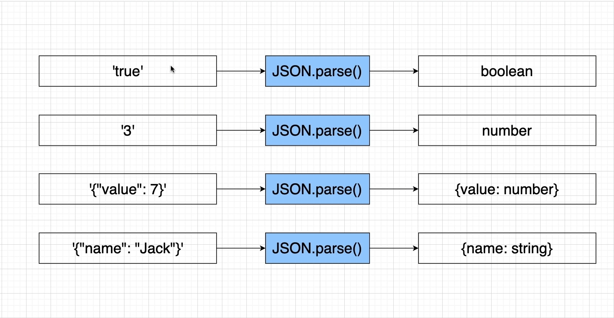
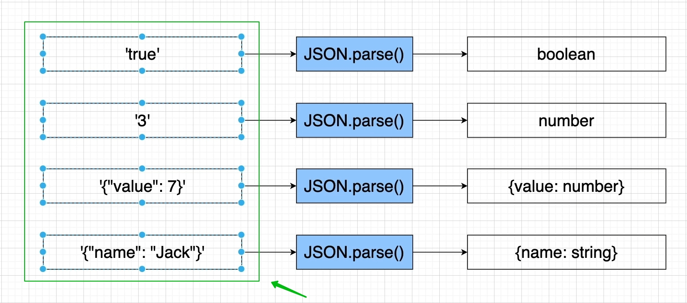
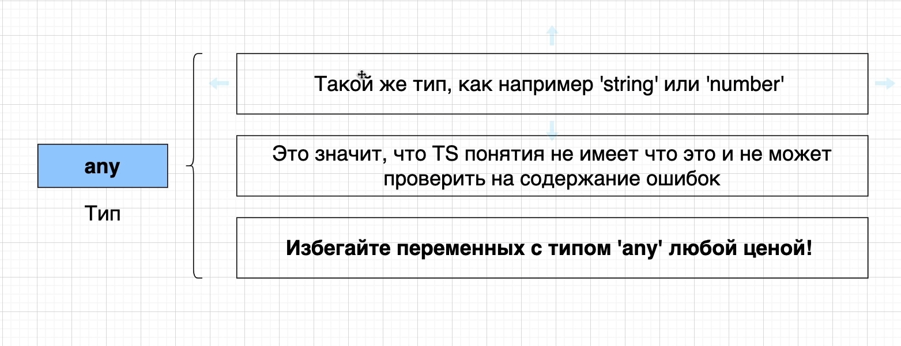

# Тип any



Рассмотрим когда функция возвращает тип any и нам нужно уточнить тип.

```ts
//When to use type annotations когда использовать анотацию типов
//Functions return the 'any' type
const json = `{"x":10, "y": 20}`;
const coordinates = JSON.parse(json);
console.log(coordinates);
```



Это означает что JSON.parse возвращает тип any.

Давайте разберемсячто такое any и почему в данном случае мы обязаны добавлять анотацию типов.



На самом деле в реальности когда мы передаем какие-то значения в JSON.parse, на выходе мы получаем тип any. В любом
случае представленном на скриншоте мы будем получать тип any.

На самом деле если внимательнее посмотреть на диаграмму, то мы увидим что в JSON.parse мы передаем строки. И мы получаем
типы этих значений.

Цель данной диаграммы заключается в том что мы должны понять что каждый раз когда мы передаем строку в JSON.parse(), то
мы получаем разные значения типов. И проблема в том что TS не может предсказать эти разные значения. Он не может
предсказать что мы получим из этого метода. Это полностью зависит какую строку мы передаем в этот метод.





Основная идея TS все эти аннотации, весь этот код который мы пишем. Это пишется для того что бы отлавливать ошибки в
нашем коде на этапе разработки.