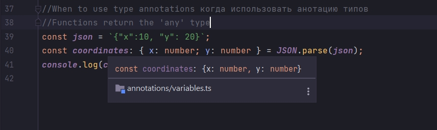

# Исправление типа any

```ts
//features annotations variables.ts

// Примитивные типы
let oranges; // декларирую, объявляю переменную
oranges = 5; // Инициализирую, присваиваю значение переменной

let speed: string = "fast";
let hasDog: boolean = false;

let nothing: null = null;
let nothing1: undefined = undefined;

// build-in object встроенные типы
let now: Date = new Date();

//array
let colors: string[] = ["red", "yellow", "gray"];
let numbers: number[] = [1, 2, 3];
let results: boolean[] = [false, true, false];

//classes
class Car {
}

let car: Car = new Car();

//object literal
let point: { x: number; y: number } = {
    x: 10,
    y: 20,
};

//functions
const logNumber: (i: number) => void = (i: number) => {
    console.log(i);
};

//When to use type annotations когда использовать анотацию типов
//Functions return the 'any' type
const json = `{"x":10, "y": 20}`;
const coordinates = JSON.parse(json);
console.log(coordinates);

```

coordinates имеет тип any. Он имеет его потому что JSON.parse возвращает тип any. TS не может предсказать что вернет
этот метод.

Для того что бы это исправить добавим аннотацию типов к переменной coordinates.

Мы это уже делали когда рассматривали объектный литерал.

```js
//When to use type annotations когда использовать анотацию типов
//Functions return the 'any' type
const json = `{"x":10, "y": 20}`;
const coordinates: { x: number; y: number } = JSON.parse(json);
console.log(coordinates);
```

И теперь мы дали достатчно информации TS чтобы понять какие значения значения будет содержать переменная coordinates.



Все что мы должны сделать это добавить анотацию типа каждый раз когда мы вызываем функцию или метод которая возвращает
тип any.

