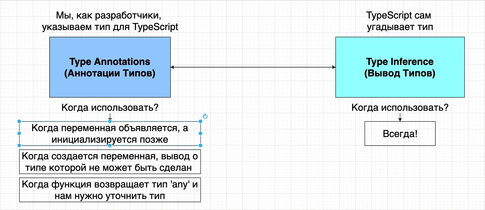
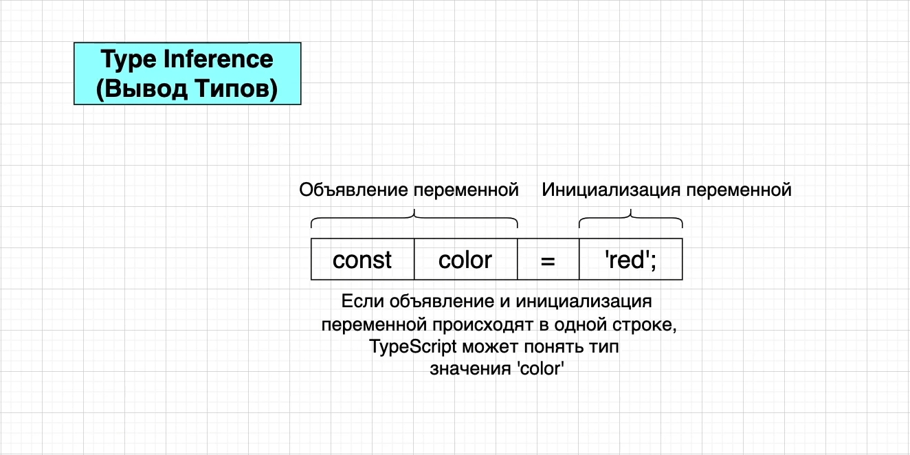
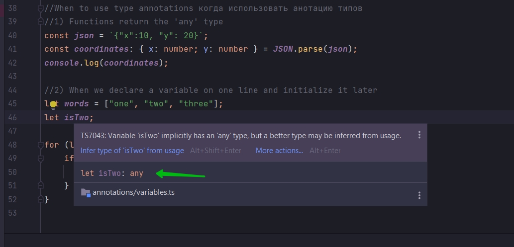
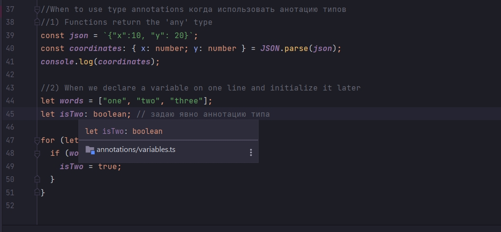

# Отложенная инициализация





Если декларирование, объявление переменной и инициализацию переменной мы разбиваем на два разных шага, то вывод типов не
работает.

```js
//When to use type annotations когда использовать анотацию типов
//1) Functions return the 'any' type
const json = `{"x":10, "y": 20}`;
const coordinates: { x: number; y: number } = JSON.parse(json);
console.log(coordinates);

//2) When we declare a variable on one line and initialize it later
let words = ["one", "two", "three"];
let isTwo;

for (let i = 0; i < words.length; i++) {
    if (words[i] === 'two') {
        isTwo = true
    }
}
```

В данном случае мы декларируем переменную isTwo в одной строке. И присваиваю ей значение внутри цикла.



Задаю явную анотацию типа.

```js
//When to use type annotations когда использовать анотацию типов
//1) Functions return the 'any' type
const json = `{"x":10, "y": 20}`;
const coordinates: { x: number; y: number } = JSON.parse(json);
console.log(coordinates);

//2) When we declare a variable on one line and initialize it later
let words = ["one", "two", "three"];
let isTwo: boolean; // задаю явно аннотацию типа

for (let i = 0; i < words.length; i++) {
    if (words[i] === "two") {
        isTwo = true;
    }
}
```



Т.е. каждый раз когда я декларирую, объявляю переменную и инициализирую т.е. присваиваю значение переменой в назных
строках. При декларировании переменной мне нужно вручную добавлять аннотацию типа.