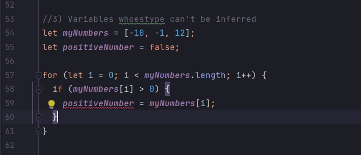
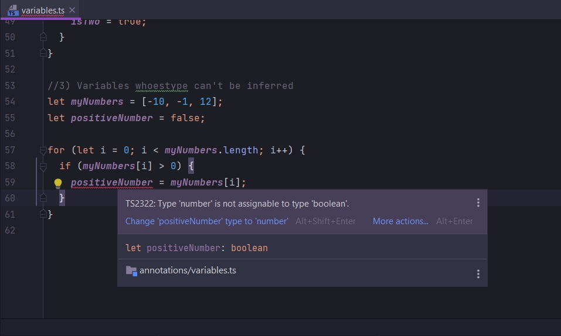

# Когда вывод типов не работает

Разберем пример когда создается переменная, вывод о типе которой не может быть сделан. Даже когда и декларирование и
инициализация переменной происходит в одной строке.

```ts
//3) Variables whoestype can't be inferred
let myNumbers = [-10, -1, 12];
let positiveNumber;
```

И так мы будем производить итерацию, перебирать массив. И если мы находим польжительное число, то мы присваиваем это
число в positiveNumber.

Но если мы не находим это число мы присваеваем переменной false т.е. boolean значение.

И как вы понимаете переменная positiveNumber должна содержать значение двух типов boolean и number.

По умолчанию positiveNumber присваиваю false.

Далее делаю перебор массива.

```ts
//features annotations variables.ts

// Примитивные типы
let oranges; // декларирую, объявляю переменную
oranges = 5; // Инициализирую, присваиваю значение переменной

let speed: string = "fast";
let hasDog: boolean = false;

let nothing: null = null;
let nothing1: undefined = undefined;

// build-in object встроенные типы
let now: Date = new Date();

//array
let colors: string[] = ["red", "yellow", "gray"];
let numbers: number[] = [1, 2, 3];
let results: boolean[] = [false, true, false];

//classes
class Car {
}

let car: Car = new Car();

//object literal
let point: { x: number; y: number } = {
    x: 10,
    y: 20,
};

//functions
const logNumber: (i: number) => void = (i: number) => {
    console.log(i);
};

//When to use type annotations когда использовать анотацию типов
//1) Functions return the 'any' type
const json = `{"x":10, "y": 20}`;
const coordinates: { x: number; y: number } = JSON.parse(json);
console.log(coordinates);

//2) When we declare a variable on one line and initialize it later
let words = ["one", "two", "three"];
let isTwo: boolean; // задаю явно аннотацию типа

for (let i = 0; i < words.length; i++) {
    if (words[i] === "two") {
        isTwo = true;
    }
}

//3) Variables whoestype can't be inferred
let myNumbers = [-10, -1, 12];
let positiveNumber = false;

for (let i = 0; i < myNumbers.length; i++) {
    if (myNumbers[i] > 0) {
        positiveNumber = myNumbers[i];
    }
}

```

Как видите мы сразу же получаем сообщение об ошибке.





и как же мы тут можем использовать анотацию типов?

Для этого при написании аннотации использую логическое или or ||. Но пишу не как обычно две черты а одну.

```ts
//3) Variables whoestype can't be inferred
let myNumbers = [-10, -1, 12];
let positiveNumber: boolean | number = false;

for (let i = 0; i < myNumbers.length; i++) {
    if (myNumbers[i] > 0) {
        positiveNumber = myNumbers[i];
    }
}
```

