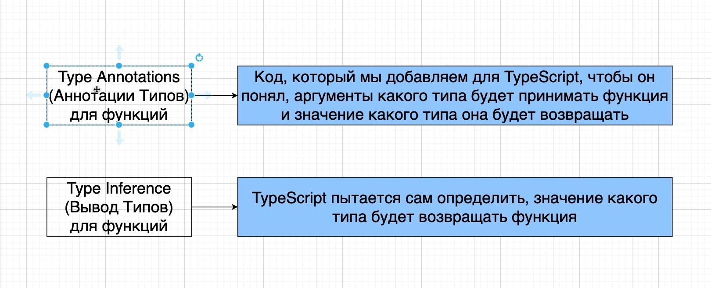
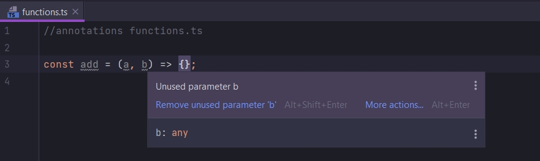
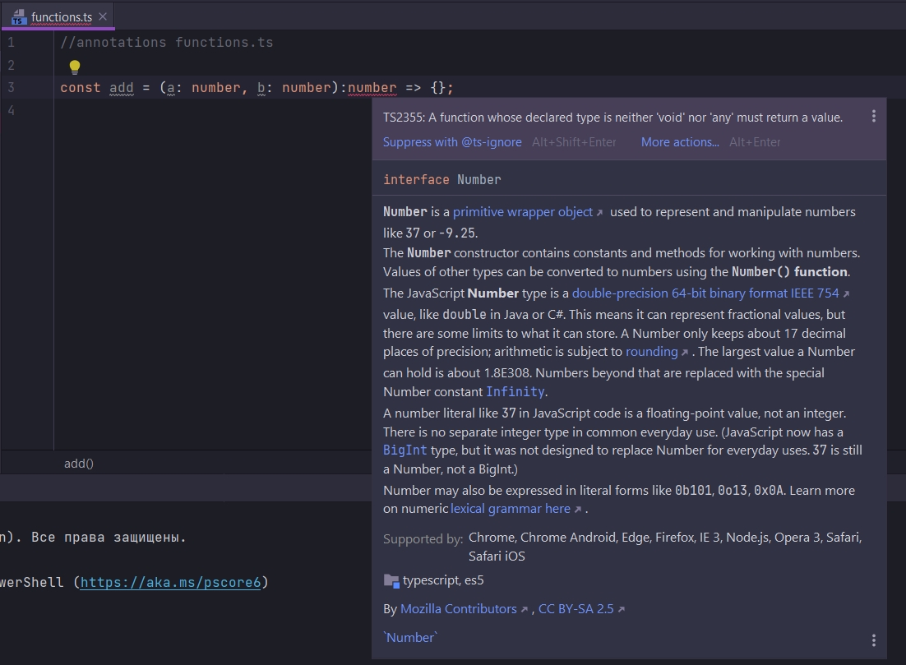
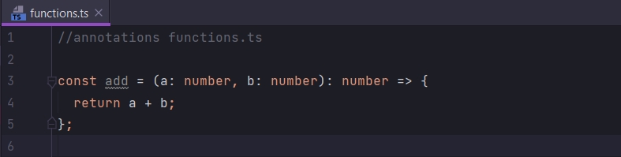

# Больше об аннотациях для функций

В прошлом блоке мы уже писали аннотацию для функции.

```ts
//functions
const logNumber: (i: number) => void = (i: number) => {
    console.log(i);
};
```

Полный файл

```ts
//features annotations variables.ts

// Примитивные типы
let oranges; // декларирую, объявляю переменную
oranges = 5; // Инициализирую, присваиваю значение переменной

let speed: string = "fast";
let hasDog: boolean = false;

let nothing: null = null;
let nothing1: undefined = undefined;

// build-in object встроенные типы
let now: Date = new Date();

//array
let colors: string[] = ["red", "yellow", "gray"];
let numbers: number[] = [1, 2, 3];
let results: boolean[] = [false, true, false];

//classes
class Car {
}

let car: Car = new Car();

//object literal
let point: { x: number; y: number } = {
    x: 10,
    y: 20,
};

//functions
const logNumber: (i: number) => void = (i: number) => {
    console.log(i);
};

//When to use type annotations когда использовать анотацию типов
//1) Functions return the 'any' type
const json = `{"x":10, "y": 20}`;
const coordinates: { x: number; y: number } = JSON.parse(json);
console.log(coordinates);

//2) When we declare a variable on one line and initialize it later
let words = ["one", "two", "three"];
let isTwo: boolean; // задаю явно аннотацию типа

for (let i = 0; i < words.length; i++) {
    if (words[i] === "two") {
        isTwo = true;
    }
}

//3) Variables whoestype can't be inferred
let myNumbers = [-10, -1, 12];
let positiveNumber: boolean | number = false;

for (let i = 0; i < myNumbers.length; i++) {
    if (myNumbers[i] > 0) {
        positiveNumber = myNumbers[i];
    }
}

```

Но это по сути аннотация для переменной logNumber.

Сейчас рассмотрим как же мы можем добавить аннотации в саму функцию. Т.е. как добавить анотации к параметрам функции. И
так же как добавить анотацию к возвращаемому значению.



Когда мы используем аннотацию типов для функций мы добавляем код который помогает Typescript. А точнее указываем
аргументы какого типа будет принимать функция. И значение какого типа она будет возвращать.

Опять же напомню что в этом блоке кода

```ts
//functions
const logNumber: (i: number) => void = (i: number) => {
    console.log(i);
};
```

я делал анотацию для переменной logNumber а именно анотацию (i: number) => void.

Теперь мы будем рассматривать анотацию для функции.

Так же у нас есть вывод типов и для функций.

Напомню Type inference или вывод типов - это такая автоматическая система Typescript которая определяет типы.

Такая же система вывода используется и для функций.

Но есть одна большая разница. Вывод типов для функций работает только для возвращаемого значения. Т.е. Typescript будет
пытаться определить тип возвращаемого значения. И он не будет пытаться определить тип аргументов которые принимает
функция.

В папке annotations создаю новый файл functions.ts

```ts
//annotations functions.ts

const add = (a, b) => {
};

```



Сейчас Typescript не имеет ни какого понятия какие типы у этих двух параметров.

Для того что бы объяснить это Typescript нам нужно добавить аннотации.

```ts
//annotations functions.ts

const add = (a: number, b: number) => {
};

```

Теперь нам нужно добавить анотацию для значения которая будет возвращаться из этой функции. Это сделать так же просто.
Мы ставим после скобок с параметрами : и указываю тип возвращаемого значения.



Здесь говориться что функция, тип которой задекларирован не void и не any, то в этом случае функция долна возвращать
значение. Как видите наша функция пока ничего не возвращает.

```ts
//annotations functions.ts

const add = (a: number, b: number): number => {
    return a + b;
};

```

