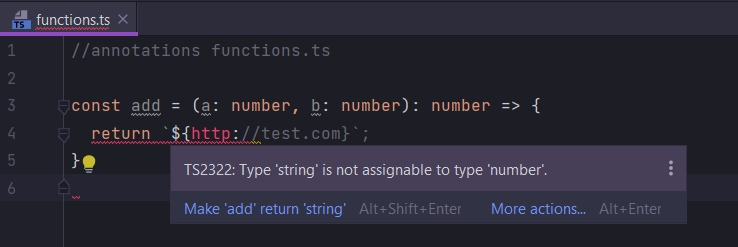
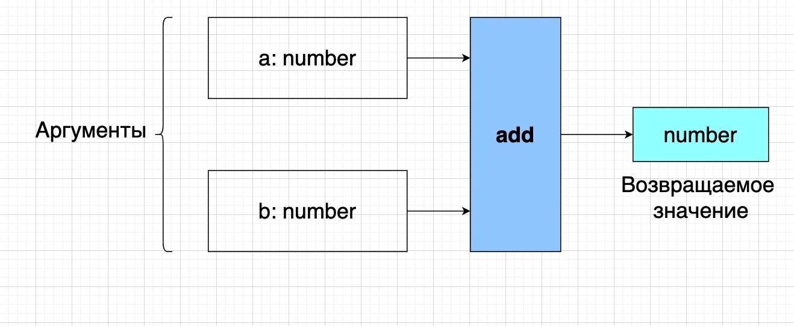
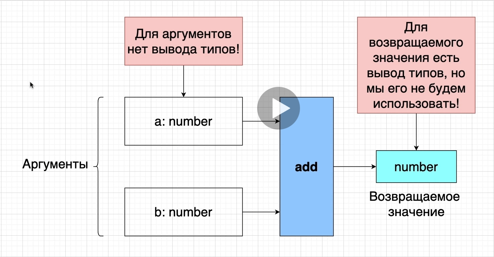
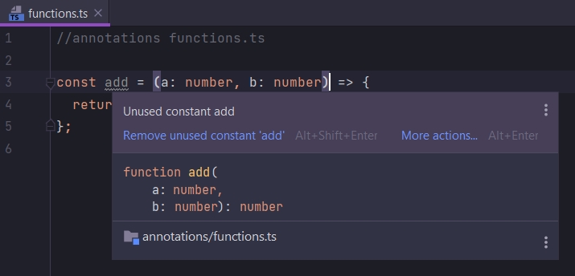
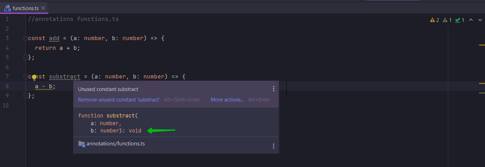
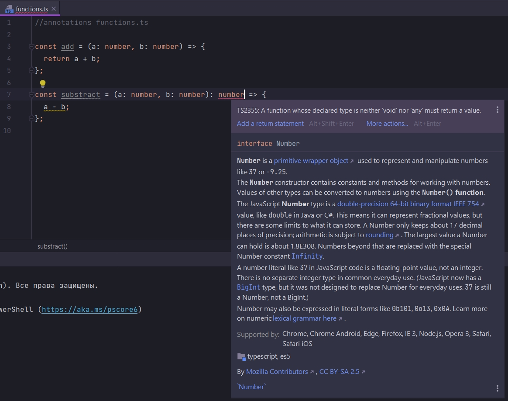

# Вывод типов для функций

И так пройдемся по основным понятиям.

```ts
//annotations functions.ts

const add = (a: number, b: number): number => {
    return a + b;
};

```

Каждый раз когда мы добавляем параметры в функцию мы должны добавлять тип к каждому параметру.

Так же после скобок с параметрами мы должны добавить анотацию для типа значения которое будет возвращать функция. И как
только мы добавляем аннотацию для возвращаемого типа, Typescript сразуже анализирует тело функции. После прочтения тела
функции Typescript выясняет возвращаете ли вы именно этот тип который вы добавили в тип возвращаемого значения.

Т.е. в данном случае Typescript видит что мы складываем два числа т.е. два числовых значения a и b. Он видит что мы
возвращаем это числовое значение из функции. И следовательно мы делаем то что задекларировали в нашей типовой аннотации.
Т.е. мы мозвращаем из функции именно числовое значение.

Если я буду возвращать не числовое значение а строку



Хоть мы и указываем тип возвращаемого значения как number. Typescript не будет полностью проверять код тела функции.
Система типов следит затем корректны ли типы, но не за логикой которую вы имплементируете.

имплементация в программировании – что это? Если говорить простыми словами, выражение технологии, алгоритма или функции
в исходном коде.

По сути, имплементировать – это реализовывать в ПО какой-либо функционал.



Рассмотрим диаграмму.

У нас есть функция add. В ней есть два аргумента или параметра a:number,b:number. И так же у нас есть возвращаемое
числовое значение number.



И когда мы говорим об аргументах или параметрах. Нам всегда нужно использовать аннотацию типов. Для аргументов нет
вывода типов.

Typescript не может угадать тип аргументов или параметров. Т.е. каждый раз когда мы определяем функцию нам обязательно в
параметрах, аргументах указывать тип при помощи аннотации типа.

Теперь переходим к возвращаемому значению.

У возвращаемого значения есть вывод типов, но мы его не будем использовать.

Удалим у функции аннотацию возвращаемого значения.

```ts
//annotations functions.ts

const add = (a: number, b: number) => {
    return a + b;
};

```



При наедении курсора на переменную Typescript говорит что она содержит функцию которая принимает два числовых параметра
и возвращает числовой параметр. Т.е. здесь действует автоматический вывод типов.

Мы можем не добавлять аннотацию возвращаемого значения.

Но лучше всегда добавлять аннотацию возвращаемого значения.

Давайте представим что у нас есть еще одна функция в которой нет аннотации возвращаемого значения.

```ts
const substract = (a: number, b: number) => {
    a - b;
};


```



И как мы видим у нашей функции возвращаемое значение void.

Typescript решил что наша функция ничего не возвращает. Т.е. т.к. нет ключевого слова return наша функция ничег не
возвращает. По-этому он возвращает тип void.

Однако мы здесь просто допустили ошибку. Не написали ключевое слово return. И Typescript не может нам об этом
подсказать. Он понятия не имеет что мы допустили ошибку.

Но если мы добавим аннотацию типов.

```js
const substract = (a: number, b: number
):
number => {
    a - b;
};

```



То мы сразу же видим сообщение об ошибке. Эта функциядолжна возвращать значение.

И мы можем исправить эту ошибку на фазе разработки.

```ts
const substract = (a: number, b: number): number => {
    return a - b;
};
```

Именно по этому всегда пишите аннотацию для возвращаемого значения функции.

Мы можем вернуть не тот тип значения. Вместо number вернем boolean. Typescript ничего не подскажет если мы не будем
использовать аннотацию возвращаемого значения функции.

По этому мы не будемиспользовать для возвращаемого значения вывод типов.

Мы его всегда будем указывать явно.
