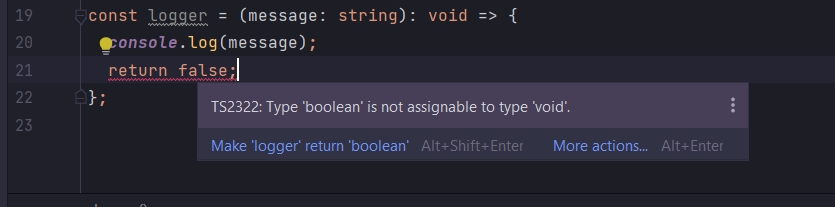
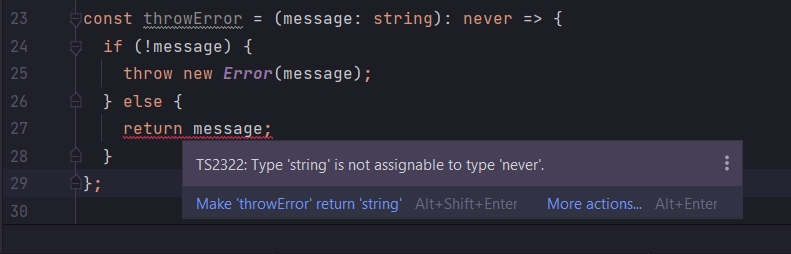

# Void & Never

```ts
const logger = (message: string) => {
    console.log(message);
};
```

Суть этой функции просто вывод в консоль. И не возвращает ни какого значения.

Для того что бы это как-то обозначить добавим анотоцию возвращаемого значения void.

```ts
const logger = (message: string): void => {
    console.log(message);
};
```

void - пустой. Эта функция ничего не возвращает.

Такие функции могут возвращать значения null и undefined.

Если же мы попытаемся что-то вернуть из функции, то мы получим ошибку.



```ts
const logger = (message: string): void => {
    console.log(message);
    return false;
};
```

Рассмотрим тип Never.

```ts
const throwError = (message: string): never => {
    throw new Error(message);
};
```

Каждый раз когда мы будем выбрасывать ошибку, функция не будет возвращать ни какого значения. Для таких функций
используется тип never что значит никогда. Это означает что мы никогда не будем достигать конца этой функции. Т.е.
каждый раз до конца функции, мы где-то будем выбрасывать ошибку.

На самом деле это редкий случай.

Этот код, с типом возвращаемого значения будет отробатывать нормально только тогда когда не будет сообщения об ошибке.

Если я напишу следующее условие.

```ts
const throwError = (message: string): never => {
    if (!message) {
        throw new Error(message);
    } else {
        return message;
    }
};
```



И теперь что бы в функции не было ошибки возвращаемого значения. Нужно корректно прописать тип возвращаемого значения.

```ts
const throwError = (message: string): string => {
    if (!message) {
        throw new Error(message);
    } else {
        return message;
    }
};
```

Тип never исмользуется только в том случае когда мы полностью уверены что в том что мы не будем достигать конца функции
и не будем возвращать ни какого значения.