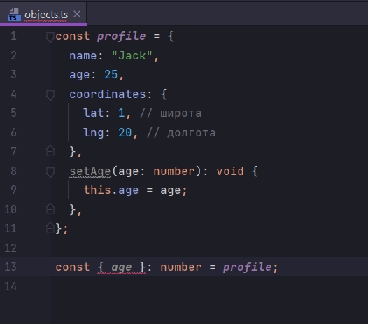
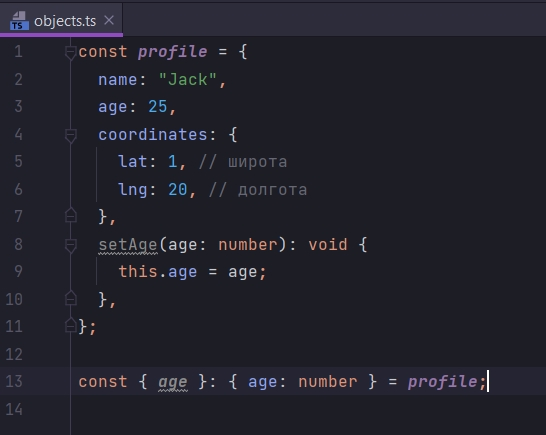
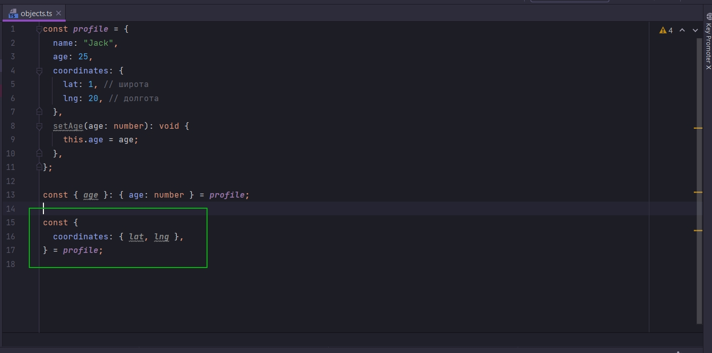
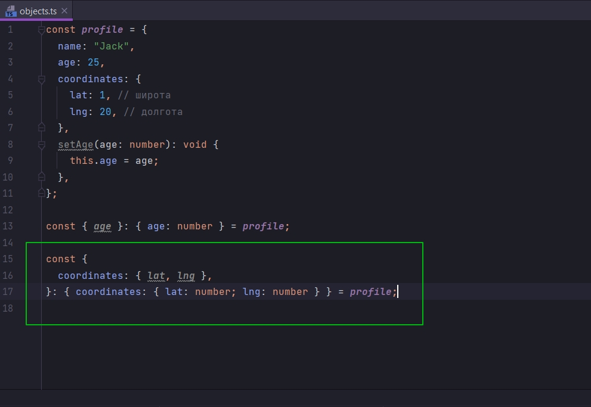

# Аннотации для объектов

Больше всего будем обсуждать деструктуризацию объектов.

```ts
const profile = {
    name: "Jack",
    age: 25,
    coordinates: {
        lat: 1, // широта
        lng: 20, // долгота
    },
};

```

Здесь встроенный объект coordinates который отображает местоположение человека в реальном мире.

Так же создадим метод в объекте который будет устанавливать возраст человека.

```ts
const profile = {
    name: "Jack",
    age: 25,
    coordinates: {
        lat: 1, // широта
        lng: 20, // долгота
    },
    setAge(age: number): void {
        this.age = age;
    },
};

```

Это пример метода или функции определенной внутри объекта.

Теперь давайте будем получать какие-то свойства из этого объекта. Это мы делаем при помощи деструктуризации.

```ts

const profile = {
    name: "Jack",
    age: 25,
    coordinates: {
        lat: 1, // широта
        lng: 20, // долгота
    },
    setAge(age: number): void {
        this.age = age;
    },
};

const {age} = profile;

```

И если мы хотим добавить аннотацию к деструктуризированному полю age, то мы не можем просто указать

```ts
const profile = {
    name: "Jack",
    age: 25,
    coordinates: {
        lat: 1, // широта
        lng: 20, // долгота
    },
    setAge(age: number): void {
        this.age = age;
    },
};

const {age}: number = profile;

```



В место этого нам нужно указывать при помощи структуры объекта



В случае с деструктуризацией объектов я сначало деструктуризирую интересующее поле объекта, а после ввиде объектного
литерала указываю тип данного поля.

Теперь еще немного усложним. Деструктуризирую свойства объекта coordinates.

```ts
const profile = {
    name: "Jack",
    age: 25,
    coordinates: {
        lat: 1, // широта
        lng: 20, // долгота
    },
    setAge(age: number): void {
        this.age = age;
    },
};

const {age}: { age: number } = profile;

const {
    coordinates: {lat, lng},
} = profile;

```



Простая деструктуризация без аннотации типов. Сначало деструтуризирую сам объект coordinates, и после деструктуризируе
его свойства { lat, lng }. Это просто синтаксис ES6.

```ts
const profile = {
    name: "Jack",
    age: 25,
    coordinates: {
        lat: 1, // широта
        lng: 20, // долгота
    },
    setAge(age: number): void {
        this.age = age;
    },
};

const {age}: { age: number } = profile;

const {
    coordinates: {lat, lng},
}: { coordinates: { lat: number; lng: number } } = profile;

```



Т.е. точно так же, только после деструктуризации вложенного объекта и его полей, мы прописываем аннотацию типов
деструктурированных полей объекта.