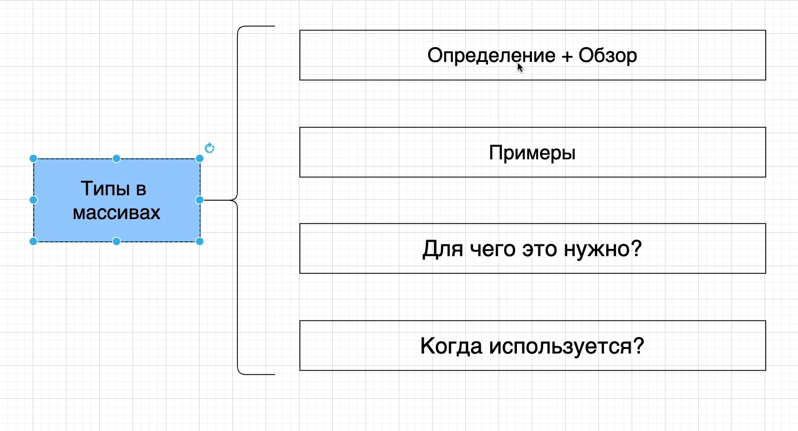
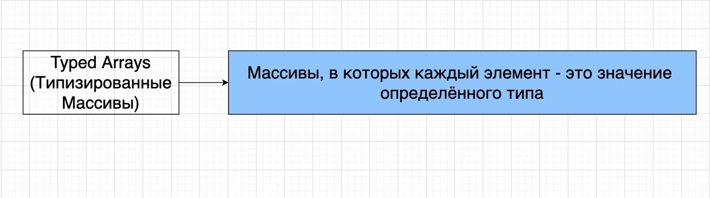
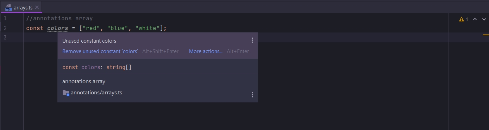
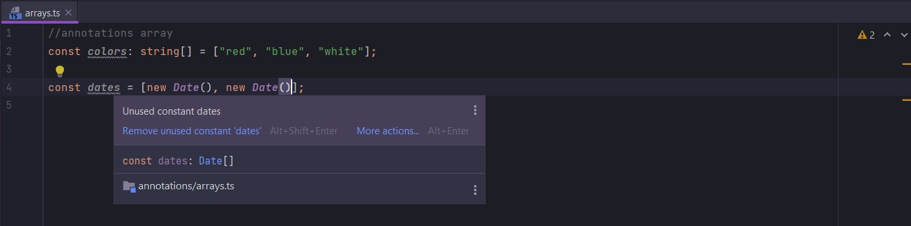
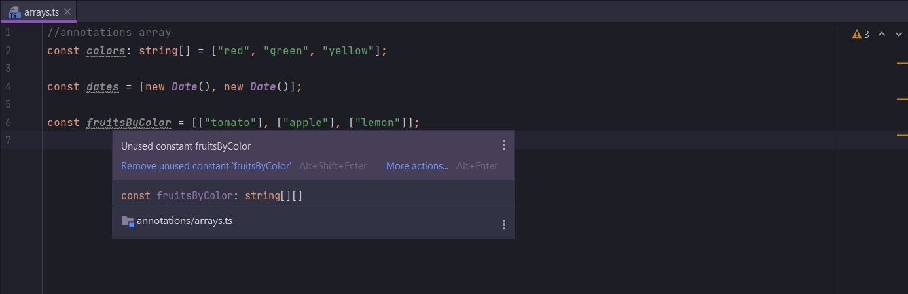

# Массивы в TypeScript





Когда мы работаем с массивами в Typescript, то мы работаем с простыми массивами в JS.

Т.е. мы можем сделать push элемента, или получить элементы из массива.

Мы можем использовать цикл Foreach или for.

Самое главное отличие массивов в TS это то что это массивы в которых каждый элемент это значение определенного типа.
Т.е. если мы создаем массив для строк, то этот массив будет содержать только строки. Если мы попробуем поместить в этот
массив числовое значение или boolean значение, то мы получим ошибку. Т.е. когда мы работаем с массивами в TS мы помещаем
в эти массивы только значения определенного типа.

Технически мы можем в массивы помещать значения разных типов. Но мы тогда должны очень явно указывать специальные
аннотации для этого.

В папке annotations создаю arrays.ts.

```ts
//annotations array
const colors = ["red", "blue", "white"];

```



Делаю явную аннотацию типов

```ts
//annotations array
const colors: string[] = ["red", "blue", "white"];

```

Когда мы будем работать с массивами нам нужно будет добавлять аннотации. В основном это нужно будет тогда когда мы будем
инициализовровать переменную пустым массивом.

```ts
//annotations array
const colors: string[] = [];

```

Мы так же можем помещать в массив сложные объекты.

```ts
//annotations array
const colors: string[] = ["red", "blue", "white"];

const dates = [new Date(), new Date()];

```



<br/>
<br/>
<br/>

Так же в Typescript мы можем использовать двумерные массивы.

```ts
//annotations array
const colors: string[] = ["red", "green", "yellow"];

const dates = [new Date(), new Date()];

const fruitsByColor = [["tomato"], ["apple"], ["lemon"]];

```



Как виидим у нас два набора квадратных скобок. Что означает двумерный стринговый массив.

Опять же нам не нужно добавлять ни какой аннотации. Ее нужно добавлять только в том случае если мы хотим
проинициализировать переменную пустыми массивами.

```ts
//annotations array
const colors: string[] = ["red", "green", "yellow"];

const dates = [new Date(), new Date()];

const fruitsByColor = [["tomato"], ["apple"], ["lemon"]];

const fruitsByColor1: string[][] = []; // инициализирую пустой объект и указываю аннотацию как string двумерный массив

```

