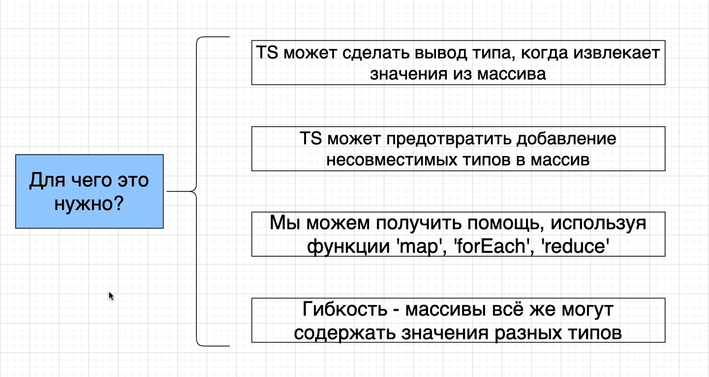
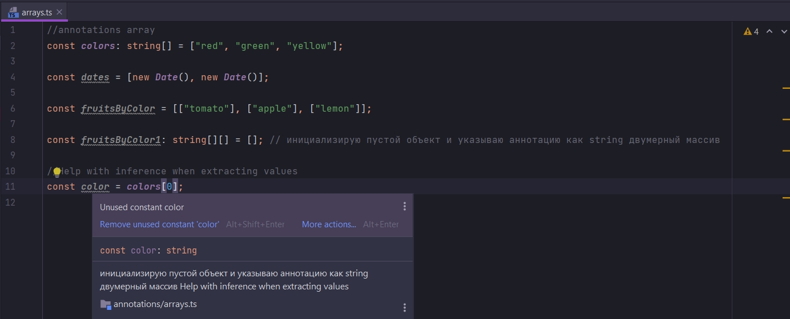
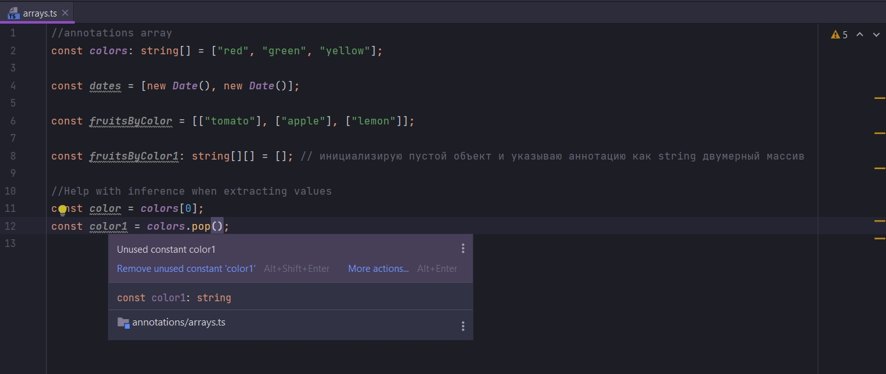
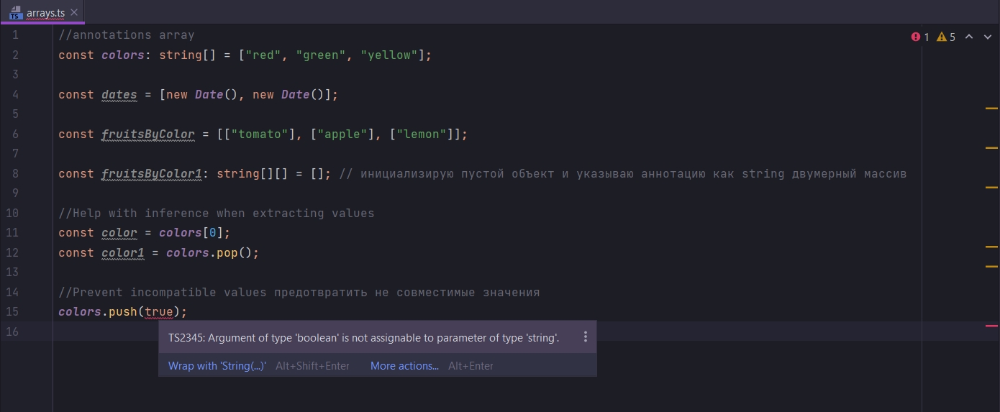
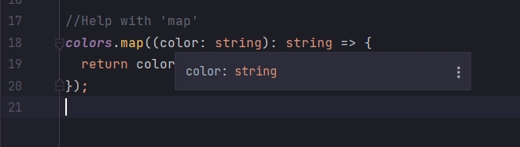

# Для чего нужны массивы в TypeScript?



TS может помочь нам сделать вывод типа когда мы извлекаем значение из массива.

Другими словами если мы сейчас посмотрим на массив colors, то мы видим что это массив строк.

```ts
//annotations array
const colors: string[] = ["red", "green", "yellow"];

const dates = [new Date(), new Date()];

const fruitsByColor = [["tomato"], ["apple"], ["lemon"]];

const fruitsByColor1: string[][] = []; // инициализирую пустой объект и указываю аннотацию как string двумерный массив

//Help with inference when extracting values

```

TS тоже знает что это массив строк через вывод типа. Это значит что когда мы из массива извлекаем како-то элемент при
помощи метода pop или по index. TS будет знать что мы извлекаем именно строку. И сразу же поможет нам выводом типа для
новой переменной в которую мы извлечем этот элемент.

```ts
//annotations array
const colors: string[] = ["red", "green", "yellow"];

const dates = [new Date(), new Date()];

const fruitsByColor = [["tomato"], ["apple"], ["lemon"]];

const fruitsByColor1: string[][] = []; // инициализирую пустой объект и указываю аннотацию как string двумерный массив

//Help with inference when extracting values
const color = colors[0];

```



И точно так же с pop

```ts
//annotations array
const colors: string[] = ["red", "green", "yellow"];

const dates = [new Date(), new Date()];

const fruitsByColor = [["tomato"], ["apple"], ["lemon"]];

const fruitsByColor1: string[][] = []; // инициализирую пустой объект и указываю аннотацию как string двумерный массив

//Help with inference when extracting values
const color = colors[0];
const color1 = colors.pop();

```



<br/>
<br/>
<br/>

TS может предотвратить добавление не совместимых типов в массив.



TS подсказывает что мы пытаемся поместить в коллекцию boolean который содержит только строки.

Это предотвращает помещаение не однородных элементов в массив.

Конечно когда мы хотим поместить значение разных типов в один и тот же массив. Мы можем это сделать, но нам нужно
использовать особый синтаксис для этого.

<br/>
<br/>
<br/>

Мы можем получить помощь использую функции map, Foreach, reduce т.д. каждый раз когда мы производим итерацию через
коллекцию элементов.

```ts
//Help with 'map'
colors.map((color: string): string => {
    return color;
});
```



И теперь я могу вызвать любой интересующий меня метод строки.

```ts
//Help with 'map'
colors.map((color: string): string => {
    return color.toUpperCase();
});
```

Каждый раз когда мы работаем с map, Foreach, reduce или с другими вспомагательными функциями,TS будет давать нам
autocomplete, автоматически будет выдавать нам список методов и свойств.