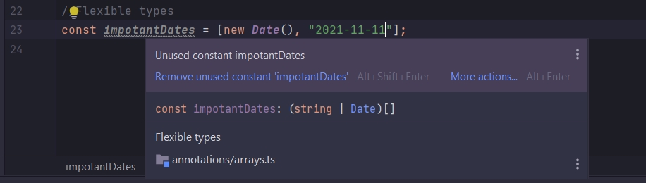
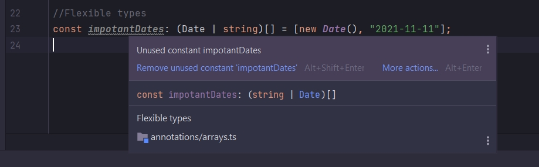
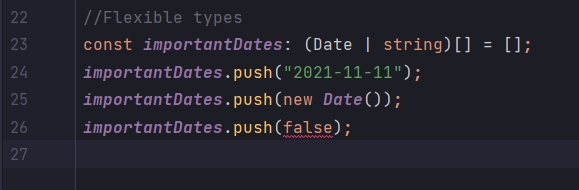
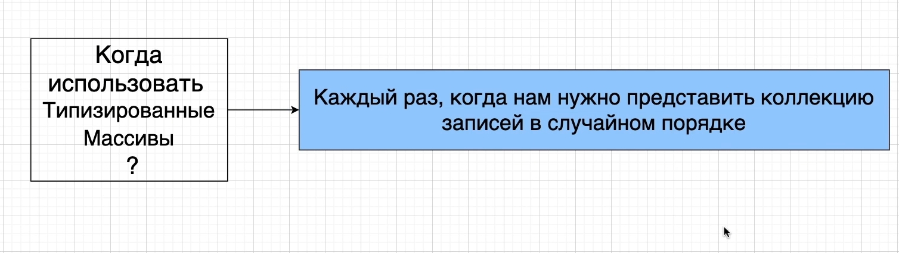

# Массивы со значениями разных типов

```ts
//Flexible types
const impotantDates = [new Date(), "2021-11-11"];
```

Если я наведу курсор на переменную, то я увижу аннотацию со сзнаком или



В этом массиве содержаться или string или объекты Date. TS автоматически выводит что этот тип массив который содержит
значения типа string и Date.

Если при инициализации укажем лишь один тип, то мы должны явно указать какой тип еще будет использоваться.

```ts
//Flexible types
const impotantDates: (Date | string)[] = [new Date(), "2021-11-11"];
```



И теперь я могу добавлять значения указанных типов в аннотации. И не могу добавлять типы не указанные в аннотации.

```ts
//Flexible types
const importantDates: (Date | string)[] = [];
importantDates.push("2021-11-11");
importantDates.push(new Date());
importantDates.push(false);
```






