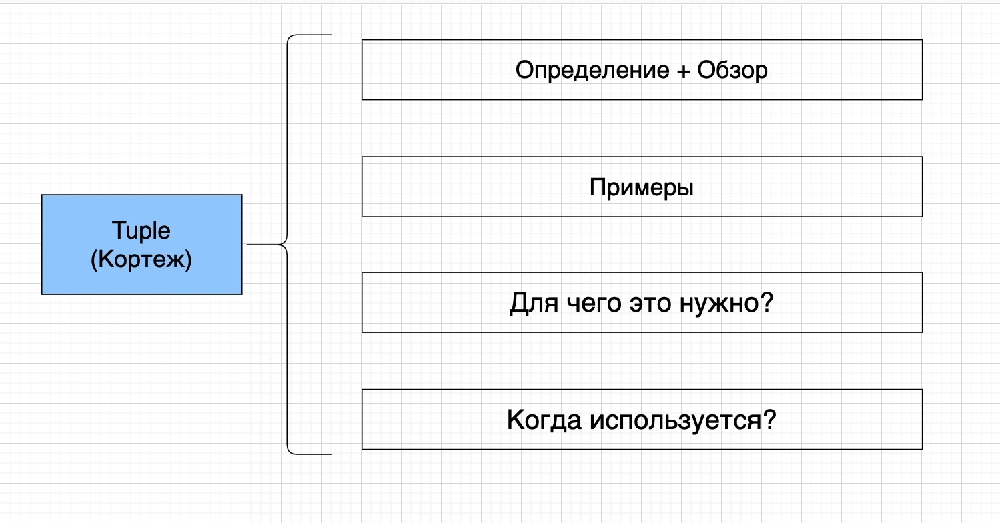
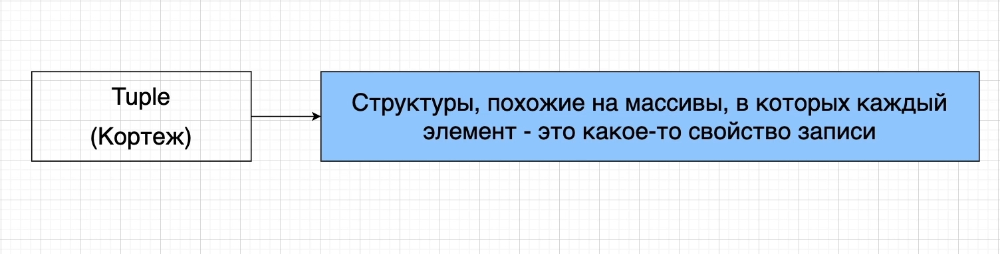
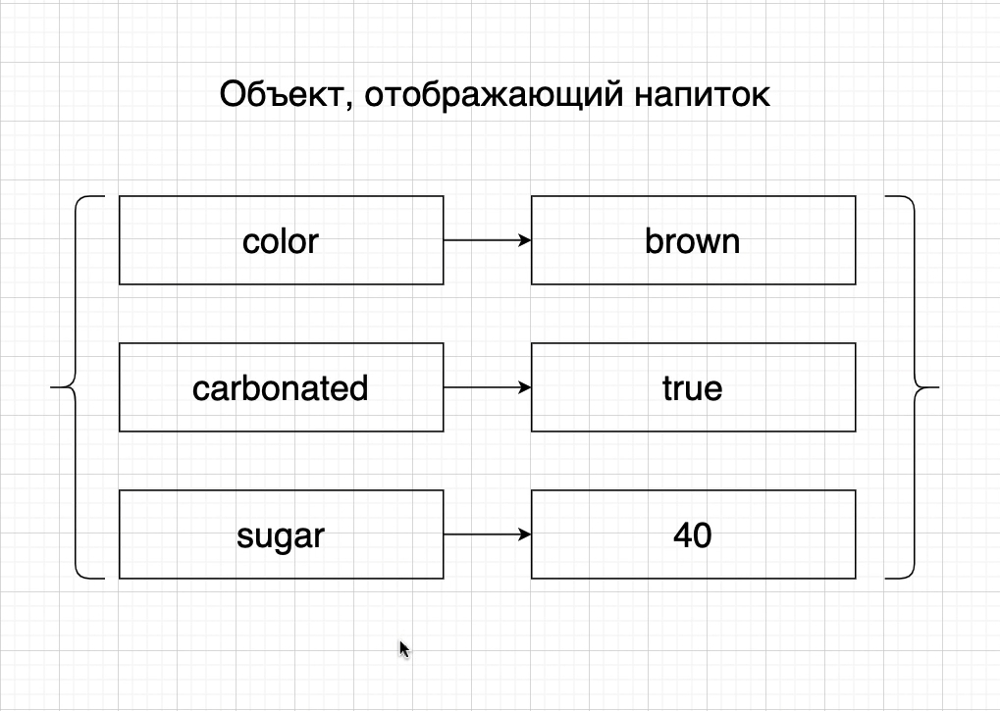
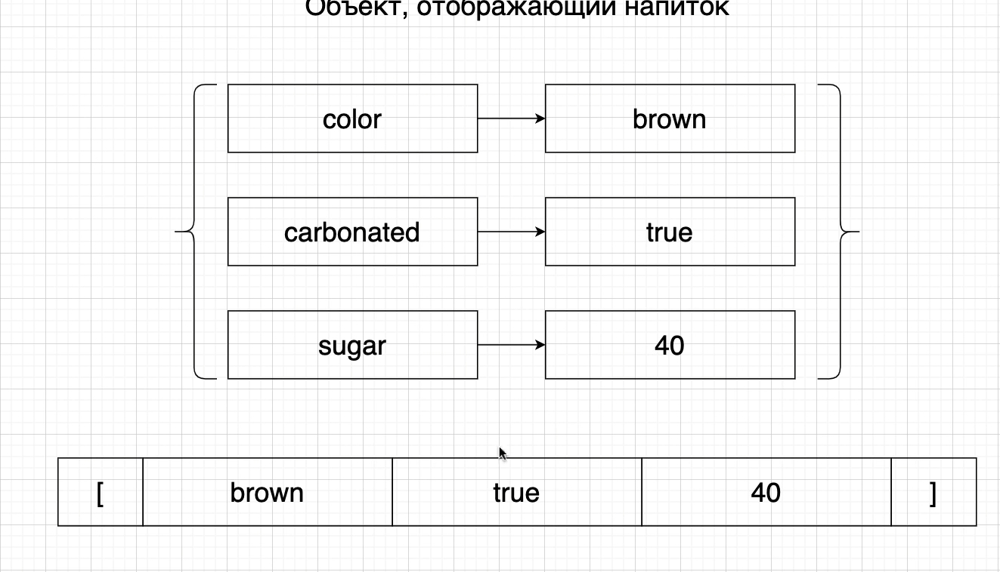
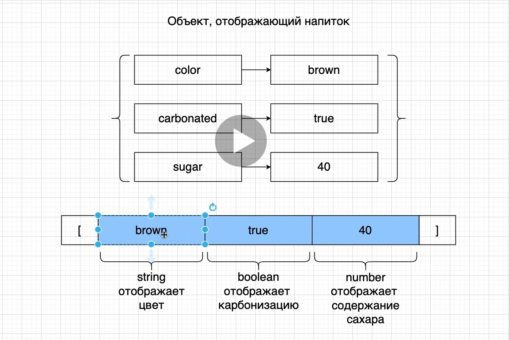

# Tuples в TypeScript

Когда мы работаем с Tuple мы работаем с чем-то похожим на массивы.

Одно большое отличие это то что эти структуры похожи на массивы. В них каждый элемент это какое-то свойство одной
записи.

В то время как массив нам рассказывает о какой-то коллекции различных элементов, различных записей.

Tuple в свою очередь описываю одну запись, но несколько свойств этой записи. Именно по-этому внутри tuple мы часто
содержим значения разных типов. Т.е. у одной записи может быть очень много свойств. Эти свойства могут отображаться при
помощи различных типов значений.

Этот напиток легко отобразить при помощи объекта со свойствами и значениями.

Представим этот объект в виде массива.

Мы конечно же потеряли какие-то данные.

Теперь нам как разработчикам нужно запомнить что на каждой позиции. Значение именно определенных типов, которые
отображают определенные свойства этого объекта, в данном случае напитка.

Но позиции с нулевым индексом, в массиве строка отображающая цвет.

На позиции с индексом 1 boolean значение.

На втором индексе у нас number значение которое отображает содержание сахара.

И нам нужно все это помнить т.к. в массиве нет ключа как в объекте. В массивах есть только индексы т.е. позиция элемента
в массиве.

Tuple именно так и выглядит. Когды мы помещаем значение в массив в определенном строгом порядке. Т.е. порядок здесь
очень важен.