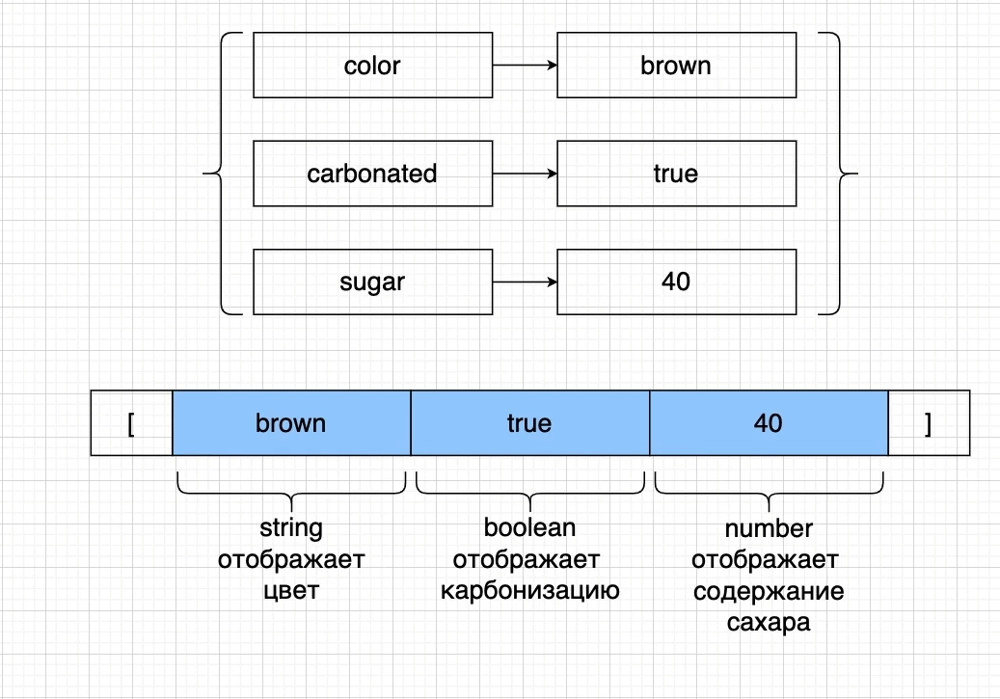
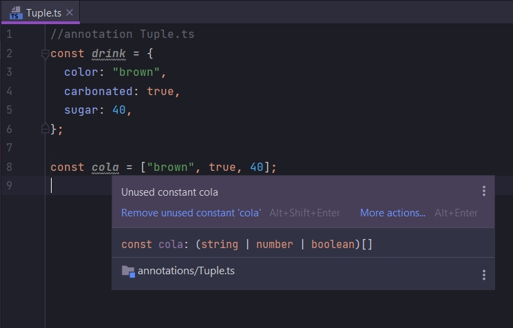
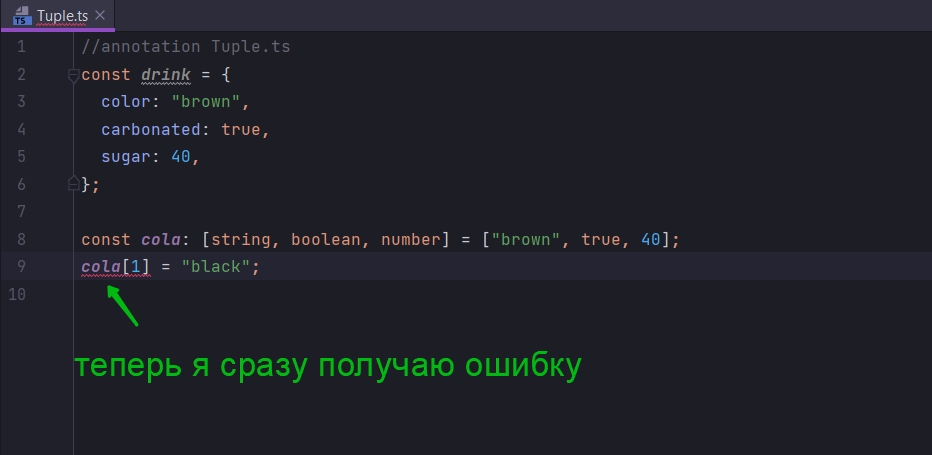

# Tuples в действии

В annotations создаю файл Tuples.js

Создам объект как в диаграмме.



```ts
//annotation Tuple.ts
const drink = {
    color: "brown",
    carbonated: true,
    sugar: 40,
};

```

Представим этот объект в виде Tuple

```ts
//annotation Tuple.ts
const drink = {
    color: "brown",
    carbonated: true,
    sugar: 40,
};

const cola = ["brown", true, 40];

```

То что мы имплементировали в значении переменной cola это массив по сути.



Это массив в котором содержаться типы string, boolean,number.

Проблема в том что мы можем перепутать порядок этих свойств, значений внутри массива. И тогда результаты работы нашего
приложения будут не корректны.

Если мы хотим поменять цвет элемента, то мы можем перепутать порядок элементов.

```ts
//annotation Tuple.ts
const drink = {
    color: "brown",
    carbonated: true,
    sugar: 40,
};

const cola = ["brown", true, 40];
cola[1] = "black"
```

Значение black поместится вместо boolean значения.

Для этого в Typescript есть специальная аннотация которая превращает этот массив в Tuple.

BИ после того как мы в массиве указываем двоеточие, указываю сначало тип, а затем квадратные скобки.

Для Tuple я сразу указываю квадратные скобки, и затем в этих квадратных скобках, в это аннотации перечисляем типы, в том
же порядке в котором они находяться в массиве.

```ts
//annotation Tuple.ts
const drink = {
    color: "brown",
    carbonated: true,
    sugar: 40,
};

const cola: [string, boolean, number] = ["brown", true, 40];

```

Такая аннотация превращает массив в Tuple. Т.е. в этом массиве все элементы теперь будут в определенном порядке.



Так же для удобства мы можем использовать ак называемые alias(Псевдоним).

```ts
//annotation Tuple.ts
const drink = {
    color: "brown",
    carbonated: true,
    sugar: 40,
};

type Drink = [string, boolean, number]; //alias псевдоним

const cola: Drink = ["brown", true, 40];
cola[1] = "black";

```

Ключевое слово type создает не массив,как можно подумать на первый взгляд. Таким образом мы создаем так называемый
типовой alias. Теперь этот тип Drink мы можем использовать в любом месте нашей программы.

```ts
//annotation Tuple.ts
const drink = {
    color: "brown",
    carbonated: true,
    sugar: 40,
};

//Type elias
type Drink = [string, boolean, number]; //alias псевдоним

//Tuple array
const cola: Drink = ["brown", true, 40];
const sprite: Drink = ["clear", true, 40];
const coffee: Drink = ["black", false, 0];

```

