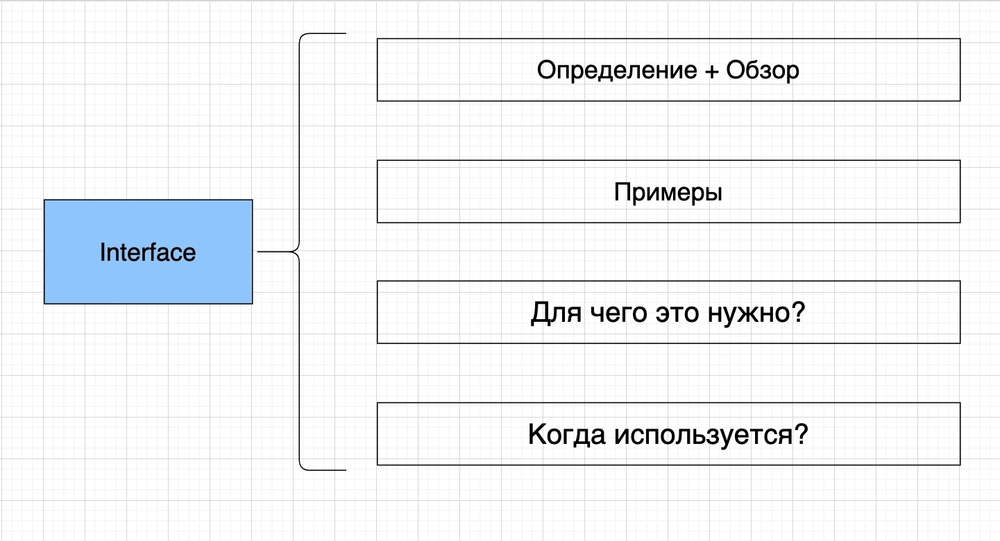
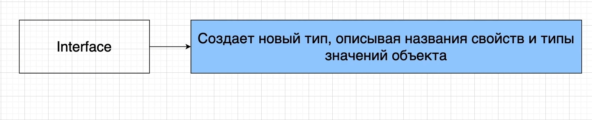

# Интерфейсы

Большое количество времени мы будем посвящать обсуждения интерфейсов и классов Typescript.

Это соединение interface + class позволяет использовать повторное использование кода в Typescript. Т.е. если вы хорошо
поймете interface вы будете разрабатывать отличные приложения.

Когда мы создаем interface мы создаем новый тип, описывая названия свойств и типы значений объекта.

Т.е. когда мы создаем interface для Typescript мы создаем новый тип. Это кастомный тип который мы сами определяем.