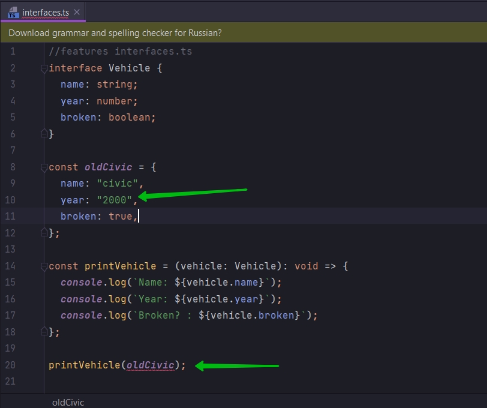
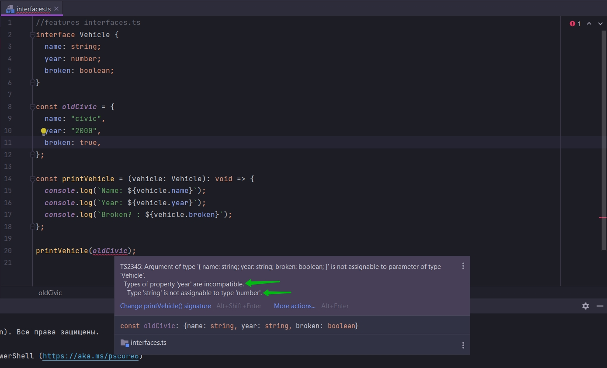
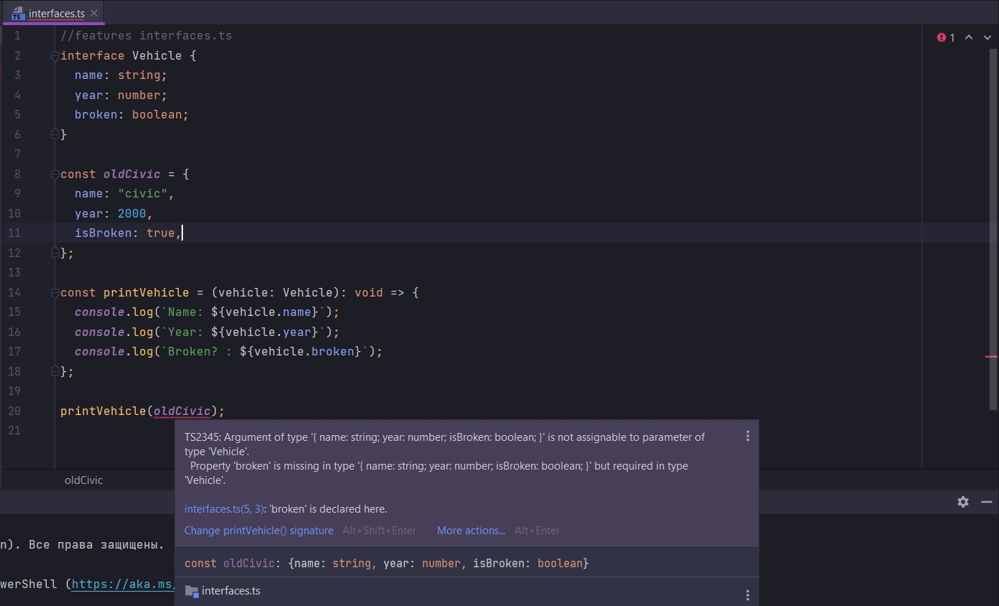

# Исправление длинных аннотаций при помощи интерфейсов

```ts
//features interfaces.ts
const oldCivic = {
    name: "civic",
    year: 2000,
    broken: true,
};

const printVehicle = (vehicle: {
    name: string;
    year: number;
    broken: boolean;
}): void => {
    console.log(`Name: ${vehicle.name}`);
    console.log(`Year: ${vehicle.year}`);
    console.log(`Broken? : ${vehicle.broken}`);
};

printVehicle(oldCivic);

```

В этом коде есть проблема слишком длинной аннотации. И что эта аннотация будет дублироваться из функции к функции
которая будет использовать объект oldCivic.

Что бы исправить это мы создадим interface внутри файла.

После указания ключевого слова interface я должен указать название типа. Каждый раз когда я создаю interface я создаю
новый тип.Такойже тип как string, number,boolean и т.д.

Название интерфейса всегда начинается с заглавной буквы.

```ts
//features interfaces.ts
interface Vehicle {
}

const oldCivic = {
    name: "civic",
    year: 2000,
    broken: true,
};

const printVehicle = (vehicle: {
    name: string;
    year: number;
    broken: boolean;
}): void => {
    console.log(`Name: ${vehicle.name}`);
    console.log(`Year: ${vehicle.year}`);
    console.log(`Broken? : ${vehicle.broken}`);
};

printVehicle(oldCivic);

```

И так же мы должны использовать общий термин для названия interface. Для интерфейсов мы должны использовать более общее
название. Именно по этому я его называю Vehicle транспортное средство.

И в этом интерфейсе я пишу какие различные свойства может иметь траспортное средство, в том числе oldCivic, и так же их
типы. Типы значений которые будут хранится в этих свойствах.

```ts
//features interfaces.ts
interface Vehicle {
    name: string;
    year: number;
    broken: boolean;
}

const oldCivic = {
    name: "civic",
    year: 2000,
    broken: true,
};

const printVehicle = (vehicle: {
    name: string;
    year: number;
    broken: boolean;
}): void => {
    console.log(`Name: ${vehicle.name}`);
    console.log(`Year: ${vehicle.year}`);
    console.log(`Broken? : ${vehicle.broken}`);
};

printVehicle(oldCivic);

```

Мы можем рассматривать Vehicle как переменную которая указывает на какой-то тип.

Теперь вместо этой длинной аннотации я могу указывать.

```ts
//features interfaces.ts
interface Vehicle {
    name: string;
    year: number;
    broken: boolean;
}

const oldCivic = {
    name: "civic",
    year: 2000,
    broken: true,
};

const printVehicle = (vehicle: Vehicle): void => {
    console.log(`Name: ${vehicle.name}`);
    console.log(`Year: ${vehicle.year}`);
    console.log(`Broken? : ${vehicle.broken}`);
};

printVehicle(oldCivic);

```

Для вызова функции printVehicle я должен предоставить объект который имеет свойства name: "civic", year: 2000, broken:
true. И наш объект oldCivic, который мы передаем при вызове функции, полностью удовлетворяет этим свойствам.

Как только я добавляю вызов функции TS делает проверку на соответствие аргумента который мы передаем. Аргументом
является oldCivic. TS проверяет объект oldCivic на соответствие полей b и их типов указанных в interface. TS пребирает
все свойства interface И проверяет имеетли все эти свойства с такимиже типами объект oldCivic.

Например год я могу указать как строку. И я моментально получаю ошибку.



Если мы наведем курсор на то место где он подсвечивает ошибку, то он нам скажет что такой аргумент с таким типом не
может быть присвоен интерфейсу с названием.



Тоже самое если я задам не правильное значение ключа в объекте.



```ts
//features interfaces.ts
interface Vehicle {
    name: string;
    year: number;
    broken: boolean;
}

const oldCivic = {
    name: "civic",
    year: 2000,
    broken: true,
};

const printVehicle = (vehicle: Vehicle): void => {
    console.log(`Name: ${vehicle.name}`);
    console.log(`Year: ${vehicle.year}`);
    console.log(`Broken? : ${vehicle.broken}`);
};

printVehicle(oldCivic);


```

