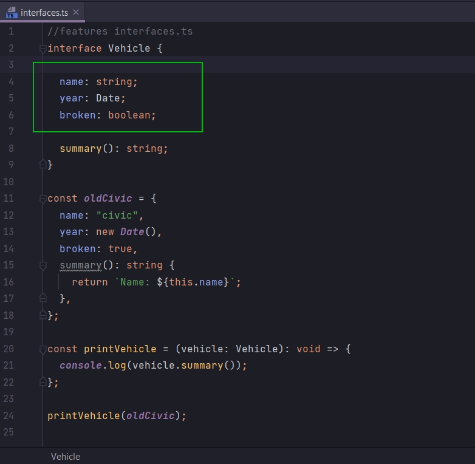
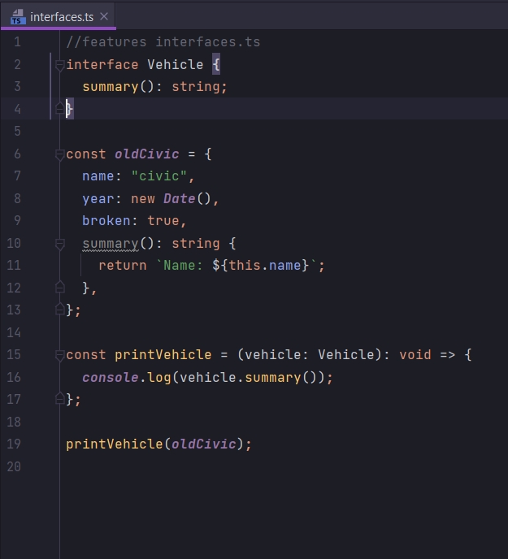
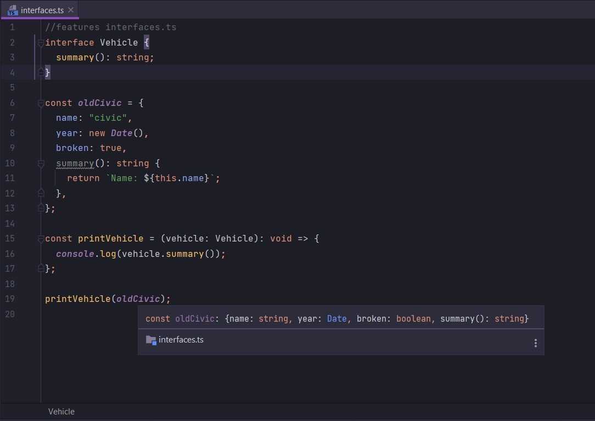

# Функции в интерфейсах

```ts
//features interfaces.ts
interface Vehicle {
    name: string;
    year: Date;
    broken: boolean;

    summary(): string;
}

const oldCivic = {
    name: "civic",
    year: new Date(),
    broken: true,
    summary(): string {
        return `Name: ${this.name}`;
    },
};

const printVehicle = (vehicle: Vehicle): void => {
    console.log(vehicle.summary());
};

printVehicle(oldCivic);

```

Вернемся к нашей функции printVehicle. И сейчас как видите мы получаем доступ только к одному свойсву объекта vehicle,
свойству summary.

Действительно ли важно нам говорить что любой объект типа vehicle должен так же иметь и вот эти свойства



Я думаю что эти свойства не обязательны.

Удаляю все эти свойства.



И как видите ошибок нет.

Почему же это происходит?

Когда мы вызываем функцию printVehicle мы передаем в него объект oldCivic и говорим что объект oldCivic должен
удовлетворять типу Vehicle.



Т.е. Typescript проверяет за нас и смотрит есть ли у него свойства summary, такое как и в interface Vehicle. И так как
объект oldCivic имеет функцию summary которая возвращает string тип, то все воспринимается нормально.

И теперь мы подошли к такому моменту рефакторинга нашего кода. Так как interface Vehicle содержит только свойство
summary. Как вы думаете действительно ли корректно называть interface Vehicle?

Корректно это будет назвать интерфейсом дающим отчет.

```ts
//features interfaces.ts
interface Reportable {
    summary(): string;
}

const oldCivic = {
    name: "civic",
    year: new Date(),
    broken: true,
    summary(): string {
        return `Name: ${this.name}`;
    },
};

const printVehicle = (vehicle: Reportable): void => {
    console.log(vehicle.summary());
};

printVehicle(oldCivic);

```

Сейчас мы говорим что если вы хотите иметь объект типа Reportable, то этот объект обязательно должен иметь функцию
называемой summary которая имеет тип string.

Теперь как бы можно переименовать и саму функцию printVehicle, т.к. по идее ни какого интерфейса Vehicle т.е.
транспортного средства у нас нет.

У нас есть Reportable т.е. отчет.

Называю функцию printSummary т.к. мы распечатываем какое-то резюме.

```ts
//features interfaces.ts
interface Reportable {
    summary(): string;
}

const oldCivic = {
    name: "civic",
    year: new Date(),
    broken: true,
    summary(): string {
        return `Name: ${this.name}`;
    },
};

const printSummary = (item: Reportable): void => {
    console.log(item.summary());
};

printSummary(oldCivic);

```

