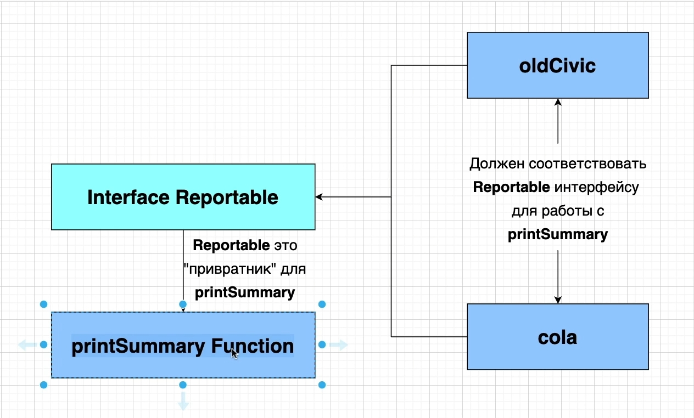
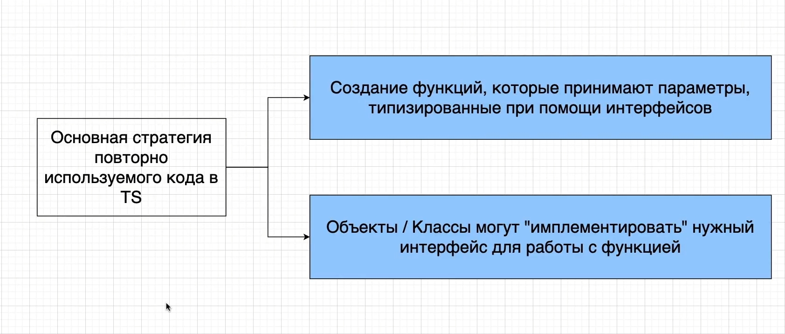
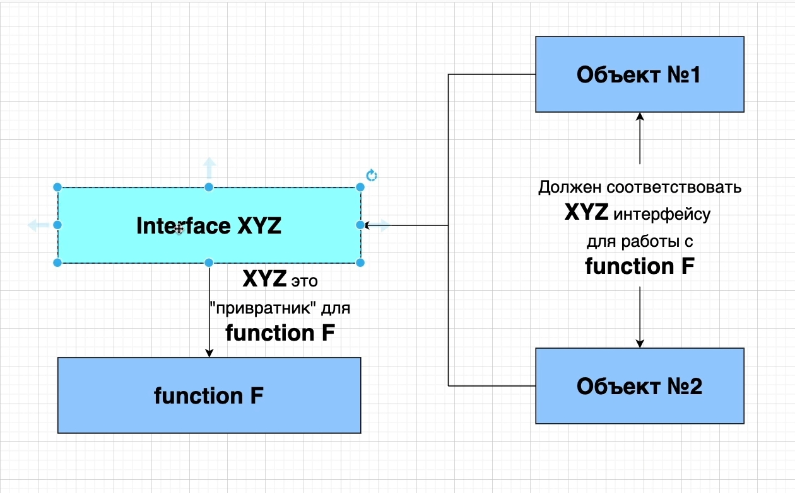

# План по интерфейсам

```ts
//features interfaces.ts
interface Reportable {
    summary(): string;
}

const oldCivic = {
    name: "civic",
    year: new Date(),
    broken: true,
    summary(): string {
        return `Name: ${this.name}`;
    },
};

const cola = {
    color: "brown",
    carbonated: true,
    sugar: 40,
    summary(): string {
        return `Cola has ${this.sugar} grams of sugar`;
    },
};

const printSummary = (item: Reportable): void => {
    console.log(item.summary());
};

printSummary(oldCivic);
printSummary(cola);

```

Разберем пару диаграмм для того что бы лучше понять что эе происходит в этом файле.



Мы можем рассматривать interface Reportable как привратник для функции printSummary. Т.е. если у нас в приложении есть
какие-то объекты которые мы будем передавать в функцию printSummary. Т.е. как в нашем случае мы передаем объекты
oldCivic и cola в функцию printSummary.

Перед передачей в объектов в функцию мы должны удостовериться что поля объектов соответствуют и удовлетворяют все
требования интерфейса Reportable.

В нашем случае оба объекта,oldCivic и cola, должны иметь Функцию summary которая возвращает строку. Иначе они не могут
быть использованы с функцией printSummary.

Именно этот механизм используется для повторного использования кода в TS.



Основная стратегия которую мы будем использовать. Мы будем создавать функции, которые принимают параметры,
типизированные при помощи интерфейсов. Т.е. все функции которые мы будем создавать будут принимать в качестве параметров
интерфейс.

Конечно конечно мы будем передавать и простые значения string, boolean, но это в редких случаях. Но в основном мы будем
стараться создавать функции которые будут принимать параметры типизированные при помощи интерфейсов.

И для того что бы передавать какие-то значения в эти функции мы будем создавать объекты или классы которые могут
имплементировать нужный интерфейс для работы с функцией.

Все это можно обобщить.



Мы можем создать любой интерфейс. Он будет привратником для какой-то функции. Т.е. он как бы будет давать доступ в
какую-то функцию. Либо давать, либо отказывать если interface не имплементирован, значение которое передается в функцию.
Т.е. все объекты которые хотят работатьс функцией должны соответствовать интерфейсу т.е. имплементировать все его
свойства.

Т.е. выше стоящая диаграмма будет использоваться в каждом приложении. И каждый раз она будет значить одно и тоже.