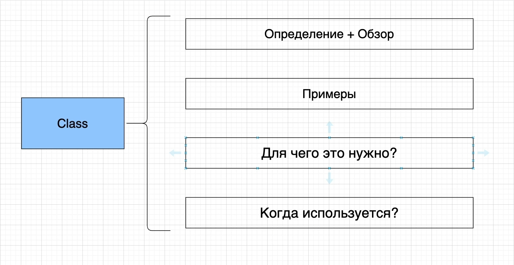
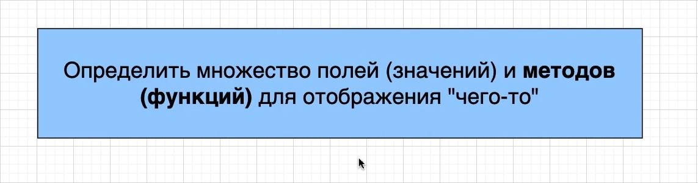
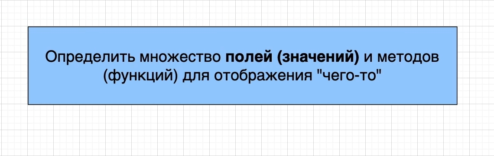
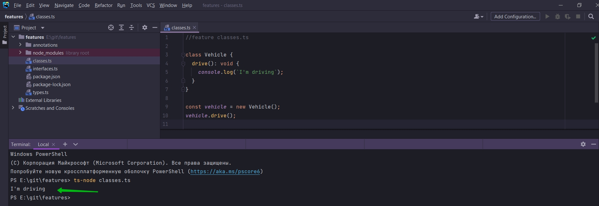

# Классы



Класс это своего рода шаблон создани объектов. Он содержит поля т.е значения и методами т.е. функциями. Для отображения
чего-то, объекта из реального мира или какой-то абстракции в приложении.



Сначало мы обсудим как классы работают с методами или функциями.

И далее мы рассмотрим как работать с полями т.е. значениями.



В корне приложения создаю classes.ts.

```ts
//feature classes.ts

class Vehicle {
    drive(): void {
        console.log(`I'm driving`);
    }
}

```

И так когда мы создаем класс, мы как бы создаем шаблон того как будет вести себя какой-то объект Vehicle, объект
транспортного средства.

Мы обычно не будем создавать методы напрямую из класса.

Вместо этого мы будем использовать класс для создания объекта класса или по английски это называется instance класса.

Для этого используется ключевое слово Vehicle.

```ts
//feature classes.ts

class Vehicle {
    drive(): void {
        console.log(`I'm driving`);
    }
}

const vehicle = new Vehicle();

```

И теперь внутри этого объекта мы имеем доступ ко всем методам этого класса.

```ts
//feature classes.ts

class Vehicle {
    drive(): void {
        console.log(`I'm driving`);
    }
}

const vehicle = new Vehicle();
vehicle.drive();

```




