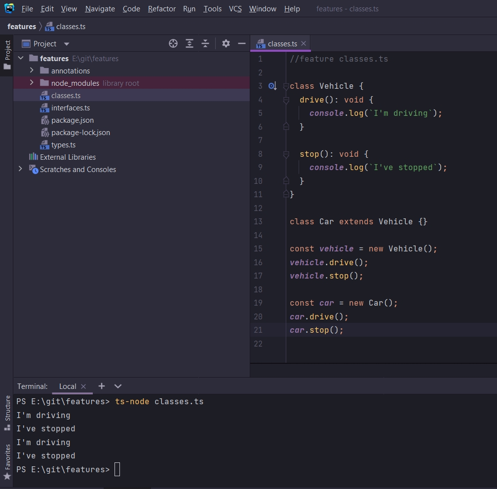
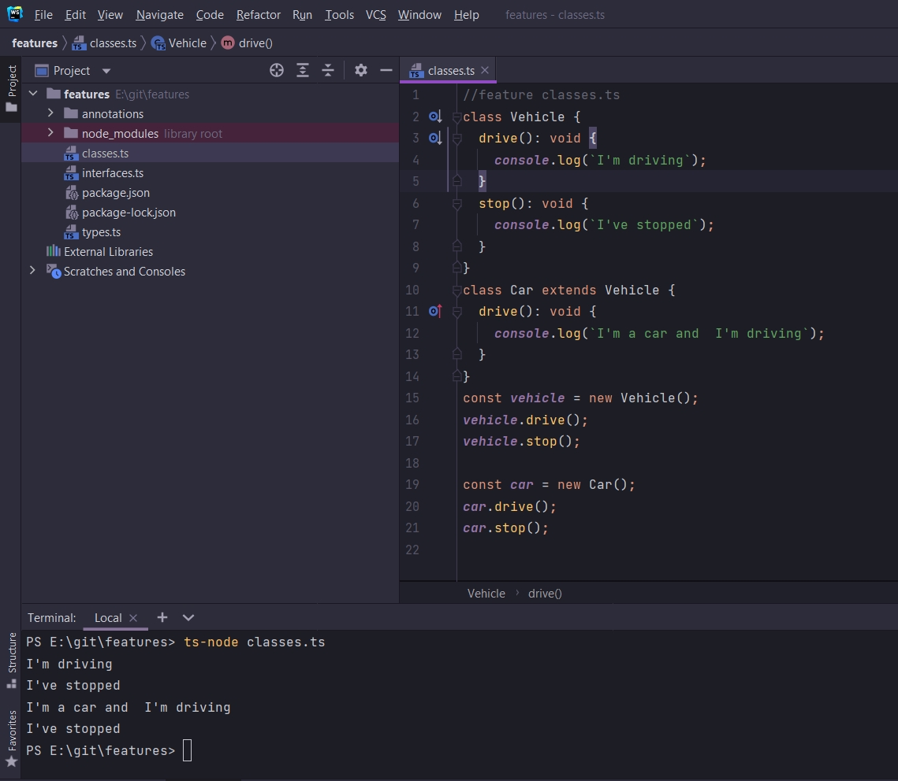

# Основы наследования

```ts
//feature classes.ts

class Vehicle {
    drive(): void {
        console.log(`I'm driving`);
    }

    stop(): void {
        console.log(`I've stopped`);
    }
}

const vehicle = new Vehicle();
vehicle.drive();
vehicle.stop();

```

Рассмотрим систему наследования классов.

Создам класс Car. Мы можем рассматривать Car как частный случай транспортного средсва Vehicle. Любой автомобиль должен
воспроизводить все те вещи транспортного средства. Т.е. drive и stop.

Мы бы хотели что бы класс Car имел все функции и методы класса Vehicle.

Как раз для этого существует система наследования. Это можно сделать при помощи ключевого слова extends. Он расширяет
или наследует класс Car от класса Vehicle. Т.е. при помощи extends я говоря что я хочу из класса Vehicle взфть все его
свойства и методы и скопировать в класс Car. Это для упрощения. На самом деле ничего не копируется, а просто передается
по ссылке.

```ts
//feature classes.ts

class Vehicle {
    drive(): void {
        console.log(`I'm driving`);
    }

    stop(): void {
        console.log(`I've stopped`);
    }
}

class Car extends Vehicle {
}

const vehicle = new Vehicle();
vehicle.drive();
vehicle.stop();

const car = new Car();
car.drive();
car.stop();

```



Так же мы можем переопределять методы в классе наследника.

```ts
//feature classes.ts

class Vehicle {
    drive(): void {
        console.log(`I'm driving`);
    }

    stop(): void {
        console.log(`I've stopped`);
    }
}

class Car extends Vehicle {
    drive(): void {
        console.log(`I'm a car and  I'm driving`);
    }
}

const vehicle = new Vehicle();
vehicle.drive();
vehicle.stop();

const car = new Car();
car.drive();
car.stop();

```



и так класс Car он называется классом наследником или дочерним классом.

Класс Vehicle называется суппер классом или классом родителем.
