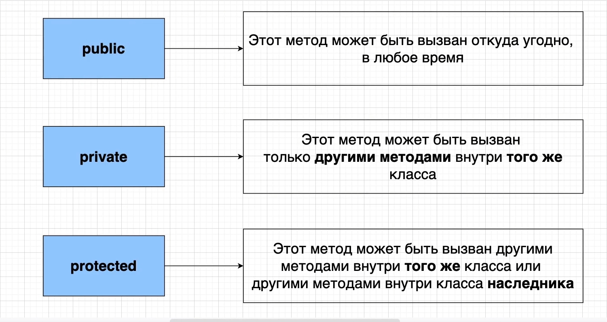
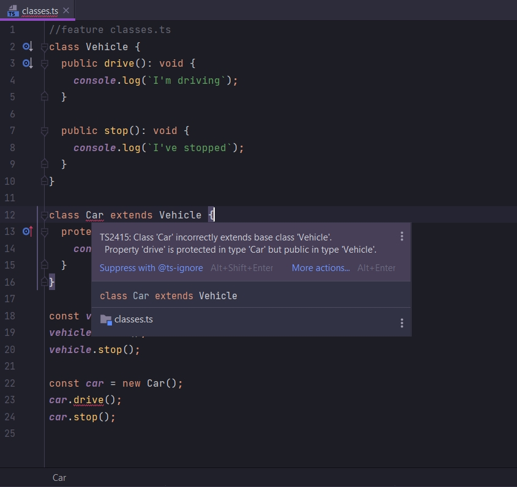
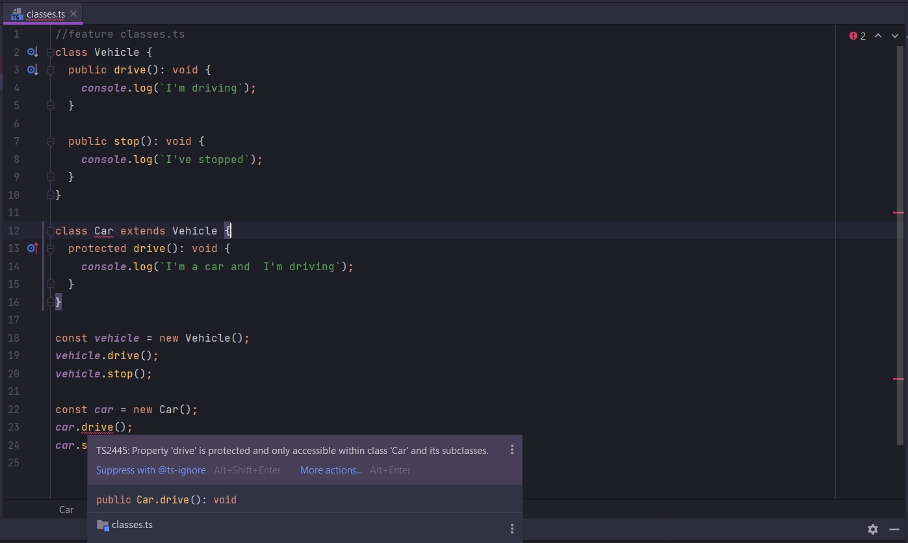
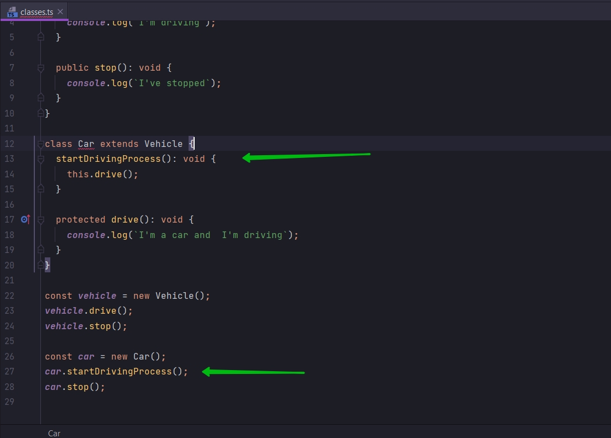
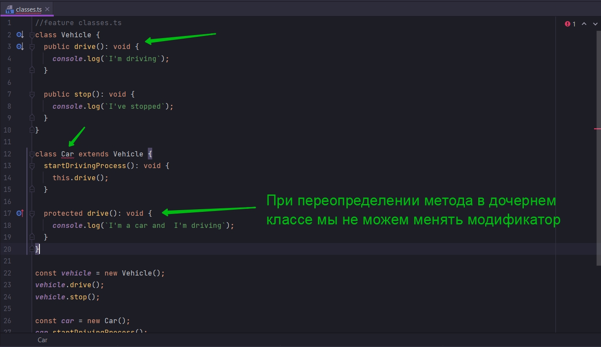
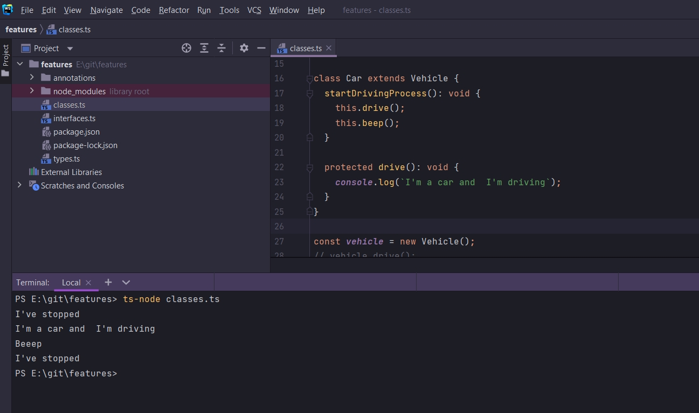

# Модификаторы методов объекта

Давайте рассмотрим различия между классами ECMAScript2015, ES6 и классами в TS.

Прежде всего мы рассмотрим модификаторы.



Модификаторы - это ключевые слова которые мы можем размещать для методов и свойств классов.

Существует три модификатора

- public
- privet
- protected

Цель этих модификаторов ограничивать доступ для различных методов и свойсвт. По умолчанию все методы и свойства класса
имеют модификатор public.

```ts
//feature classes.ts
class Vehicle {
    drive(): void {
        console.log(`I'm driving`);
    }

    stop(): void {
        console.log(`I've stopped`);
    }
}

class Car extends Vehicle {
    drive(): void {
        console.log(`I'm a car and  I'm driving`);
    }
}

const vehicle = new Vehicle();
vehicle.drive();
vehicle.stop();

const car = new Car();
car.drive();
car.stop();

```

Мы сейчас в нашем коде не добавляли ни каких ключевых модификаторов. По умолчанию все методы в этих двух классах имеют
модификатор Public.

- public - этот метод или свойство, которое имеет модификатор, может быть вызван откуда угодно, в любое время.
- privet - метод имеющий данный модификатор, может быть вызван только другими методами внутри того же класса.
- protected - Этот метод может быть вызван другими методами внутри тогоже класса или другими методами внутри класса
  наследника.

```ts
//feature classes.ts
class Vehicle {
    public drive(): void {
        console.log(`I'm driving`);
    }

    public stop(): void {
        console.log(`I've stopped`);
    }
}

class Car extends Vehicle {
    public drive(): void {
        console.log(`I'm a car and  I'm driving`);
    }
}

const vehicle = new Vehicle();
vehicle.drive();
vehicle.stop();

const car = new Car();
car.drive();
car.stop();

```

А теперь посмотрим разницу. Добавлю protected методу drive класса Car.

```ts
//feature classes.ts
class Vehicle {
    public drive(): void {
        console.log(`I'm driving`);
    }

    public stop(): void {
        console.log(`I've stopped`);
    }
}

class Car extends Vehicle {
    protected drive(): void {
        console.log(`I'm a car and  I'm driving`);
    }
}

const vehicle = new Vehicle();
vehicle.drive();
vehicle.stop();

const car = new Car();
car.drive();
car.stop();

```





Здесь говорится что свойство drive приватное и оно доступно только внутри класса Car. Т.е. это значит что я не могу
вызывать этот метод вне класса Car.

Создам еще метод внутри класса Car. Метод startDrivingProcess.



```ts
//feature classes.ts
class Vehicle {
    public drive(): void {
        console.log(`I'm driving`);
    }

    public stop(): void {
        console.log(`I've stopped`);
    }
}

class Car extends Vehicle {
    startDrivingProcess(): void {
        this.drive();
    }

    protected drive(): void {
        console.log(`I'm a car and  I'm driving`);
    }
}

const vehicle = new Vehicle();
vehicle.drive();
vehicle.stop();

const car = new Car();
car.startDrivingProcess();
car.stop();

```

Ошибки у startDrivingProcess не возникает потому что он по умолчанию имеет модификатор public. Метод startDrivingProcess
в свою очередь может вызвать privet модификатор который присвоен методу drive, потому что startDrivingProcess находится
внутри класса Car.

Но если вы заметили класс Car подсвечивается ошибкой. Происходит это потому что мы наследуемся от класса Vehicle. А у
жтого класса метод drive имеет модификатор public.

При переопределении метода в дочернем классе мы не можем менять модификатор доступа!!!!



Но если суппер класс, класс родителя не имел такого метода с таким модификатором доступа, то все бы прошло отлично.

```ts
//feature classes.ts
class Vehicle {
    // public drive(): void {
    //   console.log(`I'm driving`);
    // }

    public stop(): void {
        console.log(`I've stopped`);
    }
}

class Car extends Vehicle {
    startDrivingProcess(): void {
        this.drive();
    }

    protected drive(): void {
        console.log(`I'm a car and  I'm driving`);
    }
}

const vehicle = new Vehicle();
vehicle.drive();
vehicle.stop();

const car = new Car();
car.startDrivingProcess();
car.stop();

```

Зачем же нам это нужно?

Модификатор доступа privet не имеет ничего общего с какими-то соображениями безопасности.

Этот модификатор ограничивает доступ к методам которые могут вызвать другие разработчики. Что бы не давать им
возможность вызывать этот метод. Причина этого может быть в том что мы можем иметь мотод который очень глубоко
манипулирует данными в классе. Разработчики могут без всякого злого умысла, просто не осторожно, каким-то обращением с
таким методом сломать приложение.

<br/>
<br/>
<br/>

Обсудим protected (Защищенный) модификатор. Здесь все те же самые свойства как у privet, только добаляется доступ
изнутри класса наследника. Нетолько доступ из самого суппер класса или класса родителя, но и из класса наследника.

```ts
//feature classes.ts
class Vehicle {
    // public drive(): void {
    //   console.log(`I'm driving`);
    // }

    public stop(): void {
        console.log(`I've stopped`);
    }

    protected beep(): void {
        console.log(`Beeep`);
    }
}

class Car extends Vehicle {
    startDrivingProcess(): void {
        this.drive();
        this.beep();
    }

    protected drive(): void {
        console.log(`I'm a car and  I'm driving`);
    }
}

const vehicle = new Vehicle();
// vehicle.drive();
vehicle.stop();

const car = new Car();
car.startDrivingProcess();
car.stop();


```

Как видите я могу спокойно вызвать метод beep в классе наследника.



Мы можем данный метод beep вызывать в классе наследника. Но ни как снаружи класса. Это приведет к ошибке.

```ts
//feature classes.ts
class Vehicle {
    // public drive(): void {
    //   console.log(`I'm driving`);
    // }

    public stop(): void {
        console.log(`I've stopped`);
    }

    protected beep(): void {
        console.log(`Beeep`);
    }
}

class Car extends Vehicle {
    startDrivingProcess(): void {
        this.drive();
        this.beep();
    }

    protected drive(): void {
        console.log(`I'm a car and  I'm driving`);
    }
}

const vehicle = new Vehicle();
// vehicle.drive();
vehicle.stop();

const car = new Car();
car.startDrivingProcess();
car.stop();

```

