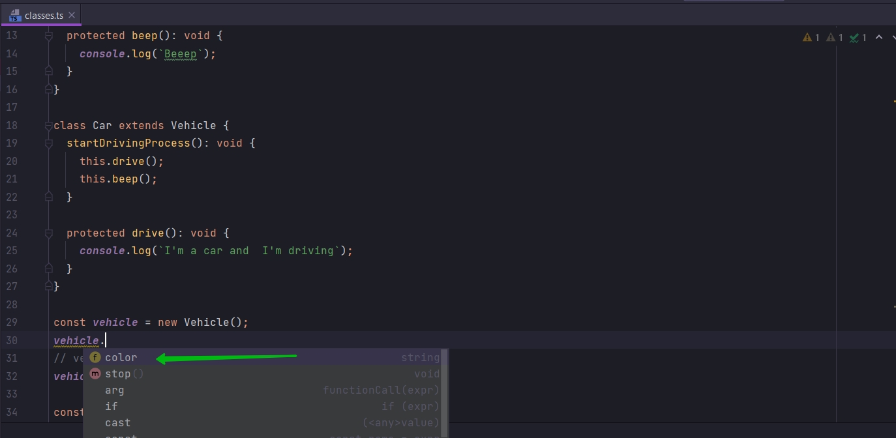
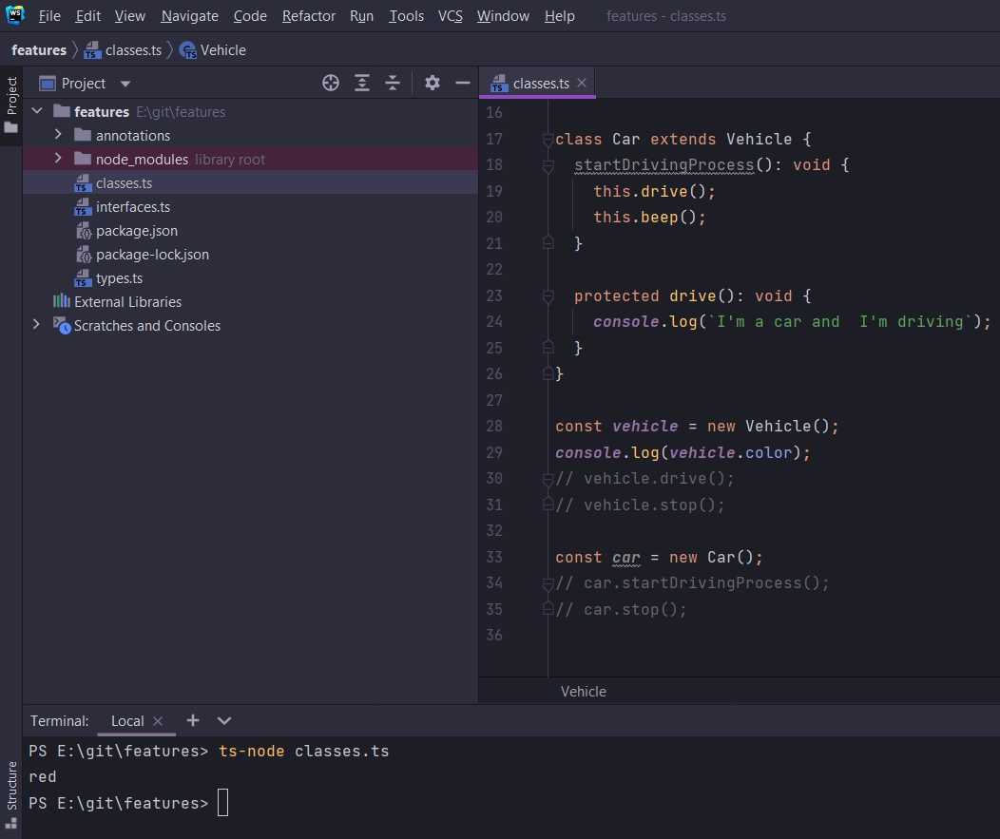
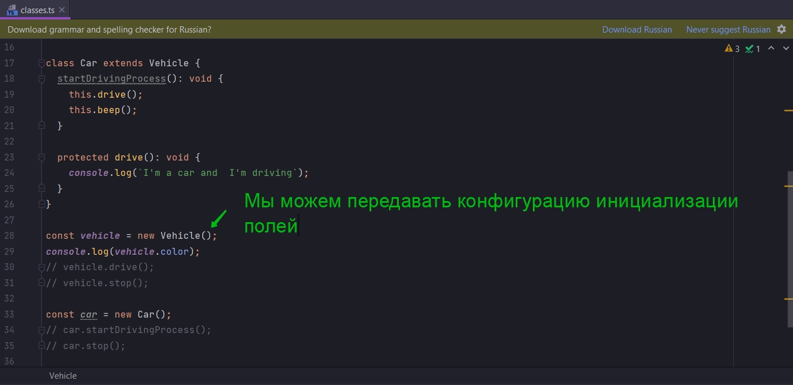
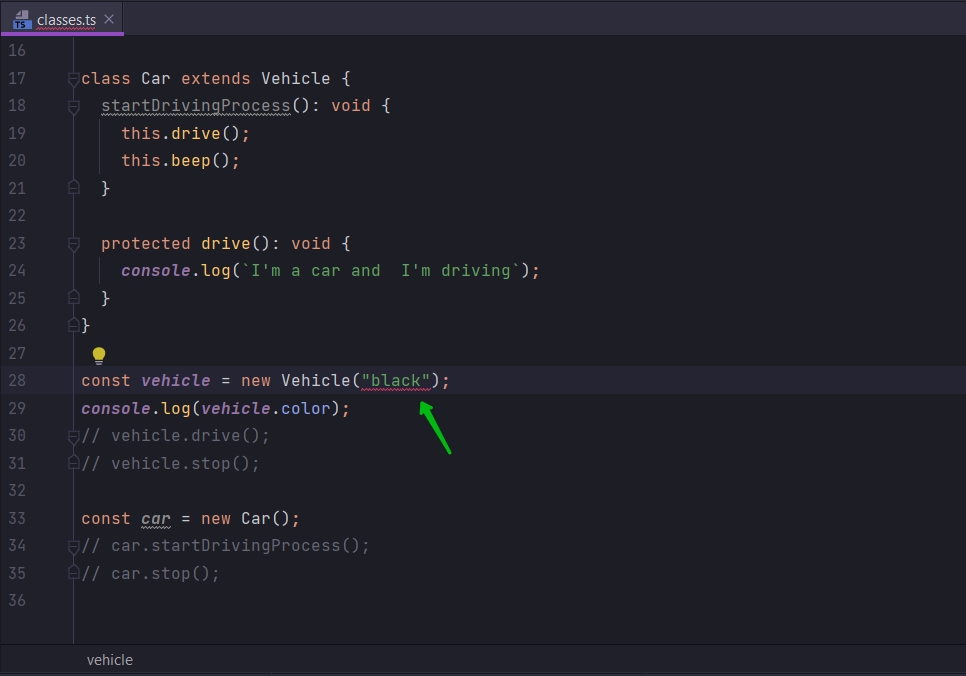
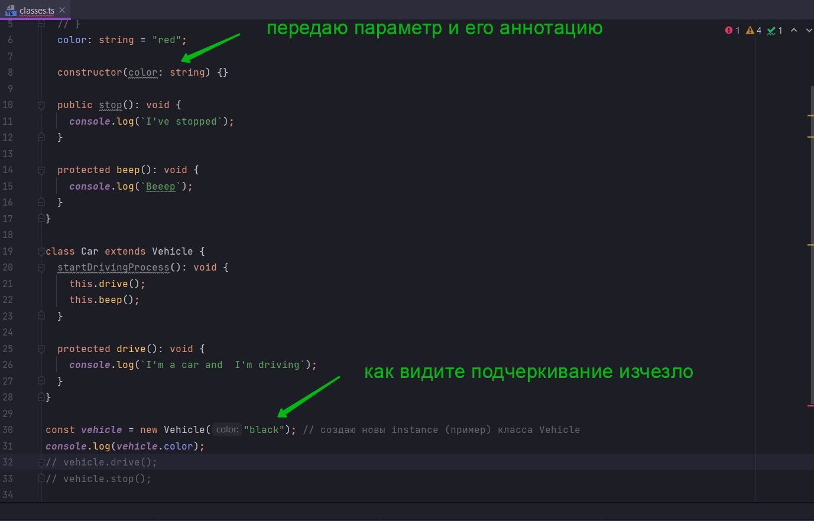
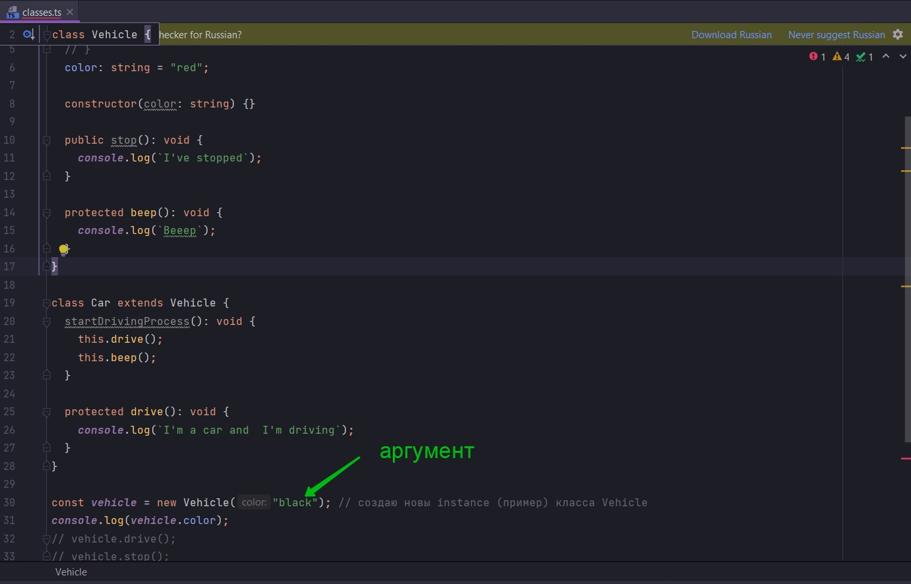
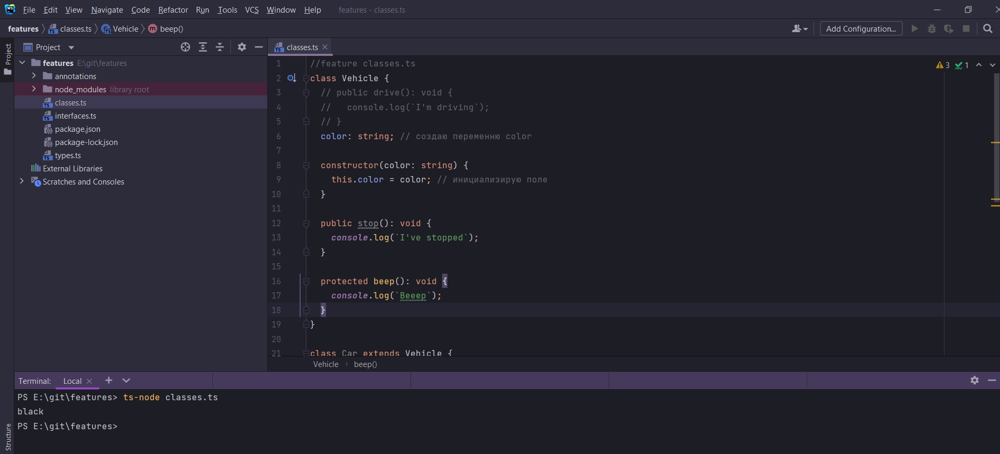
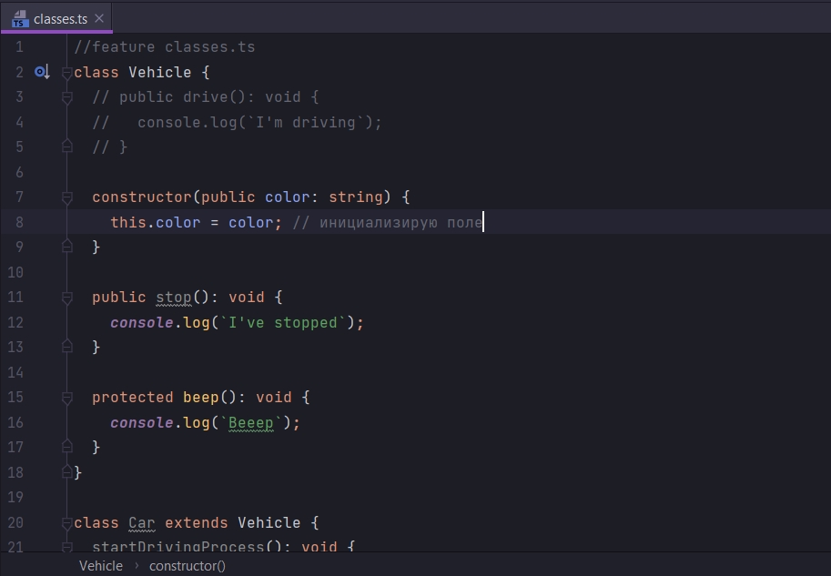
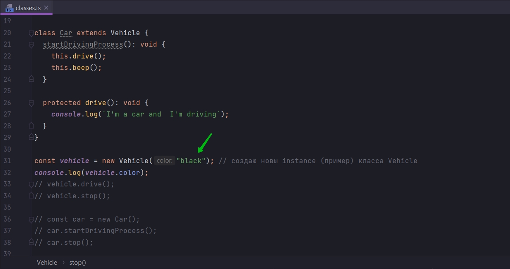
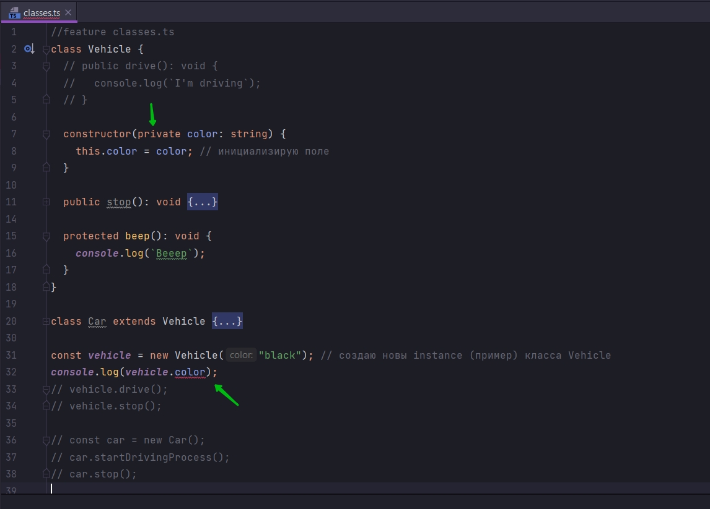

# Поля в классах

Мы рассмотрели с вами как работают методы в классах.

Теперь мы рассмотрим как отображать данные в классах.

перехожу в класс Vehicle и добавлю два поля. Это будут свойства с какими-то значениями.

Каждый раз когда мы хотим отобразить свойства в классе, мы должны написать название этого свойства, например color: и
добавить аннотацию string.

В данном случае мы просто сделали декларацию, или объявление свойства класса или поле класса color.

```ts
//feature classes.ts
class Vehicle {
    // public drive(): void {
    //   console.log(`I'm driving`);
    // }

    color: string

    public stop(): void {
        console.log(`I've stopped`);
    }

    protected beep(): void {
        console.log(`Beeep`);
    }
}

class Car extends Vehicle {
    startDrivingProcess(): void {
        this.drive();
        this.beep();
    }

    protected drive(): void {
        console.log(`I'm a car and  I'm driving`);
    }
}

const vehicle = new Vehicle();
// vehicle.drive();
vehicle.stop();

const car = new Car();
car.startDrivingProcess();
car.stop();

```

Но мы не присвоили ни какое значение этому свойству или полю. Но мы можем это сделать.

```ts
//feature classes.ts
class Vehicle {
    // public drive(): void {
    //   console.log(`I'm driving`);
    // }

    color: string = "red";

    public stop(): void {
        console.log(`I've stopped`);
    }

    protected beep(): void {
        console.log(`Beeep`);
    }
}

class Car extends Vehicle {
    startDrivingProcess(): void {
        this.drive();
        this.beep();
    }

    protected drive(): void {
        console.log(`I'm a car and  I'm driving`);
    }
}

const vehicle = new Vehicle();
// vehicle.drive();
vehicle.stop();

const car = new Car();
car.startDrivingProcess();
car.stop();

```

Это значит что каждый раз когда мы будем создавать объект класса Vehicle, этот объект будет иметь свойство color. И этот
цвет изначально будет инициализирован red красным цветом.

Т.е. теперь после создания инстанса класса vehicle мы можем обратится к жтому свойству.



```ts
//feature classes.ts
class Vehicle {
    // public drive(): void {
    //   console.log(`I'm driving`);
    // }

    color: string = "red";

    public stop(): void {
        console.log(`I've stopped`);
    }

    protected beep(): void {
        console.log(`Beeep`);
    }
}

class Car extends Vehicle {
    startDrivingProcess(): void {
        this.drive();
        this.beep();
    }

    protected drive(): void {
        console.log(`I'm a car and  I'm driving`);
    }
}

const vehicle = new Vehicle();
console.log(vehicle.color);
// vehicle.drive();
// vehicle.stop();

const car = new Car();
// car.startDrivingProcess();
// car.stop();

```



Это один из способов инициализации переменной внутри класса.

Так же очень часто мы можем инициализировать переменную класса во время создания объекта класса. Т.е. когда мы создаем
переменную при помощи ключевого слова new. Мы можем передавать конфигурации инициализацию каких то полей.



Было бы удобно конечно сюда передавать какой-то цвет, потому что не обязательно транспортное средство сразу должно быть
красным. Мы должны иметь возможность передавать какой-то цвет что бы инициализио=ровать объект сразу каким-то цветом по
нашему желанию.



Но как мы видим мы этого сделать не можем.

Мы не определили специальную функцию в классе Vehicle называемую constructor. В constructor мы потом можем передавать
какие-то аргументы.

constructor - это специальная функция определяемая внутри класса. Эта функция запускается автоматически после того как
мы создаем новый instance этого класса const vehicle = new Vehicle();

В конструктор мы можем передавать параметры как в обычную функцию в этот constructor.



```ts
//feature classes.ts
class Vehicle {
    // public drive(): void {
    //   console.log(`I'm driving`);
    // }
    color: string = "red";

    constructor(color: string) {
    }

    public stop(): void {
        console.log(`I've stopped`);
    }

    protected beep(): void {
        console.log(`Beeep`);
    }
}

class Car extends Vehicle {
    startDrivingProcess(): void {
        this.drive();
        this.beep();
    }

    protected drive(): void {
        console.log(`I'm a car and  I'm driving`);
    }
}

const vehicle = new Vehicle("black"); // создаю новы instance (пример) класса Vehicle
console.log(vehicle.color);
// vehicle.drive();
// vehicle.stop();

const car = new Car();
// car.startDrivingProcess();
// car.stop();

```

И далее с этой строкой, с этим аргументом который мы получим при создании класса, что-то проделывать в конструкторе.



теперь где я инициализировал color: string = "red"; я могу удалить инициализацию переменной. оставляю color: string;

Теперь поле color я буду инициализировать в constructor.

```ts
//feature classes.ts
class Vehicle {
    // public drive(): void {
    //   console.log(`I'm driving`);
    // }
    color: string; // создаю переменню color

    constructor(color: string) {
        this.color = color; // инициализирую поле
    }

    public stop(): void {
        console.log(`I've stopped`);
    }

    protected beep(): void {
        console.log(`Beeep`);
    }
}

class Car extends Vehicle {
    startDrivingProcess(): void {
        this.drive();
        this.beep();
    }

    protected drive(): void {
        console.log(`I'm a car and  I'm driving`);
    }
}

const vehicle = new Vehicle("black"); // создаю новы instance (пример) класса Vehicle
console.log(vehicle.color);
// vehicle.drive();
// vehicle.stop();

// const car = new Car();
// car.startDrivingProcess();
// car.stop();

```



Я еще могу сократить код с помощью модификатора public.



```ts
//feature classes.ts
class Vehicle {
    // public drive(): void {
    //   console.log(`I'm driving`);
    // }

    constructor(public color: string
    ) {
        this
            .color = color; // инициализирую поле
    }

    public

    stop()
        :
        void {
        console.log(`I've stopped`);
    }

    protected

    beep()
        :
        void {
        console.log(`Beeep`);
    }
}

class Car extends Vehicle {
    startDrivingProcess(): void {
        this.drive();
        this.beep();
    }

    protected

    drive(): void {
        console.log(`I'm a car and  I'm driving`);
    }
}

const vehicle = new Vehicle("black"); // создаю новы instance (пример) класса Vehicle
console.log(vehicle.color);
// vehicle.drive();
// vehicle.stop();

// const car = new Car();
// car.startDrivingProcess();
// car.stop();

```

Теперь первый аргумент который передается в конструктор при вызове new Vehicle.



Мы присваиваем public полю color. Т.е. мы создаем для объекта эту переменную color и присваиваем ей передаваемое
строковое значение которая передается в качестве аргумента, в нашем случаа black.

Мы будем использовать сокращенную инициализацию очень часто.

Теперь поговорим о модификаторах.

Они точно так же применяются к переменным или к полям класса как и к методам или функциям.

Мы так же можем использовать модификатор privet. Но как мы помним что мы не можем обращаться к данному свойству ни
откуда кроме как изнутри самого класса.



С protected мы так же не можем обращаться снаружи класса. Но мы можем обращаться не только внутри класса, но и в классе
наследника.

