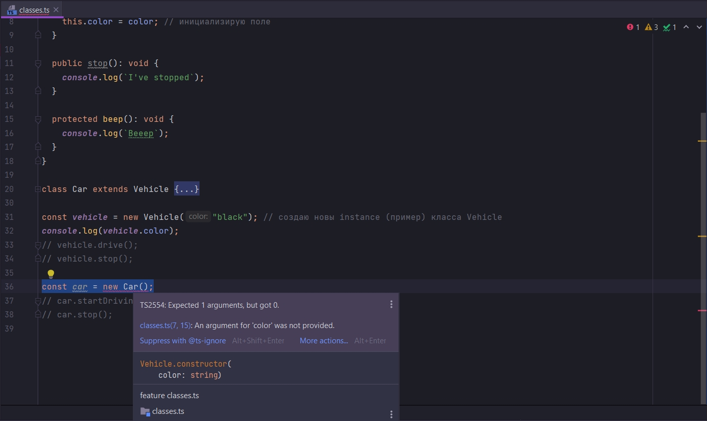
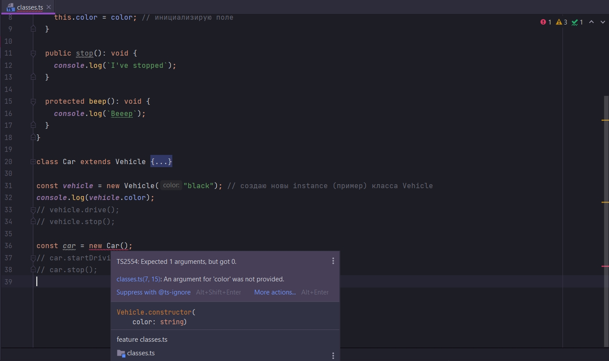
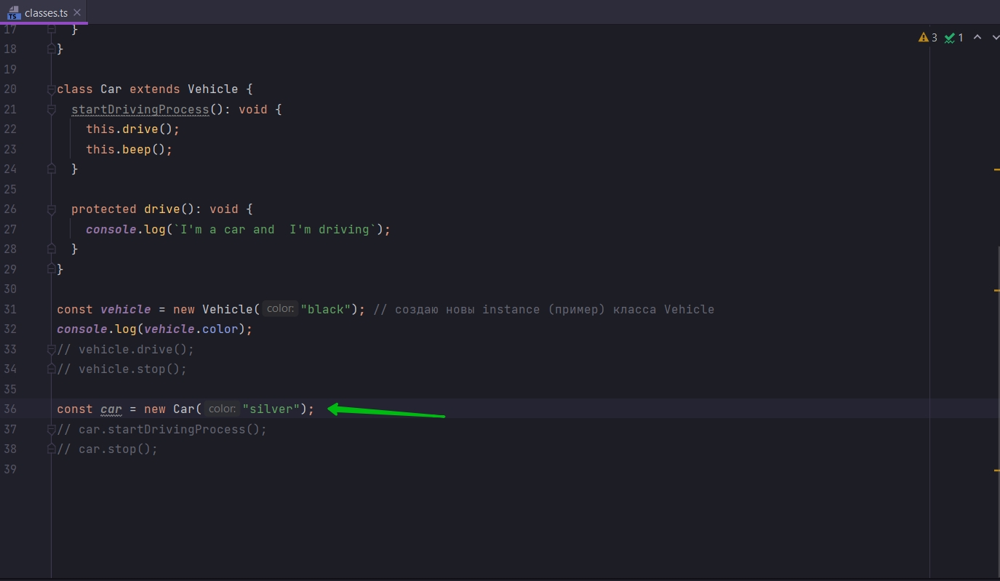
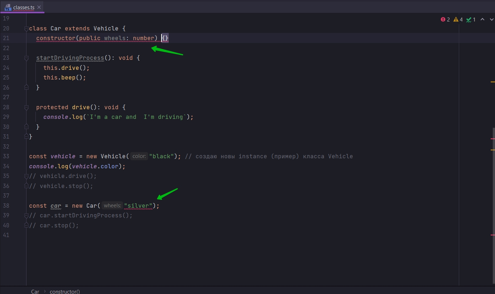
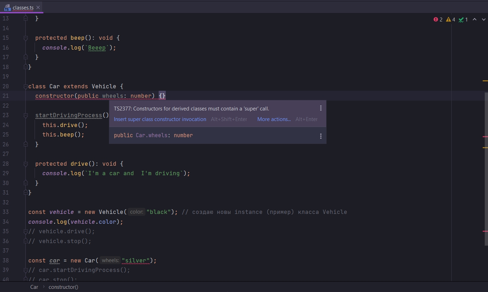
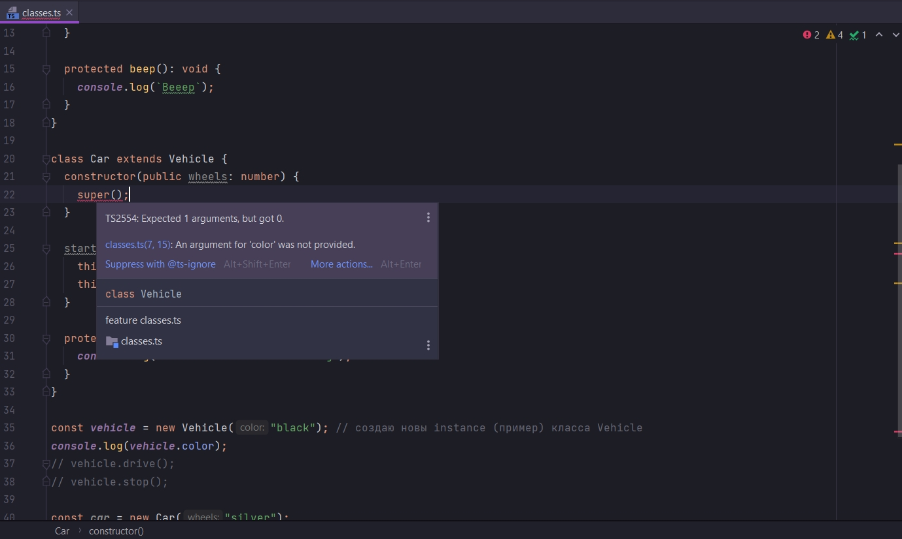
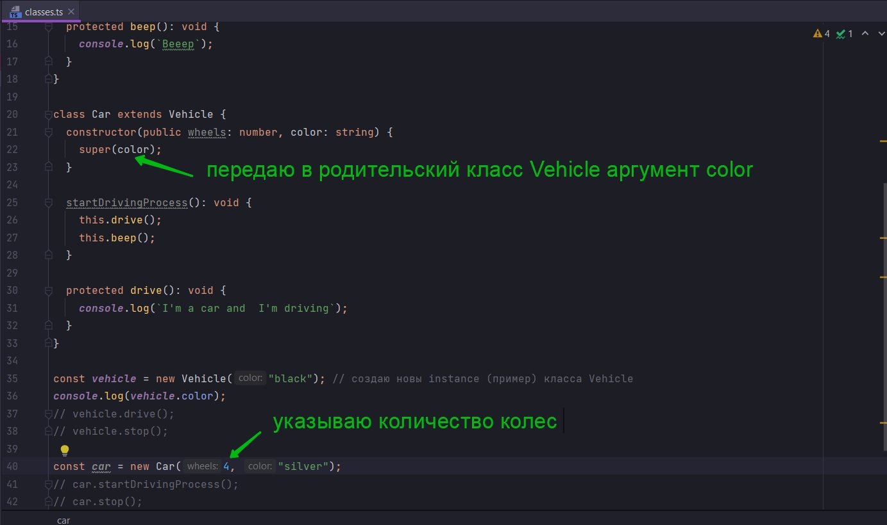

# Поля и наследование

```ts
//feature classes.ts
class Vehicle {
    // public drive(): void {
    //   console.log(`I'm driving`);
    // }

    constructor(public color: string) {
        this.color = color; // инициализирую поле
    }

    public stop(): void {
        console.log(`I've stopped`);
    }

    protected beep(): void {
        console.log(`Beeep`);
    }
}

class Car extends Vehicle {
    startDrivingProcess(): void {
        this.drive();
        this.beep();
    }

    protected drive(): void {
        console.log(`I'm a car and  I'm driving`);
    }
}

const vehicle = new Vehicle("black"); // создаю новы instance (пример) класса Vehicle
console.log(vehicle.color);
// vehicle.drive();
// vehicle.stop();

const car = new Car();
// car.startDrivingProcess();
// car.stop();

```

Теперь когда мы знаем как работают поля внутри классов давайте разберем как они работают во время наследования.

Расскоментирую const car = new Car();

Как видите у нас здесь появляется ошибка.



И вот в чем проблема. Наш класс Car унаследован от класса Vehicle т.е. класс Car является классом наследником.

И каждый раз когда мы создаем то что является Vehicle, мы должны передавать в коструктор строку, которая будет
присваиваться полю color.

Именно по этому мы и получаем ошибку потому что мы должны в instance класса Car передать строку которая будет color.





```ts
//feature classes.ts
class Vehicle {
    // public drive(): void {
    //   console.log(`I'm driving`);
    // }

    constructor(public color: string) {
        this.color = color; // инициализирую поле
    }

    public stop(): void {
        console.log(`I've stopped`);
    }

    protected beep(): void {
        console.log(`Beeep`);
    }
}

class Car extends Vehicle {
    startDrivingProcess(): void {
        this.drive();
        this.beep();
    }

    protected drive(): void {
        console.log(`I'm a car and  I'm driving`);
    }
}

const vehicle = new Vehicle("black"); // создаю новы instance (пример) класса Vehicle
console.log(vehicle.color);
// vehicle.drive();
// vehicle.stop();

const car = new Car("silver");
// car.startDrivingProcess();
// car.stop();

```

Здесь происходит кое что интересное. В данный момент у нас в классе Car нет конструктора. И по этому TS каждый раз когда
мы будем создавать новый объект класса Car будет вызывать коструктор класса родителя т.е. Vehicle.

Но если мы создадим конструктор и в классе наследнике, то все будет происходить немного по другому.



Как только мы создали этот конструктор, то сразу же появляется красное подчеркивание



Т.е. конструкторы классов наследников должны содержать вызов функции super. С помощью него мы вызываем конструктор
родительского класса.



Мы должны передать какой-то цвет.

В конструктор класса Car передаю второй параметр color:string. И я не прописываю ему модификатор public, потому что я
хочу в качестве аргумента использовать color из класса родителя Vehicle.



```ts
//feature classes.ts
class Vehicle {
    // public drive(): void {
    //   console.log(`I'm driving`);
    // }

    constructor(public color: string) {
        this.color = color; // инициализирую поле
    }

    public stop(): void {
        console.log(`I've stopped`);
    }

    protected beep(): void {
        console.log(`Beeep`);
    }
}

class Car extends Vehicle {
    constructor(public wheels: number, color: string) {
        super(color);
    }

    startDrivingProcess(): void {
        this.drive();
        this.beep();
    }

    protected drive(): void {
        console.log(`I'm a car and  I'm driving`);
    }
}

const vehicle = new Vehicle("black"); // создаю новы instance (пример) класса Vehicle
console.log(vehicle.color);
// vehicle.drive();
// vehicle.stop();

const car = new Car(4, "silver");
// car.startDrivingProcess();
// car.stop();

```


