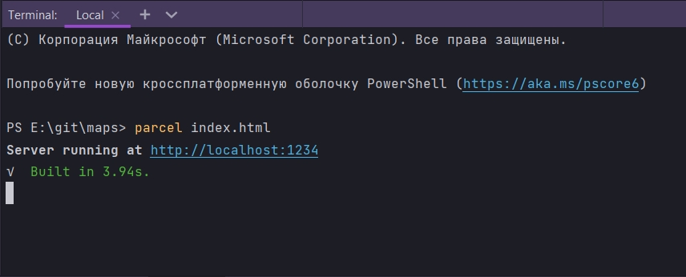
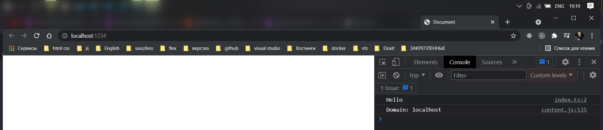
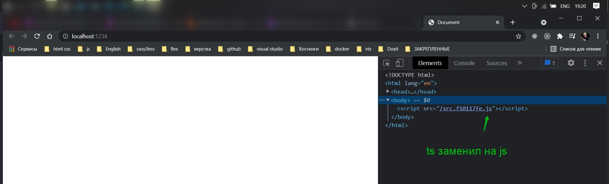

# Запуск приложения с помощью Parcel

Устанавливаю в том проекте в котором работал.

```shell
npm i -g parcel-bundler

```

Далее нужно сделать кое какую инициализацию для нашего прокта.

Создаю проект maps.

```html
<!doctype html>
<html lang="en">
<head>
    <meta charset="UTF-8">
    <meta name="viewport"
          content="width=device-width, user-scalable=no, initial-scale=1.0, maximum-scale=1.0, minimum-scale=1.0">
    <meta http-equiv="X-UA-Compatible" content="ie=edge">
    <title>Document</title>
</head>
<body>
<script src="./src/index.ts"></script>
</body>
</html>
```

```ts
//index.ts
console.log("Hello");

```

Сейчас мы parcel передадим html файл.

```shell
parcel index.html

```

Parcel увидил ts файл и установил еще пару зависимостей. У меня появилось сообщение что мое приложение находится по
адресу.








