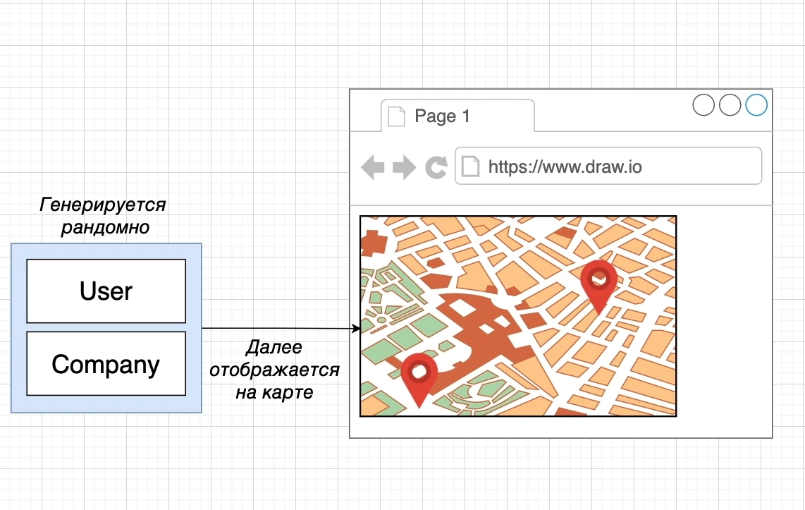
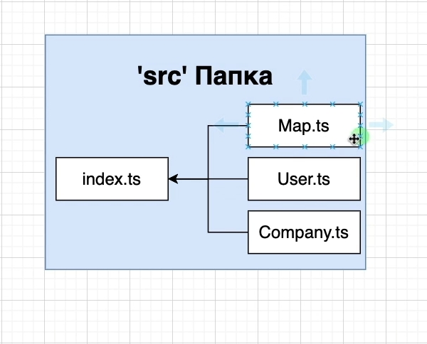

# Структура проекта

Создадим несколько файлов. Каждый файл будет содержать один класс. Каждый из этих классов будет отображать какую-то
сущность в нашем проекте.

Класс User будет иметь какие-то методы и поля которые будут ассоциироваться с пользователем. Все эти свойства, поля
будут определять что значит быть пользователем.

Класс Company так же будет отображать что из себя представляет компания в нашем приложении.

И последний такой кусок в нашем приложении это сама карта. Мы можем создать отдельный файл и в него поместить класс
который будет отображать карту.

