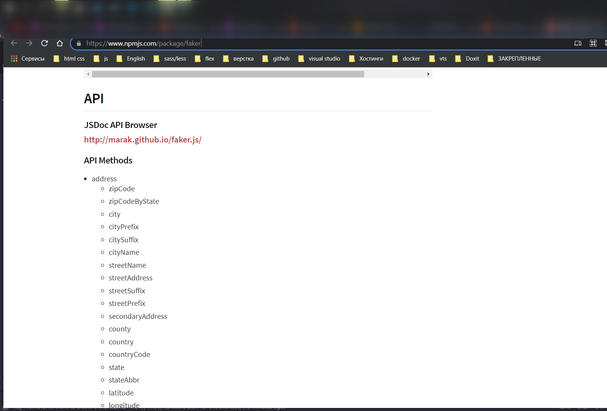
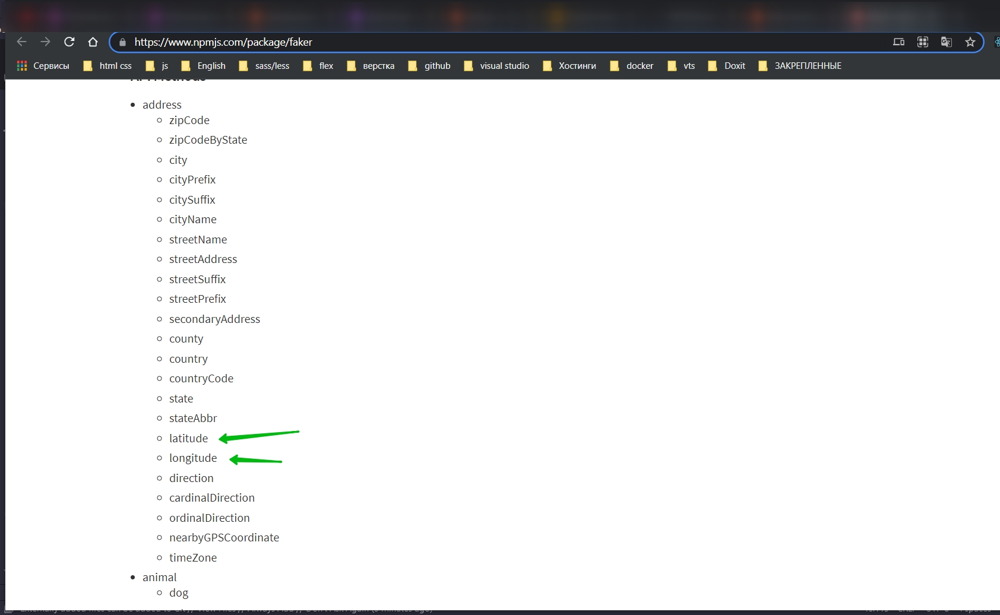
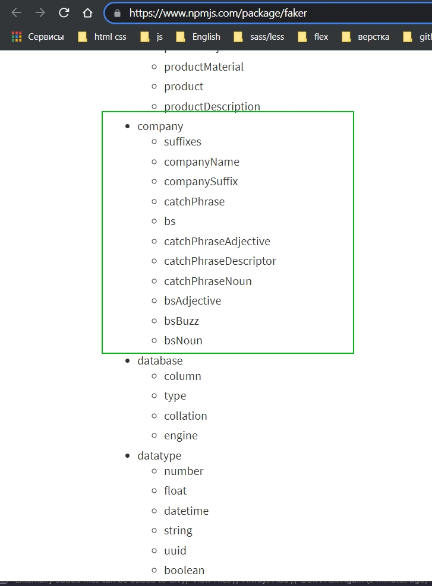
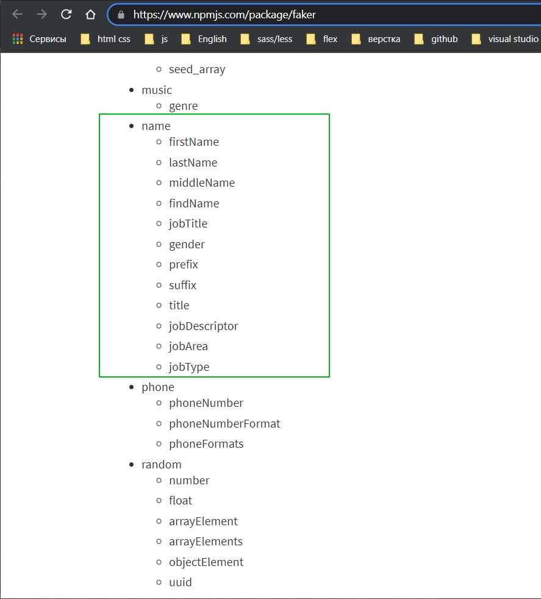
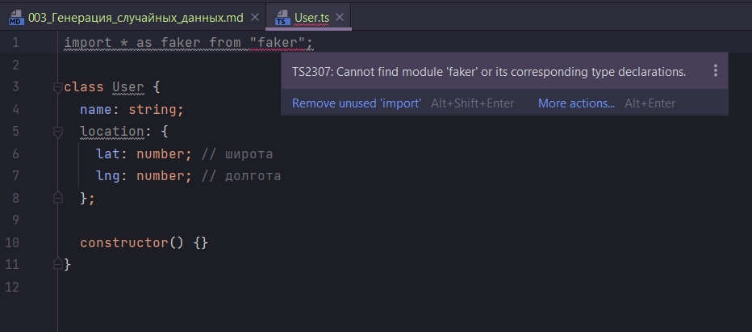

# Генерация случайных данных

Класс User будет содержать данные которые будут генерировать рандомно.

```ts
class User {
    name: string;
    location: {
        lat: number; // широта
        lng: number; // долгота
    };
}

```

Широту и долготу мы будем генерировать рандомно.

Если вы помните, когда мы создаем свйства или поля мы должны их инициализировать либо в той же строке кода, либо в
constructor. Если это какое-то не изменяемое значение, то мы можем сразу же присвоить это значение переменной.

Но в данном случае мы хотим рандомно генерировать и имя и location. Здесь нам целесообразно использовать функцию
constructor.

```ts
class User {
    name: string;
    location: {
        lat: number; // широта
        lng: number; // долгота
    };

    constructor() {
    }
}

```

Теперь рассмотрим документацию библиотеки с помощью которой мы будем генерировать случайные...

[https://www.npmjs.com/package/faker](https://www.npmjs.com/package/faker)

И переходим к API.



Мы можем использовать модуль address что бы генерировать zipCode, city. Как видите тут есть и широта с долготой.



И так же тут есть модуль company.





```shell
npm i faker
```

```ts
import * as faker from "faker";

class User {
    name: string;
    location: {
        lat: number; // широта
        lng: number; // долгота
    };

    constructor() {
    }
}

```

Это * as подставил webStorm.

Далее разберемся почему мы видим это предупреждение

