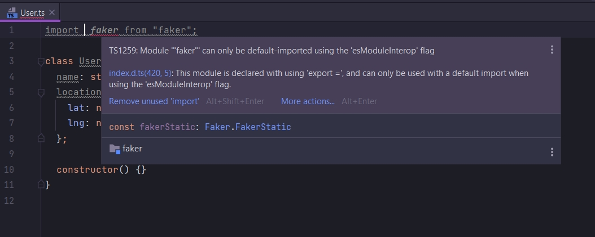
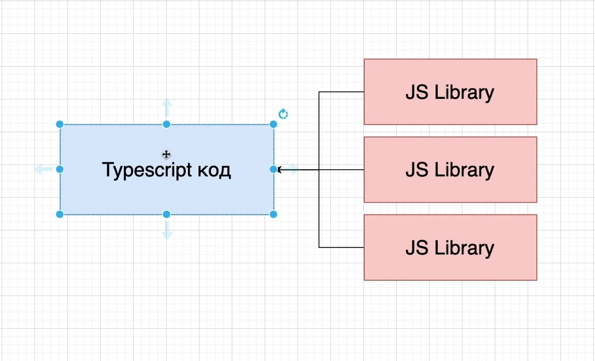
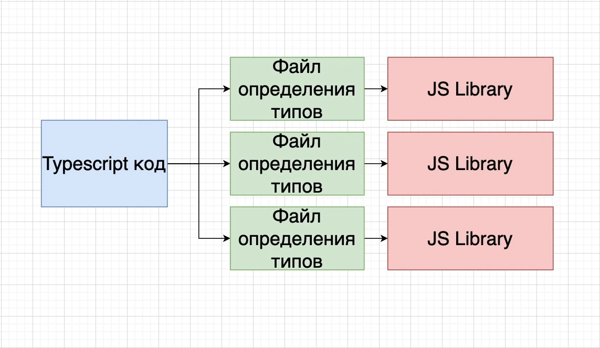
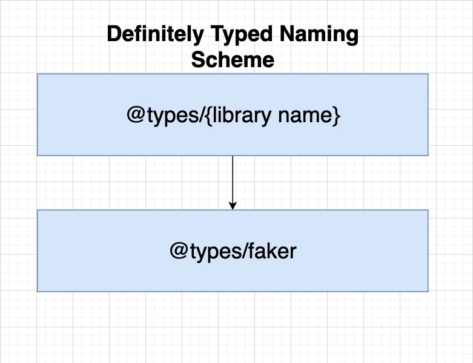
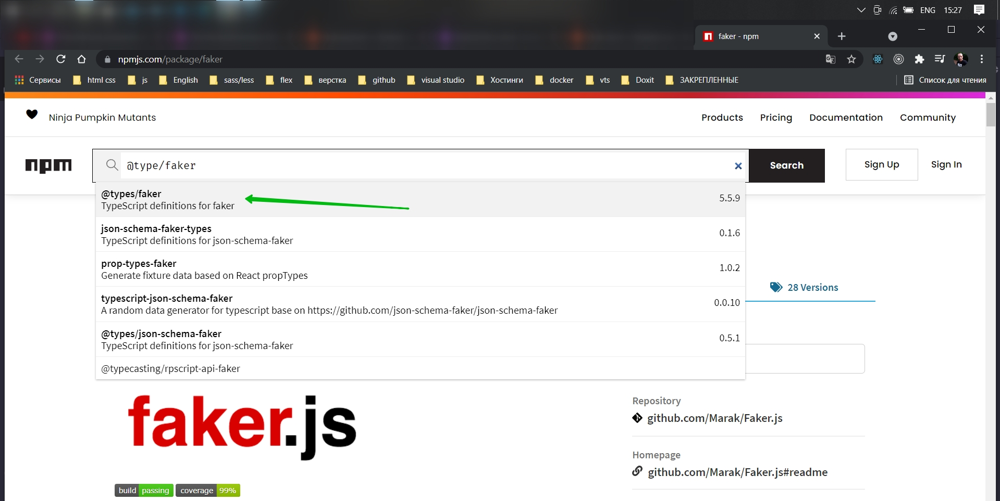
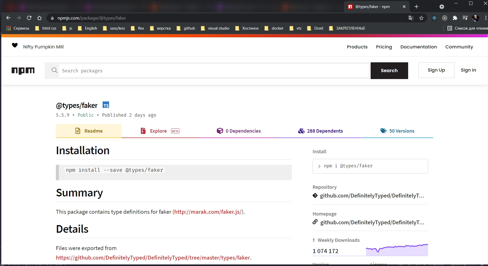

# Файлы определения типов

Не возможно найти файл декларации для модуля faker

Как помните TS хочет проверять наш код использую типы. Он хочет хнать все функции которые у вас в проекте. Какого типа
параметры они принимают и какого типа возвращаемое значение в этих функциях.

В TS есть такая штука как файл определения типов. Его можно рассматривать как адаптер между TS кодом который мы пишем и
JS кодом библиотеки или файлами которые мы пишем.

Файлы определения типов говорять TS компилятору типы параметров всех функций которые используются в библиотеках JS.

Иногда файл определения типов устанавливается автоматически когда мы устанавливаем ту или иную библиотеку.

Модуль faker не имеет файл определения типов и поэтому мы должны установить этот файл определения типов вручную.

Каждый раз когда вы пытаетесь импортировать библиотеку и видите такое предупреждение, то это значит что нужно установить
файл определения типов вручную.

[https://www.npmjs.com/package/@types/faker](https://www.npmjs.com/package/@types/faker)

