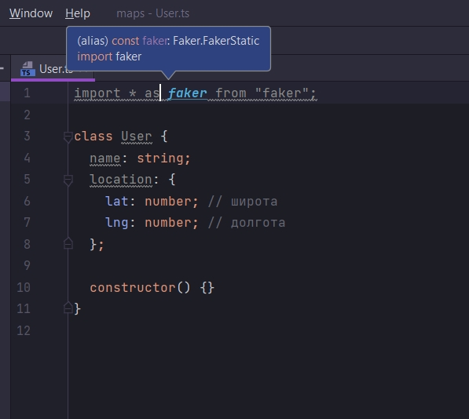
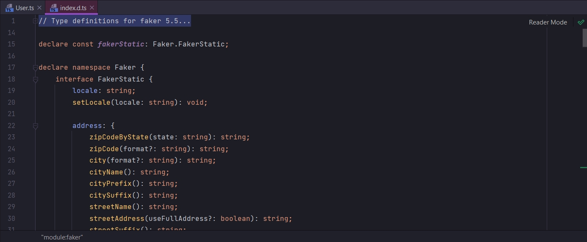
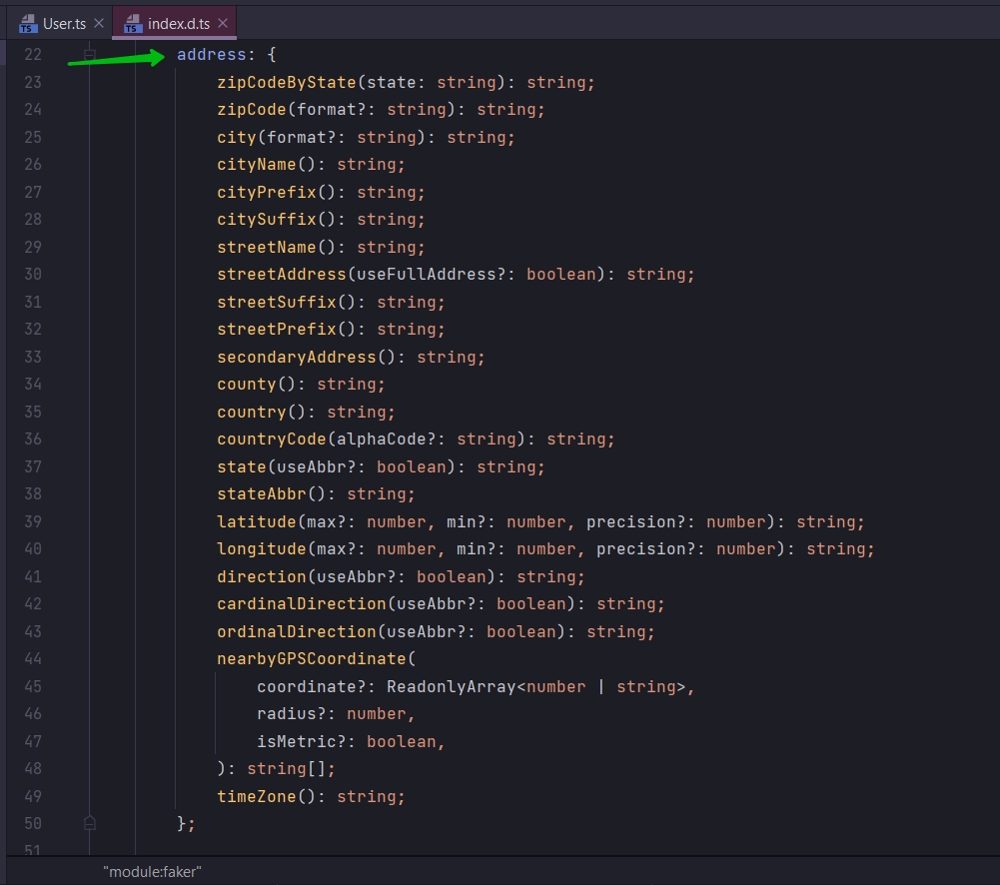
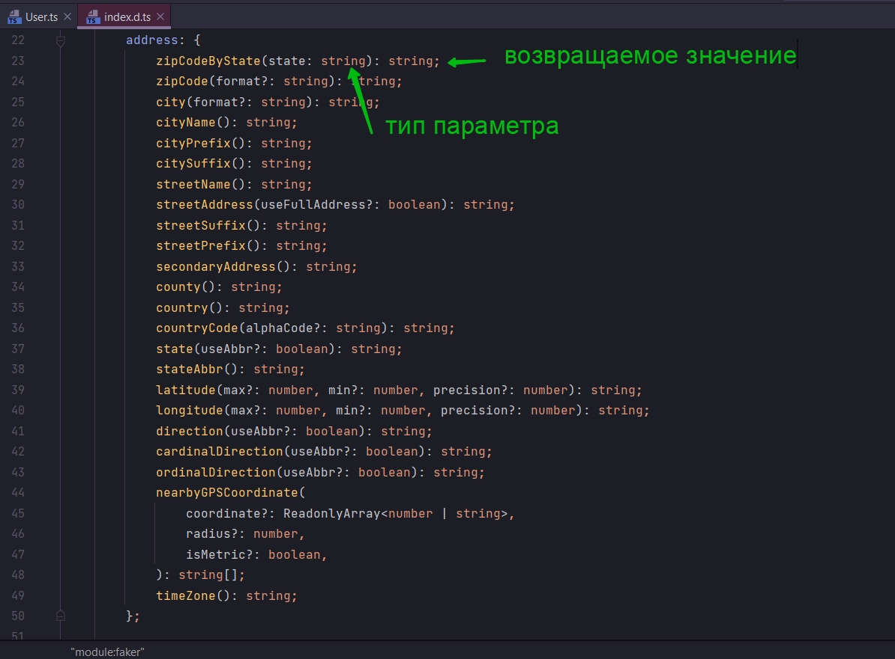
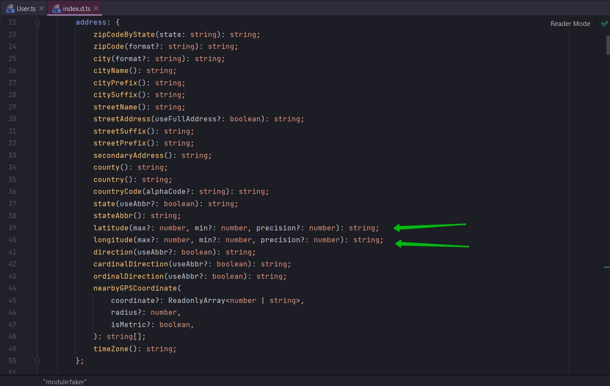
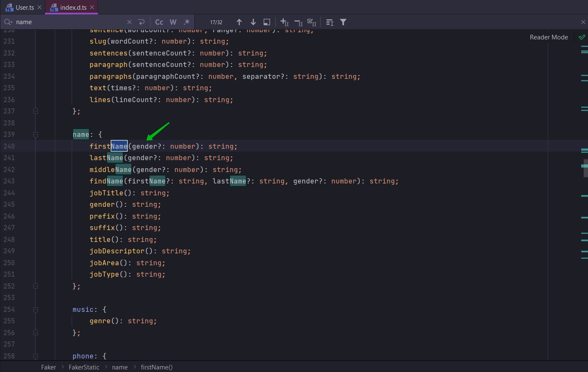
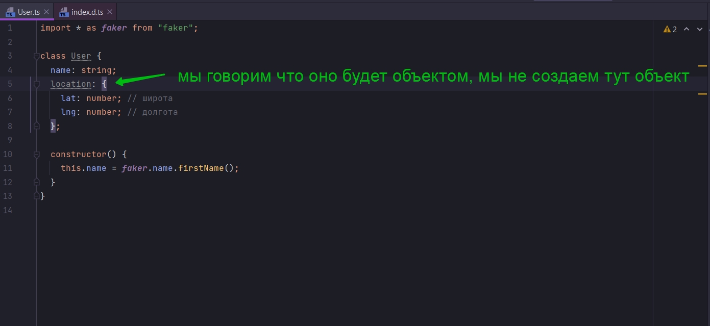
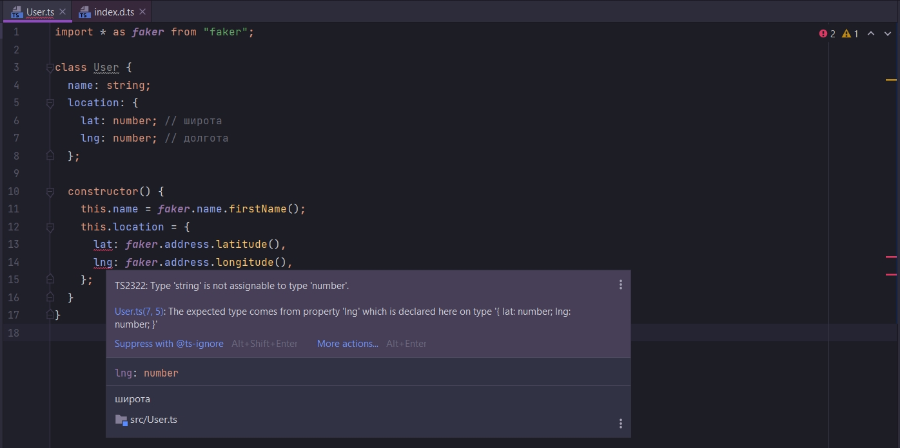
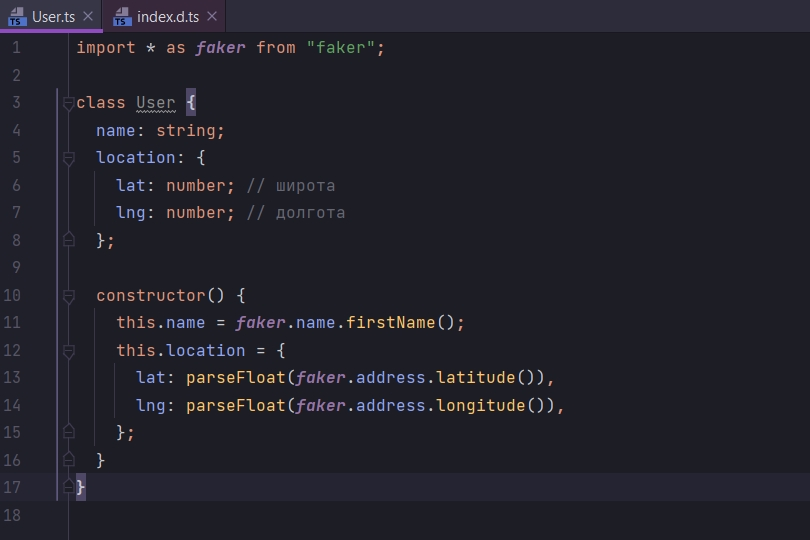

# Использование файлов определения типов

После установки файла определения типа я могу войти в этот файл Ctrl + название в импорте.





Единственная цель данного файла описать все типы, функции, значения объектов классов которые содержатся в этой
библиотеке. Это мы можем использовать как источник какой-то документации.



Как видим address это объект содержащий большое количество функций. Так же мы видим типы параметров которые принимают
эти функции и значения которые возвращаются из функции.



Смотрите долгота и ширина возвращают значения типа string



Это довольно не обычно. Потому что они отображаются как значения числового типа.

И так когда будет создаваться новый пользователь мы будем случайно генерировать имя и присваивать его соответствующему
полю этого объекта.

```ts
import * as faker from "faker";

class User {
    name: string;
    location: {
        lat: number; // широта
        lng: number; // долгота
    };

    constructor() {
        this.name = faker.name.firstName();
    }
}

```

Иногда файл определения дает нам больше информации чем официальная докуметация. Как видим мы можем определить пол



Теперь посмотрим на объект location. Важный момент. Когда мы будем создавать пользователя location не будет автоматичеки
становиться объектом. Т.е. в классе User мы говорим что оно будет объектом, мы не создаем тут объект.



Поэтому мы ответственны за инициализацию этого объекта. Как самого объекта, так и свойств этого объекта.

```ts
import * as faker from "faker";

class User {
    name: string;
    location: {
        lat: number; // широта
        lng: number; // долгота
    };

    constructor() {
        this.name = faker.name.firstName();
        this.location = {
            lat: faker.address.latitude(),
            lng: faker.address.longitude(),
        };
    }
}

```

И мы сразу получаем ошибку.



Тип string не может быть присвоет типу number.

Когда мы смотрели в файл определения то том четко было написано что возвращаются string.

Теперь мне эти строки нужно сконвертировать в number. Делаю это с помощью функции parseFloat.

[https://learn.javascript.ru/number](https://learn.javascript.ru/number)



```ts
import * as faker from "faker";

class User {
    name: string;
    location: {
        lat: number; // широта
        lng: number; // долгота
    };

    constructor() {
        this.name = faker.name.firstName();
        this.location = {
            lat: parseFloat(faker.address.latitude()),
            lng: parseFloat(faker.address.longitude()),
        };
    }
}

```


