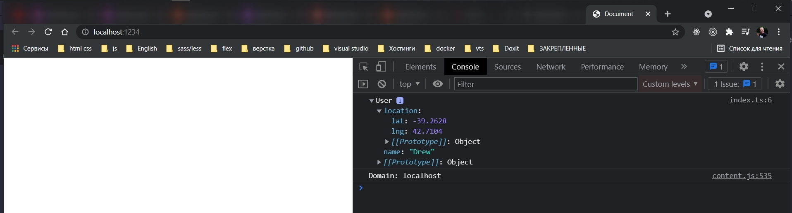

# Экспорт в TypeScript

Для того что бы использовать класс где угодно использую ключевое слово export.

```ts
import * as faker from "faker";

export class User {
    name: string;
    location: {
        lat: number; // широта
        lng: number; // долгота
    };

    constructor() {
        this.name = faker.name.firstName();
        this.location = {
            lat: parseFloat(faker.address.latitude()),
            lng: parseFloat(faker.address.longitude()),
        };
    }
}

```

```ts
//index.ts
import {User} from "./User";

```

Объяснение фигурных скобок. Каждый раз когда мы экспортируем из файла используя ключевое слово export, то всгда в другом
файле мы будем получать экспортируемый класс таким образом.

Если я экспортирую что-то по default то фигурные скобки, в файле кута мы импортируем, использовать не нужно.

По конвенции TS не используют ключевое слово default

```ts
//index.ts
import {User} from "./User";

const user = new User();

console.log(user);

```

```shell
parcel index.html

```



