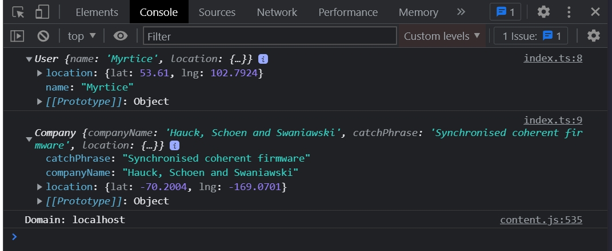

# 007_Создание_класса_Company

Т.к. это все повторяется описание всего писать буду по минимуму.

```ts
// src Company.ts
import * as faker from "faker";
import {fake} from "faker";

export class Company {
    companyName: string;
    catchPhrase: string; // крылатая фраза
    // Это не объект. Это будет объектом после инициализации в конструкторе
    location: {
        lat: number;
        lng: number;
    };

    //Инициализирую все в конструкторе
    constructor() {
        this.companyName = faker.company.companyName();
        this.catchPhrase = faker.company.catchPhrase();
        this.location = {
            lat: parseFloat(faker.address.latitude()),
            lng: parseFloat(faker.address.longitude()),
        };
    }
}

```

```ts
//index.ts
import {User} from "./User";
import {Company} from "./Company";

const user = new User();
const company = new Company();

console.log(user);
console.log(company);

```



