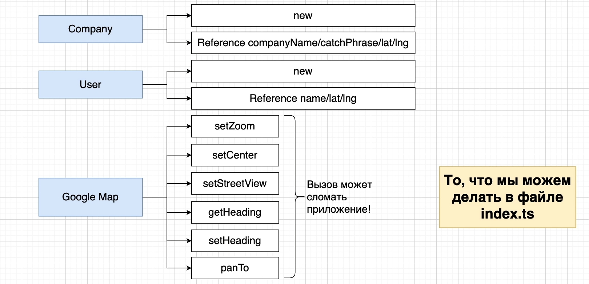
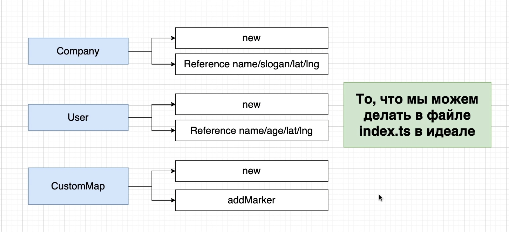
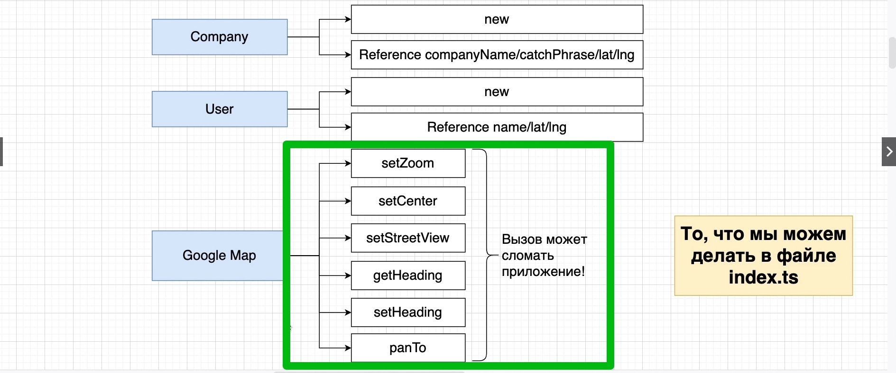

# 011_Скрытая_функциональность



```ts
//index.ts
// import { User } from "./User";
// import { Company } from "./Company";

new google.maps.Map(document.getElementById("map"), {
    zoom: 1,
    center: {
        lat: 0,
        lng: 0,
    },
});

```

Присвою это все переменной.

```ts
//index.ts
// import { User } from "./User";
// import { Company } from "./Company";

const map = new google.maps.Map(document.getElementById("map"), {
    zoom: 1,
    center: {
        lat: 0,
        lng: 0,
    },
});

```

Есть ли какой-то способ что бы ограничить доступ к карте? Что бы другие разработчики не сломали приложение.



Мы можем запретить позволять создавать в нашем приложении new объект класса Company и вызывать какие-то методы и
свойства.

Тоже самое создавать новый объект класса User и обращаться к его свойствам.

Для этого мы можем создать новый класс к приметру castomMap. Этот класс можно будет импользовать для создания новых
объектов и так же мы можем добавить в этот класс метод addMarker.

И суть в том что Google Map и все потенциально опасные методы



не будут доступны т.е. они не будут видны внутри нашего index.ts 