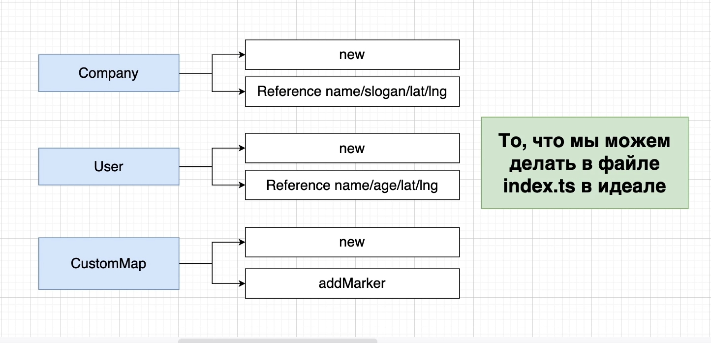
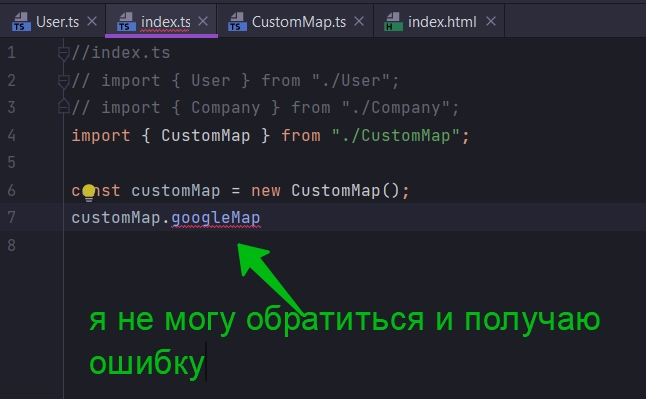
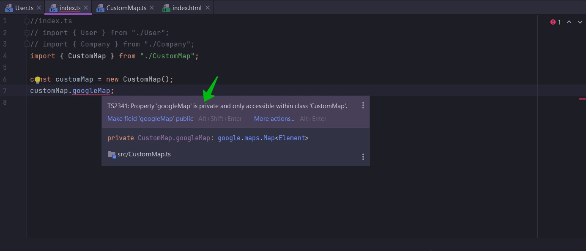
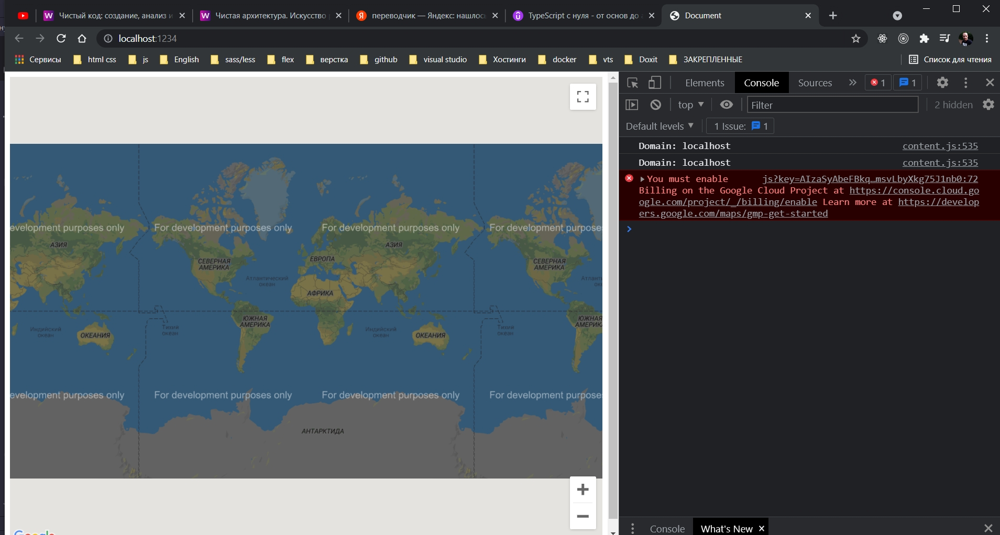
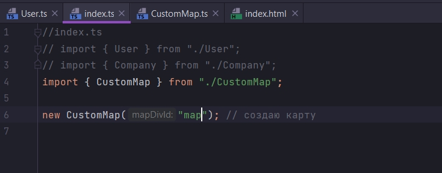

# 012_Зачем_использовать_модификаторы_private

Скроем функциональность Google Maps от других разработчиков.



Создание класса customMap позволит нам скрыть Google Maps. Будет давать доступ к какому-то ограниченному количеству
информации т.е. new и addMarker. Все что мы будет давать делать это создавать новый класс Company и вызывать его
различные свойства.

Создавать объект класса User и вызывать его различные свойства.

И так же создавать объект класса customMap и вызывать только метод addMarker.

Это сделает наше приложение очень простым.

В src создаю новый файл CustomMap.ts

```ts
//src CustomMap.ts
export class CustomMap {
}

//src CustomMap.ts
export class CustomMap {
}

```

И данный класс будет иметь лишь одно свойство. Будет иметь ссылку на Google Map.

```ts
//src CustomMap.ts
export class CustomMap {
    googleMap: google.maps.Map;
}

```

Т.е. в этой переменной googleMap будет храниться объект класса google.maps.Map

```ts
//src CustomMap.ts
export class CustomMap {
    googleMap: google.maps.Map;

    //инициализирую карту и отображаю ее на экране
    constructor() {
        this.googleMap = new google.maps.Map(document.getElementById("map"), {
            zoom: 1,
            center: {
                lat: 0,
                lng: 0,
            },
        });
    }
}

```

Из index.ts все удаляю.

Если вы помните, каждый раз когда мы создаем свойсва в классе оно имеет по умолчанию модификатор доступа public. И этот
модификатор обозначает что из любого места в приложении, в не этого класса, можно вызывать, обратится к этому свойству
googleMap и вызвать у него любые свойсва, поля, любые функции и методы.

Для ограничения доступа указываю модификатор privet.

```ts
//src CustomMap.ts
export class CustomMap {
    private googleMap: google.maps.Map;

    //инициализирую карту и отображаю ее на экране
    constructor() {
        this.googleMap = new google.maps.Map(document.getElementById("map"), {
            zoom: 1,
            center: {
                lat: 0,
                lng: 0,
            },
        });
    }
}

```

И это значит что вне класса customMap мы не увидим метод googleMap. И соотвтетсвенно мы не сможем к нему обратится и
вызывать различные методы которые могут привести к краху приложения.





```ts
//index.ts
// import { User } from "./User";
// import { Company } from "./Company";
import {CustomMap} from "./CustomMap";

new CustomMap(); // создаю карту

```



Что бы улучшить код класса CustomMap, сделать его переиспользуемым. Мы можем жестко закодированный id map передавать
аргументов в конструктор.

```ts
//src CustomMap.ts
export class CustomMap {
    private googleMap: google.maps.Map;

    //инициализирую карту и отображаю ее на экране
    constructor(mapDivId: string) {
        this.googleMap = new google.maps.Map(document.getElementById(mapDivId), {
            zoom: 1,
            center: {
                lat: 0,
                lng: 0,
            },
        });
    }
}

```

А при создании новой карты, т.е. при instance класса CustomMap теперь передаю нужный id.



```ts
//index.ts
// import { User } from "./User";
// import { Company } from "./Company";
import {CustomMap} from "./CustomMap";

new CustomMap("map"); // создаю карту

```

Теперь я могу создавать еще div в нашем приложении для отображения еще карт. К примеру на других страницах нашего
приложения.