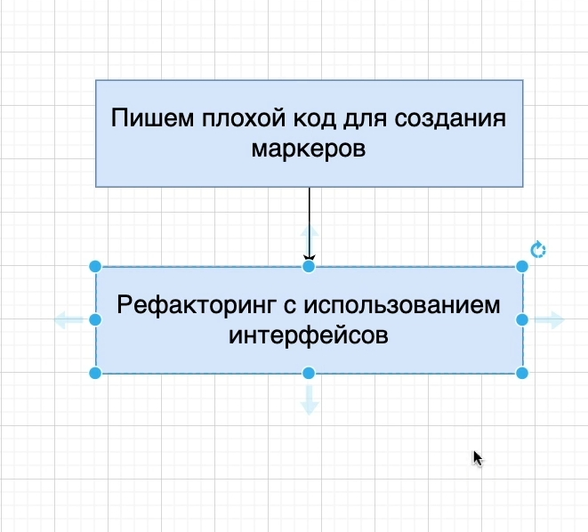
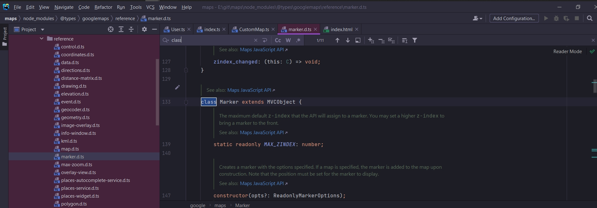

# 013_Добавление_маркеров



Плохой код. В CustomMap один метод будет user в качестве параметра и добавлять его на карту

```ts
//src CustomMap.ts
export class CustomMap {
    private googleMap: google.maps.Map;

    //инициализирую карту и отображаю ее на экране
    constructor(mapDivId: string) {
        this.googleMap = new google.maps.Map(document.getElementById(mapDivId), {
            zoom: 1,
            center: {
                lat: 0,
                lng: 0,
            },
        });
    }

    addUserMarker() {
    }

    addCompanyMarker() {

    }
}

```

Для того что бы добавить аннотацию типов нам нужно добавить эти файлы в CustomMap.

```ts
//src CustomMap.ts
import {User} from "./User";
import {Company} from "./Company";

export class CustomMap {
    private googleMap: google.maps.Map;

    //инициализирую карту и отображаю ее на экране
    constructor(mapDivId: string) {
        this.googleMap = new google.maps.Map(document.getElementById(mapDivId), {
            zoom: 1,
            center: {
                lat: 0,
                lng: 0,
            },
        });
    }

    addUserMarker() {
    }

    addCompanyMarker() {
    }
}

```

User и Company мы создали как классы. В TS классы скажем так имеют двойную природу.

- мы можем использовать классы для создания объекта этого класса
- мы можем так же использовать или точнее переменную которая относится к классу, например User, для того что бы
  ссылаться на такой тип. Т.е. мы можем создавать объекты класса User с помощью и так же создавать тип User.

```ts
//src CustomMap.ts
import {User} from "./User";
import {Company} from "./Company";

export class CustomMap {
    private googleMap: google.maps.Map;

    //инициализирую карту и отображаю ее на экране
    constructor(mapDivId: string) {
        this.googleMap = new google.maps.Map(document.getElementById(mapDivId), {
            zoom: 1,
            center: {
                lat: 0,
                lng: 0,
            },
        });
    }

    addUserMarker(user: User): void {
    }

    addCompanyMarker(company: Company): void {
    }
}

```

Написание этих двух методов по сути плохой код. И мы сейчас это обсудим почему.

Давайте обсудим что мы должны написать в этих методах. Перехожу в marker.d.ts




В нормальных приложениях в которых используется Google Map можно иметь несколько карт. Если мы и создаем маркер мы
должны указать на какую именно карту мы хотим его добавить.

Когда мы создаем маркер мы должны передать параметр opts который является объектом. Этот объект будет содержать свойства
map. В свою очередь map должно быть тип Map либо типа StreetViewPanorama


Еще одно свойство которое нам нужно это position.


```ts
//src CustomMap.ts
import {User} from "./User";
import {Company} from "./Company";

export class CustomMap {
    private googleMap: google.maps.Map;

    //инициализирую карту и отображаю ее на экране
    constructor(mapDivId: string) {
        this.googleMap = new google.maps.Map(document.getElementById(mapDivId), {
            zoom: 1,
            center: {
                lat: 0,
                lng: 0,
            },
        });
    }

    addUserMarker(user: User): void {
        new google.maps.Marker(); // создаю новый объект класса т.е. здесь вызываеся constructor в который мы можем передать какие-то опции
    }

    addCompanyMarker(company: Company): void {
    }
}

```

new google.maps.Marker(); // создаю новый объект класса т.е. здесь вызываеся constructor в который мы можем передать
какие-то опции

```ts
//src CustomMap.ts
import {User} from "./User";
import {Company} from "./Company";

export class CustomMap {
    private googleMap: google.maps.Map;

    //инициализирую карту и отображаю ее на экране
    constructor(mapDivId: string) {
        this.googleMap = new google.maps.Map(document.getElementById(mapDivId), {
            zoom: 1,
            center: {
                lat: 0,
                lng: 0,
            },
        });
    }

    addUserMarker(user: User): void {
        new google.maps.Marker({
            map: this.googleMap,
            position: {
                lat: user.location.lat,
                lng: user.location.lng,
            },
        }); // создаю новый объект класса т.е. здесь вызываеся constructor в который мы можем передать какие-то опции
    }

    addCompanyMarker(company: Company): void {
    }
}

```

```ts
//index.ts
import {User} from "./User";
// import { Company } from "./Company";
import {CustomMap} from "./CustomMap";

const user = new User(); // Создаю пользователя

const customMap = new CustomMap("map"); // создаю карту
customMap.addUserMarker(user); // Добавляю маркер на карту

```


