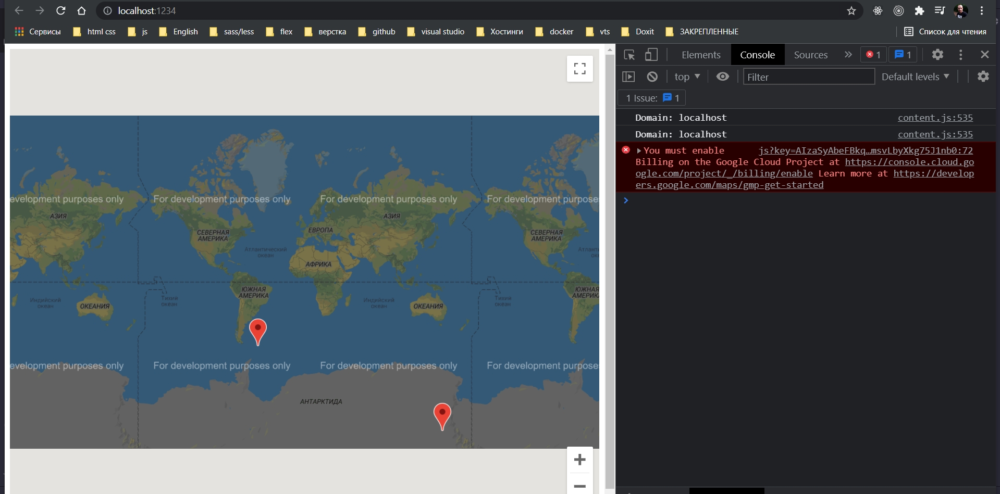

# 014_ Дублирование_кода

```ts
//src CustomMap.ts
import {User} from "./User";
import {Company} from "./Company";

export class CustomMap {
    private googleMap: google.maps.Map;

    //инициализирую карту и отображаю ее на экране
    constructor(mapDivId: string) {
        this.googleMap = new google.maps.Map(document.getElementById(mapDivId), {
            zoom: 1,
            center: {
                lat: 0,
                lng: 0,
            },
        });
    }

    addUserMarker(user: User): void {
        new google.maps.Marker({
            map: this.googleMap,
            position: {
                lat: user.location.lat,
                lng: user.location.lng,
            },
        }); // создаю новый объект класса т.е. здесь вызываеся constructor в который мы можем передать какие-то опции
    }

    addCompanyMarker(company: Company): void {
        new google.maps.Marker({
            map: this.googleMap,
            position: {
                lat: company.location.lat,
                lng: company.location.lng,
            },
        }); // создаю новый объект класса т.е. здесь вызываеся constructor в который мы можем передать какие-то опции
    }
}

```

Есть такой принцип написания кода DRY - Don't Repeat Yourself не повторяйте себя.

Нам нужно будет сделать рефакторинг.

Добавляю маркер компании.

```ts
//index.ts
import {User} from "./User";
import {Company} from "./Company";
import {CustomMap} from "./CustomMap";

const user = new User(); // Создаю пользователя
const company = new Company(); // Создаю компанию

const customMap = new CustomMap("map"); // создаю карту
customMap.addUserMarker(user); // Добавляю маркер на карту
customMap.addCompanyMarker(company);// Добавляю маркер компании

```

```shell
parcel index.html

```



Вот именно это написан плохой код. Повторяемость очень высокая. Практически все одинаковое в методах addUserMarker и
addCompanyMarker. За исключением параметров которые передаются и далее используются в своих методах.

Было бы не плохо если бы мы написали один метод который принимал бы параметр и этот параметр длжен проверяться на то что
у него ест такие свойства lat и lng. В этом случае параметру будет позволено быть аргументом при вызове метода
addUserMarker и addCompanyMarker.