# 015_Одно_из_возможных_решений

Начнем с одного подхода, но он теже имеет свои не очень хорошие стороны. Вконце концов мы в конце сделаем второй подход.
И этот подход. И этот код мы оставим.

Закоментирую код addCompanyMarker. Это я делаю для того что бы подспатривать этот код.

И сфокисируюсь на addUserMarker.

```ts
//src CustomMap.ts
import {User} from "./User";
import {Company} from "./Company";

export class CustomMap {
    private googleMap: google.maps.Map;

    //инициализирую карту и отображаю ее на экране
    constructor(mapDivId: string) {
        this.googleMap = new google.maps.Map(document.getElementById(mapDivId), {
            zoom: 1,
            center: {
                lat: 0,
                lng: 0,
            },
        });
    }

    addUserMarker(user: User): void {
        new google.maps.Marker({
            map: this.googleMap,
            position: {
                lat: user.location.lat,
                lng: user.location.lng,
            },
        }); // создаю новый объект класса т.е. здесь вызываеся constructor в который мы можем передать какие-то опции
    }

    // addCompanyMarker(company: Company): void {
    //   new google.maps.Marker({
    //     map: this.googleMap,
    //     position: {
    //       lat: company.location.lat,
    //       lng: company.location.lng,
    //     },
    //   }); // создаю новый объект класса т.е. здесь вызываеся constructor в который мы можем передать какие-то опции
    // }
}

```

Для начало изменю имя функции. И это будет просто addMarker. В параметрах указываю что я могу сюда передавать либо
объект клааса User либо объект класса Company. И так же конечно нужно изменить название самого параметра не user а
mappable - отображаемый.

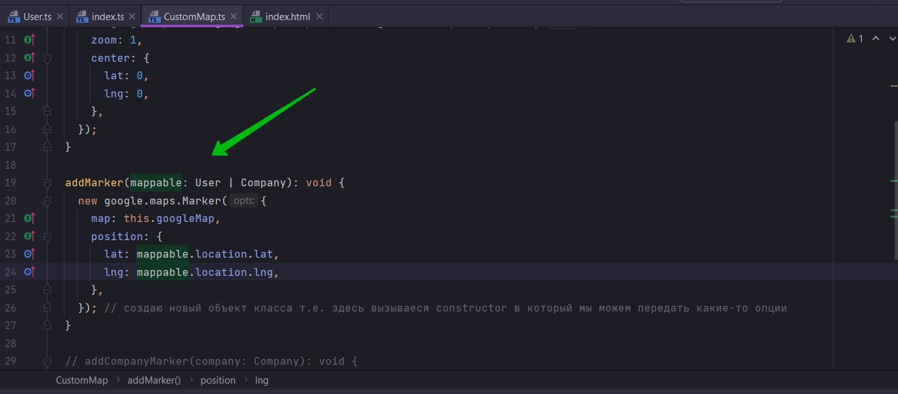

И теперь давайте подробнее поговорим о том что здесь делает оператор or, |, или.

Мы только что сказали что mappable может быть либо объектом класса User или объектом класса Company.

Но что тут на самом деле происходит?

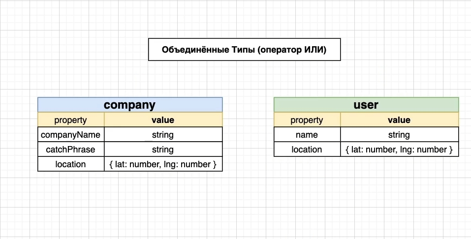

Когда мы используем оператор or мы помещаем при помощи оператора or эти два разных объект company и user, а точнее
объекты разных классов. TS смотрит какие параметры, какие свойства у этих двух объектов одинаковые. Потому что он
считает что мы можем обращаться к обоим объектам только через одинаковое свойство, т.е. мы используем одно и тоже
свойство в нашей функции к которому мы обращаемся как в объекте класса company так и в объекте класса user.

Например он смотрит первое свойство companyName и он анализирует такое же свтйство в классе user. Нет, такого свойства в
классе user нет. По-этому мы не можем обращаться при помощи оперетора или к этому свойству companyName.

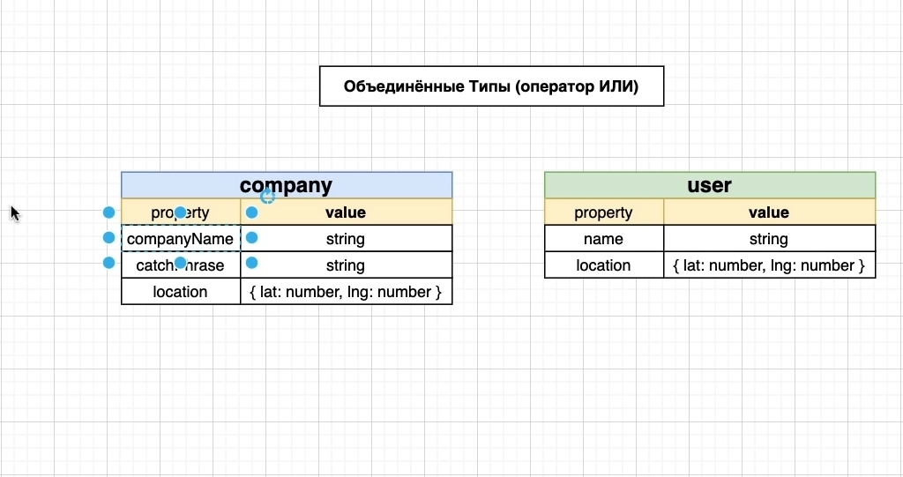

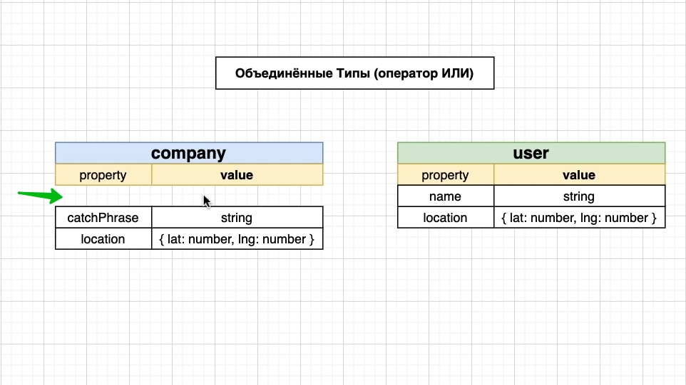

Он берет и удаляет companyName из аргумента mappable

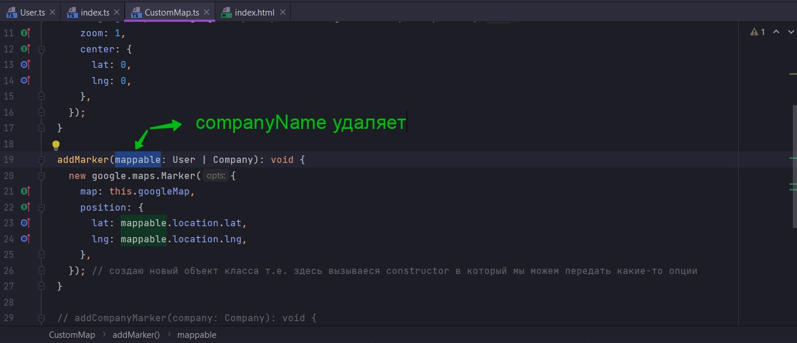

Т.е. он как бы уже не обращает внимание на это свойство.

Далее он смотрит на следующее свойство catchPhase. Существует ли такое свойство в user, нет не существует.

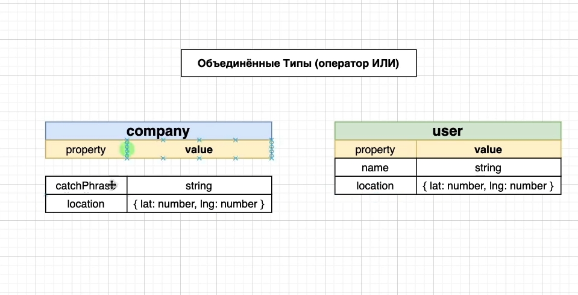

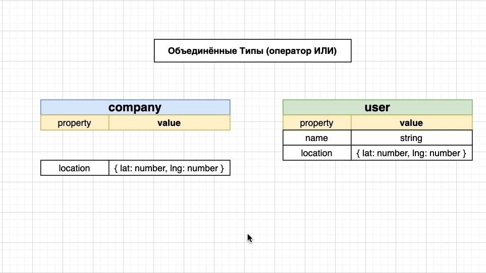

И опять TS как бы удаляет это свойство. Т.е. не удаляет, а перестает на него ссылаться.

Следующее свойство location. Опять TS анализирует user есть ли такое свойство. Есть. Далее он смотрит на типы lat:number
и lng:number есть ли же такие же свойства в user, да есть. Т.е. нам теперь разрешено через аргумент этой функции
ссылаться на свойство location.

Далее TS производит итерацию через все свойства класса user. name есть ли такое совойство в company, нет.

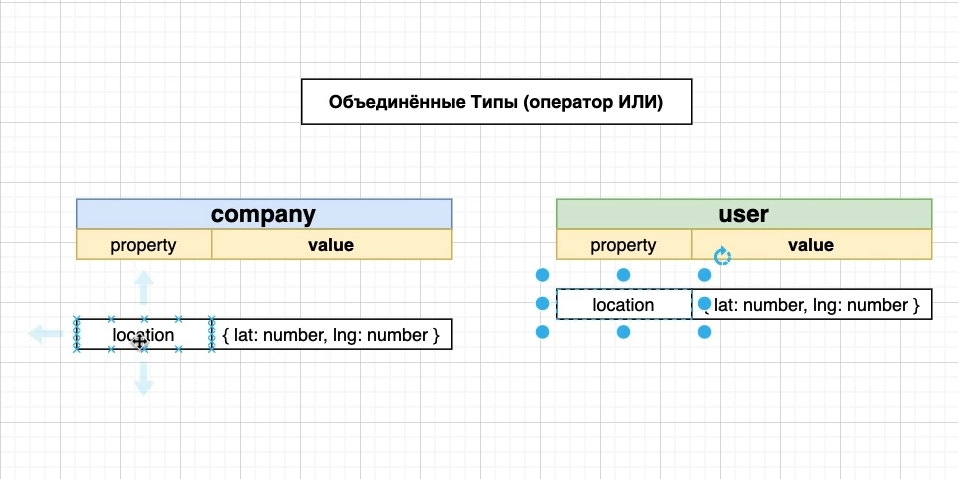

Результатом данной проверки является то что TS ограничивает количество свойств на которые мы можем ссылаться через
аргумент или параметр mappable.

И мы можем это легко проверить

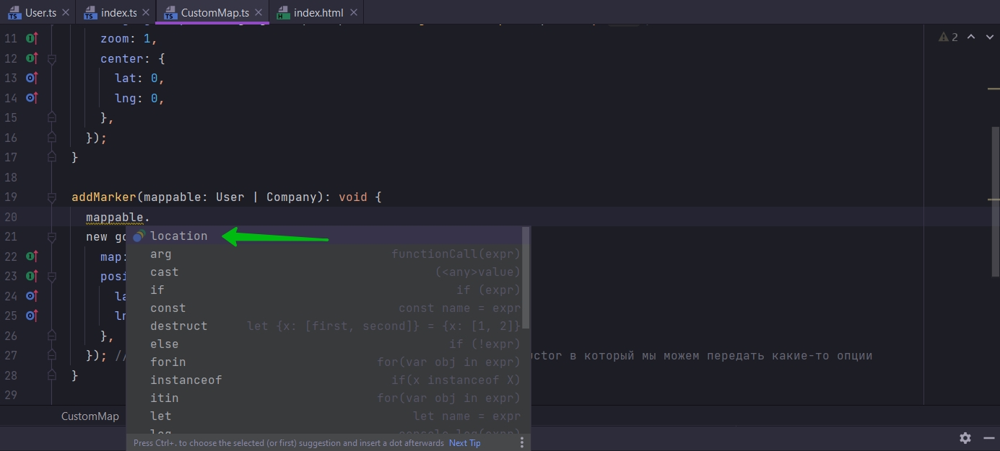

Как видите я могу ссылаться только на свойство location.

Это происходит потому что это единственное общее свойство между классами User и Company. Именно по этому нам разрешено
ссылаться на lat: mappable.location.lat, и lng: mappable.location.lng.

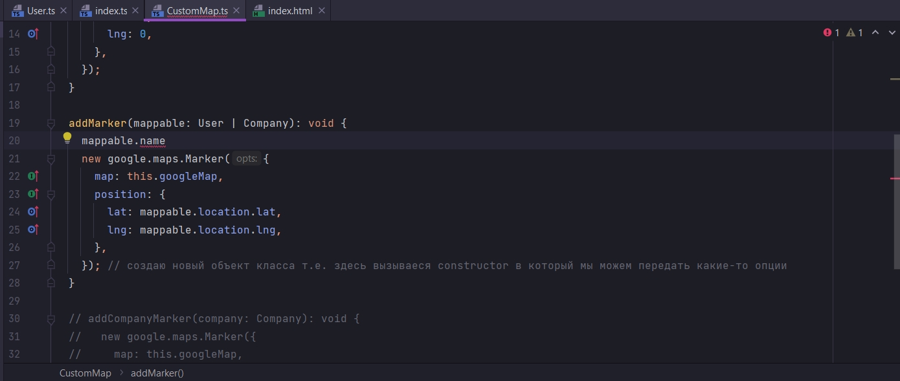

Хотя name и существует в company но мы не можем на него ссылаться.

Впринципе это для нас вполне подходит. Едиственное свойство которое нам нужно и в User и в Company это location.

Но здесь есть такая не очено хорошая штука в этом подходе. Этот код работает, но он не идеален.

```ts
//src CustomMap.ts
import {User} from "./User";
import {Company} from "./Company";

export class CustomMap {
    private googleMap: google.maps.Map;

    //инициализирую карту и отображаю ее на экране
    constructor(mapDivId: string) {
        this.googleMap = new google.maps.Map(document.getElementById(mapDivId), {
            zoom: 1,
            center: {
                lat: 0,
                lng: 0,
            },
        });
    }

    addMarker(mappable: User | Company): void {
        new google.maps.Marker({
            map: this.googleMap,
            position: {
                lat: mappable.location.lat,
                lng: mappable.location.lng,
            },
        }); // создаю новый объект класса т.е. здесь вызываеся constructor в который мы можем передать какие-то опции
    }

    // addCompanyMarker(company: Company): void {
    //   new google.maps.Marker({
    //     map: this.googleMap,
    //     position: {
    //       lat: company.location.lat,
    //       lng: company.location.lng,
    //     },
    //   }); // создаю новый объект класса т.е. здесь вызываеся constructor в который мы можем передать какие-то опции
    // }
}

```

Рассмотрим на примере диаграммы.

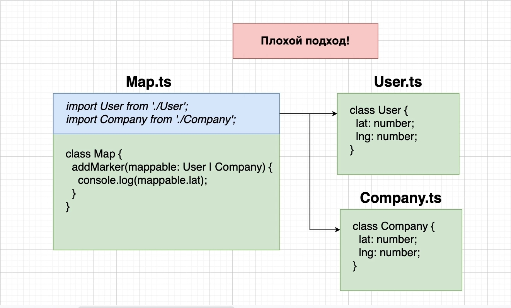

Допустим у нас в будущем понадобится еще один класс отобразить на карте.

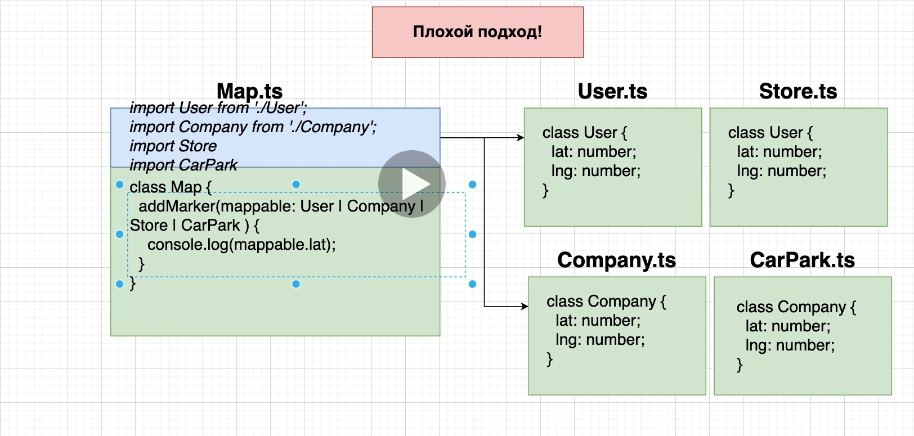

Обратите внимание как через оператор or нам нужно перечислять классы. Т.е. каждый раз нам нужно добавлять много
различного кода.

Например если мы захотим отобразить 30-50 объектов реального мира на карте. Нам нужно будет все эти классы указать в
параметрах.

Данный подход очень плохо масштабируем.

Второй минус это то что мы очень жестко связываем нашу карту со всеми классами которые мы хотим на ней отобразить.


