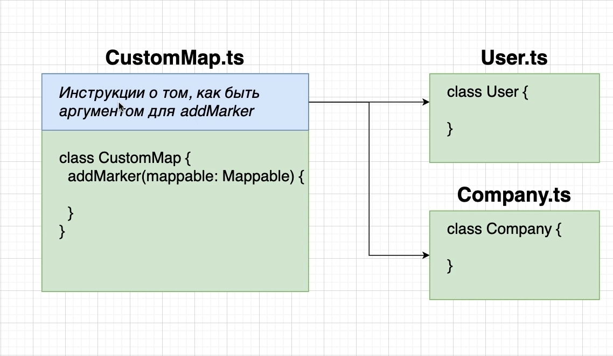

# 016_Ограничение_доступа_при_помощи_интерфейсов


Это то что у нас сейчас получается.

Вместо того что бы наш класс CustomMap.ts зависил от остальных классов. Мы будем говорить каждому классу, например
классу User. Если ты хочешь работать с классом CustomMap ты должен удовлетворять его требованиям. И это будет зависить
только от тебя, от класса User. Тоже самое для Company и так для любого другого класса.

Как же мы можем развернуть эту зависимость?



В самом верху класса CustomMap.ts мы добавим не большую конфигурацию. Эта конфигурация будет не большой инструкцией о
том как объект может быть аргументом или параметром для функции addMarker. Т.е. в самом верху класса CustomMap.ts мы
укажем следующую инструкцию для каждого из классов который хочет стать отображенном на карте. Т.е. мы скажем каждому
классу если ты хочешь быть аргументом для addMarker, то ты должен выполнить следующее. Ты должен иметь свойство location
и это должен быть объект со следующими свойствами lat и lng number типа.

Мы можем это реализовать при помощи interface.


В английском окончание - able это то что имет какую-то возможность. Имеющий возможность отображения на карте. Т.е.
внутри этого interface мы определим какое-то множество инструкций для каждого из классов внутри нашего приложения, как
их объекты могут стать аргументами для передачи в функцию addMarker.

Это теперь будет зависить от классов смогут ли они быть выбранными для отображения на карте. Они могут быть выбраны в
том члучае если у них есть свойство location, которое в свою очередь является объектом со свойсвами lat и lng.

Что значит удовлетворять interface. Это значит иметь корректные свойства с корректными типами и названиями свойств. Т.е.
если класс удовлетворяет этим свойсвам он может быть использован, его объект точнее может быть использован в качестве
аргумента для функции метода addMarker.

```ts
//src CustomMap.ts
import {User} from "./User";
import {Company} from "./Company";

//Instractions to other classes how be an arguments for 'addMarker'
interface Mappable {
    location: {
        lat: number;
        lng: number;
    };
}

export class CustomMap {
    private googleMap: google.maps.Map;

    //инициализирую карту и отображаю ее на экране
    constructor(mapDivId: string) {
        this.googleMap = new google.maps.Map(document.getElementById(mapDivId), {
            zoom: 1,
            center: {
                lat: 0,
                lng: 0,
            },
        });
    }

    addMarker(mappable: Mappable): void {
        new google.maps.Marker({
            map: this.googleMap,
            position: {
                lat: mappable.location.lat,
                lng: mappable.location.lng,
            },
        }); // создаю новый объект класса т.е. здесь вызываеся constructor в который мы можем передать какие-то опции
    }
}

```

И теперь любой класс в нашем приложении или любой другой объект или даже объектный литерал имеет свойсво location
которое является объектом со свойствами lat и lng, то он может выступать в качестве аргумента нашего addMarker метода.


И еще про interface. Любое значение в TS может быть нескольких типов.


У нас есть User класс или тип, Company тип. Т.е. это объекты User и Company, но они в тоже время могут одновременно
удовлетворять interface Mappable и соответственно быть типом Mappable.