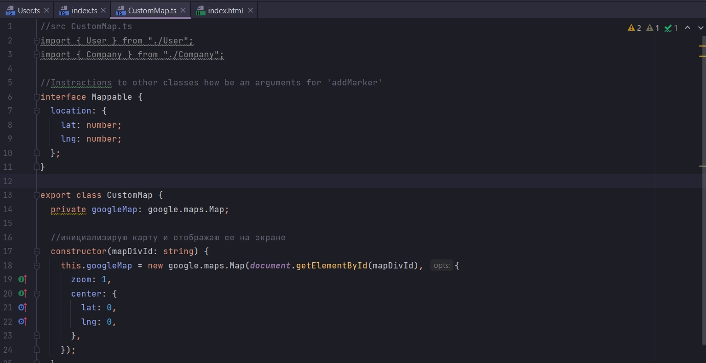
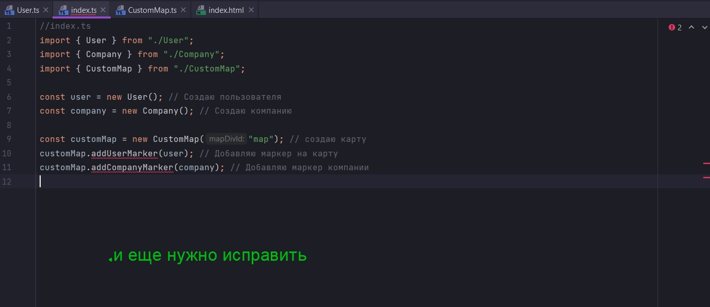
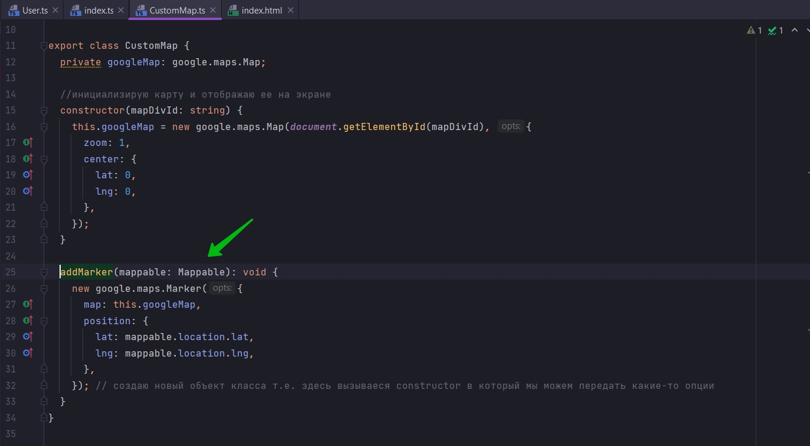
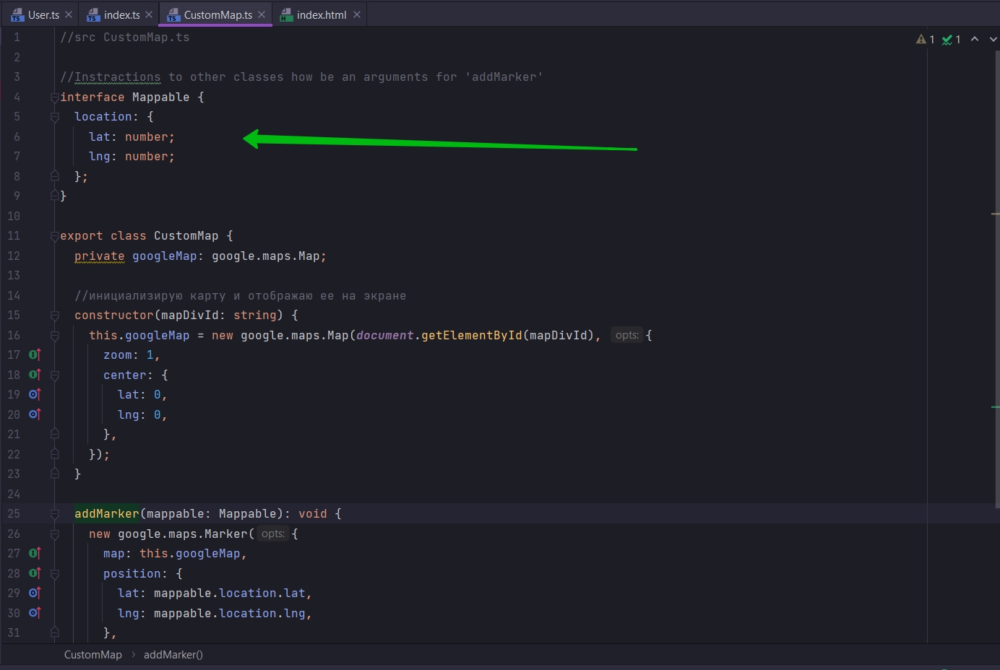
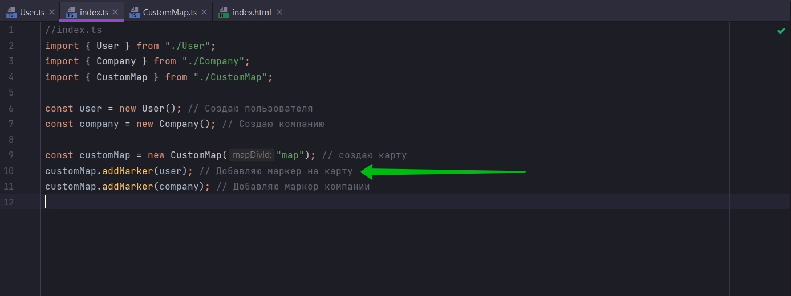
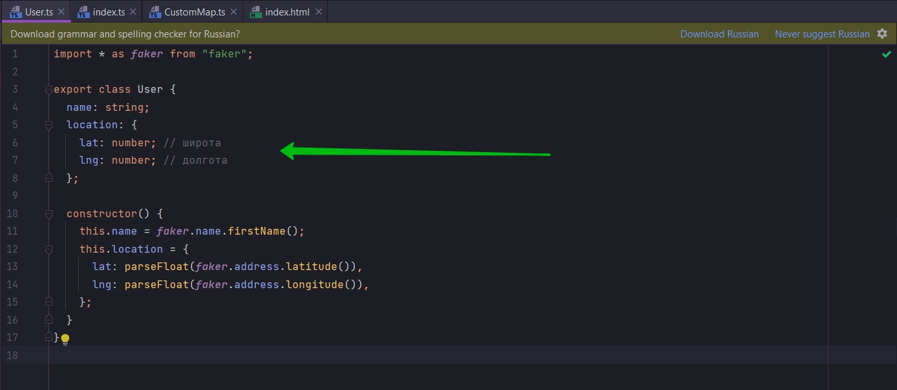
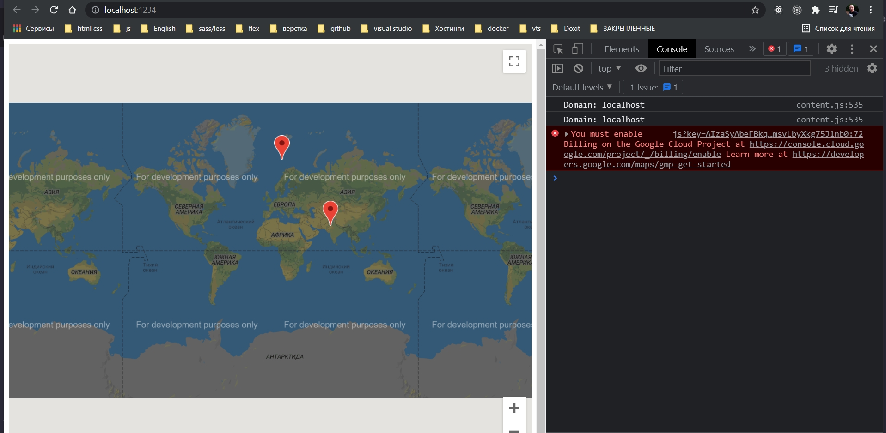

# 017_Неявная_проверка_типов

Теперь если я посмотрю на импорты



Они задекларированы но не используются. Мы полностью избавились от зависимостей нашего класса CustomMap от классов User
и Component. Я могу удалить импорты.

Теперь у меня обособленный класс CustomMap который мы можем использовать даже в других проектах. Т.е. если вы хотите
где-то отображать Google map то сохраните этот файл на всякий случай.

Потому что если в каких-то будущих проектах у вас будут классы удовлетворяющие interface Mappable вы сможете
использовать класс CustoMap в своем проекте.

```ts
//src CustomMap.ts

//Instractions to other classes how be an arguments for 'addMarker'
interface Mappable {
    location: {
        lat: number;
        lng: number;
    };
}

export class CustomMap {
    private googleMap: google.maps.Map;

    //инициализирую карту и отображаю ее на экране
    constructor(mapDivId: string) {
        this.googleMap = new google.maps.Map(document.getElementById(mapDivId), {
            zoom: 1,
            center: {
                lat: 0,
                lng: 0,
            },
        });
    }

    addMarker(mappable: Mappable): void {
        new google.maps.Marker({
            map: this.googleMap,
            position: {
                lat: mappable.location.lat,
                lng: mappable.location.lng,
            },
        }); // создаю новый объект класса т.е. здесь вызываеся constructor в который мы можем передать какие-то опции
    }
}

```



```ts
//index.ts
import {User} from "./User";
import {Company} from "./Company";
import {CustomMap} from "./CustomMap";

const user = new User(); // Создаю пользователя
const company = new Company(); // Создаю компанию

const customMap = new CustomMap("map"); // создаю карту
customMap.addMarker(user); // Добавляю маркер на карту
customMap.addMarker(company); // Добавляю маркер компании

```

Мы передаем объект user который является объектом класса User в метод addMarker. TS смотрит сначало в метод addMarker и
он видит что аргумент этой функции должен быть типа Mappable



Затем он смотрит, что бы быть типом Mappable У вас должно быть свойство location c lat lng number типа.



На самом деле TS выясняет какого типа объект user который мы передаем



И проверяет удовлетворяет объект user интерфейсу Mappable.

Т.е. он смотрит в класс User, и в определении этого класса находит



Т.е. все соответствует interface Mappable.

