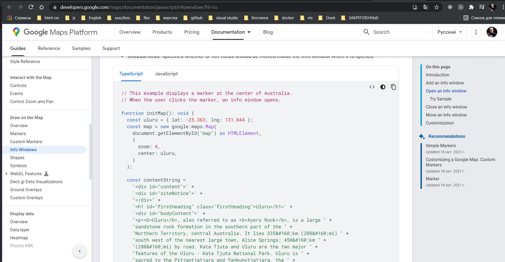
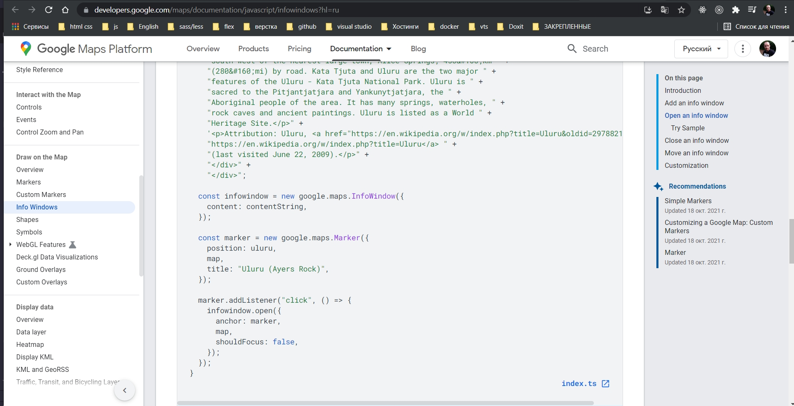
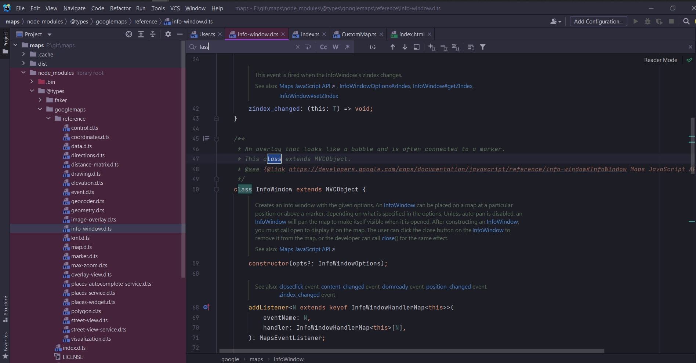
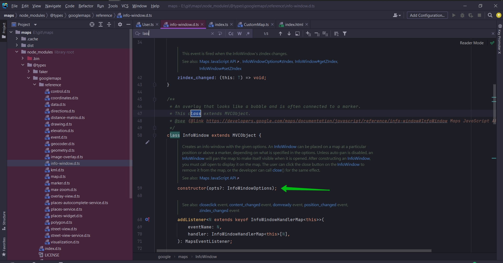
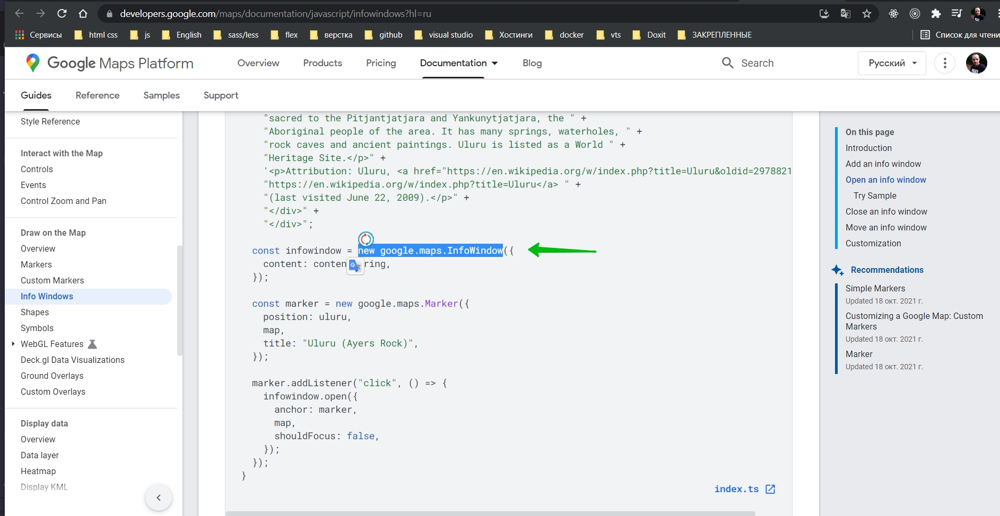
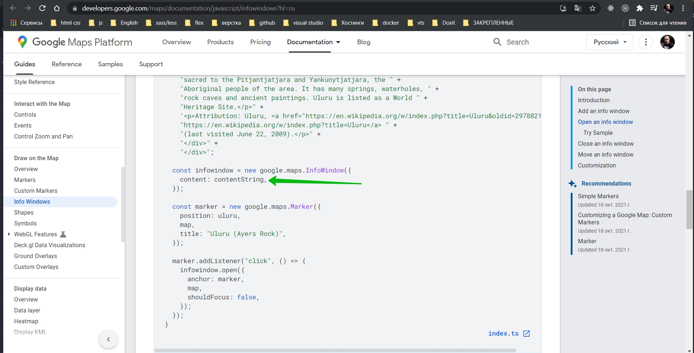
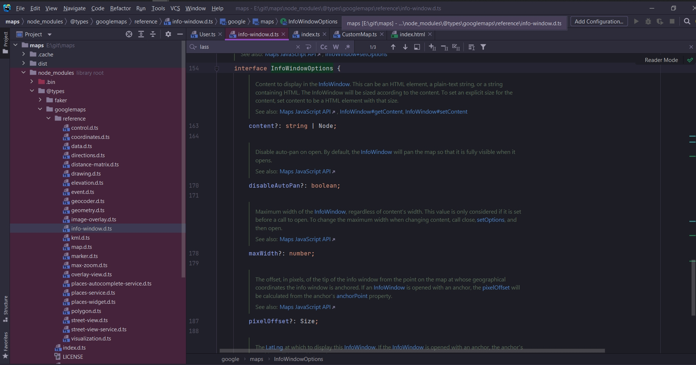
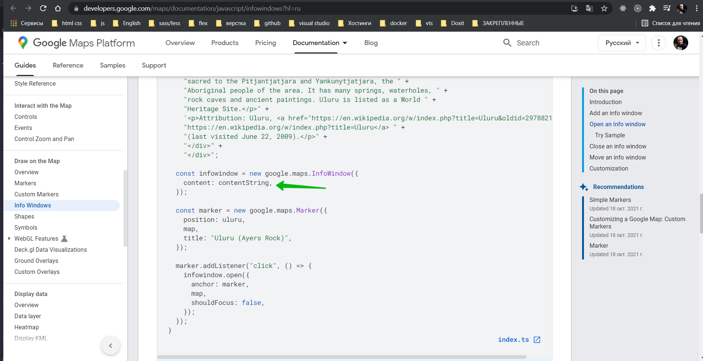
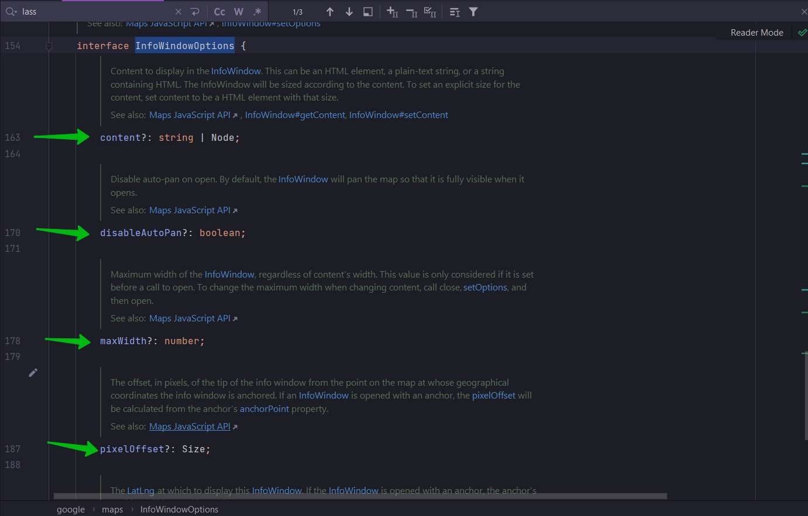
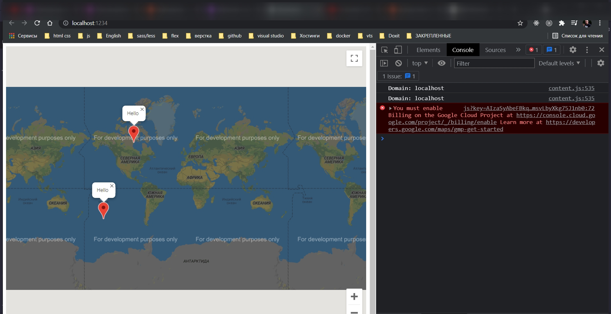

# 017_Показ_всплывающих_окон

Гуглю google maps infowindow

[https://developers.google.com/maps/documentation/javascript/infowindows?hl=ru](https://developers.google.com/maps/documentation/javascript/infowindows?hl=ru)



Как видите здесь размещена строка contentString Эта строка будет отображаться в этом всплывающем окне.

После этого они создают объект InfoWindow



InfoWindow это и есть всплывающее окно.

И каждый раз когда происходит кликанье на маркер вызывается для объекта InfoWindow метод open и передается два параметра
map, карта на которой будет это окошко и marker по которому будет производится клик.

Мы так же можем перейти в info-window.d.ts.





И как видите тут содержится конструктор который вызыватся каждый раз когда мы создаем объект класса. Т.е. каждый раз
когда мы создаем



Как видите в конструкторе показан не обязательный параметр opts. На не обязательный параметр указывает ?.

И эти не обязательные опции должны удовлетворять интерфейсу InfoWindowOptions.

В случае документации передается параметр content



Т.е. что бы понять какими же свойсвами должен обладать этот параметр, для того что бы быть переданным в этот конструктор
мы можем посмотреть документацию по интерфейсу.



Как видите первое свойство которое мы можем передават это content и оно может быть типа string или Node.

Этот параметр



удовлетворяет interface InfoWindowOptions.

и так же мы можем рассмотреть множество других опци которые могут быть переданы.



Теперь каждый раз когда я буду создавать марке я буду его присваивать переменно marker. И далее мне нужно добавить
EventListener.

```ts
//src CustomMap.ts

//Instractions to other classes how be an arguments for 'addMarker'
interface Mappable {
    location: {
        lat: number;
        lng: number;
    };
}

export class CustomMap {
    private googleMap: google.maps.Map;

    //инициализирую карту и отображаю ее на экране
    constructor(mapDivId: string) {
        this.googleMap = new google.maps.Map(document.getElementById(mapDivId), {
            zoom: 1,
            center: {
                lat: 0,
                lng: 0,
            },
        });
    }

    addMarker(mappable: Mappable): void {
        // создаю маркер
        const marker = new google.maps.Marker({
            map: this.googleMap,
            position: {
                lat: mappable.location.lat,
                lng: mappable.location.lng,
            },
        }); // создаю новый объект класса т.е. здесь вызываеся constructor в который мы можем передать какие-то опции map position
        marker.addListener("click", () => {
            const infoWindow = new google.maps.InfoWindow({
                content: "Hello",
            });
            infoWindow.open(this.googleMap, marker); // Указываю карту и маркер
        });
    }
}

```




