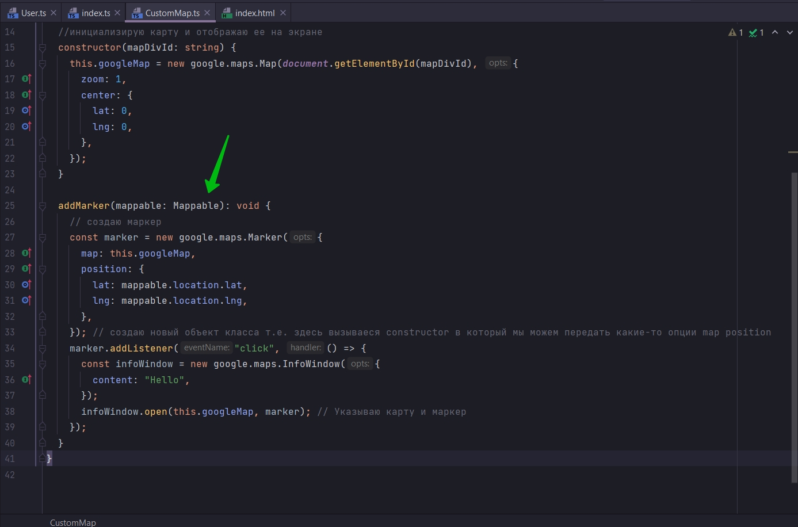
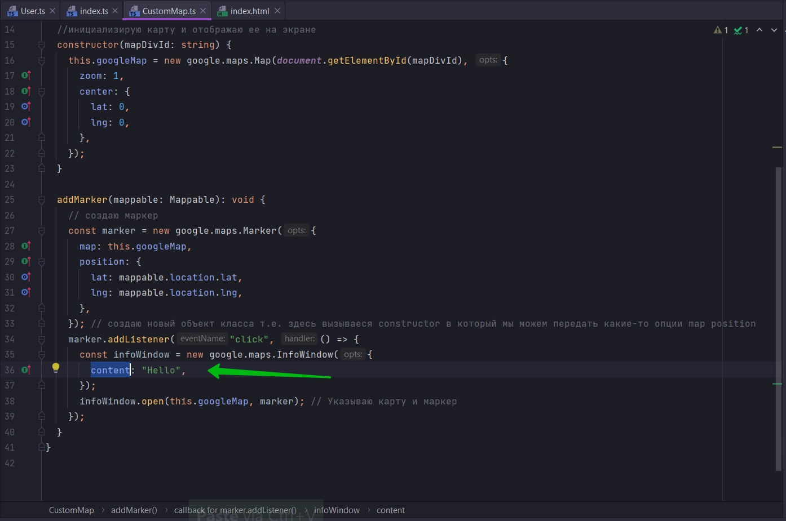
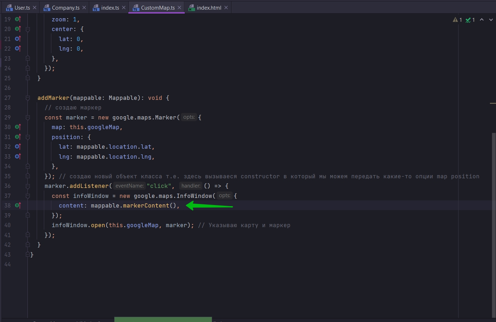
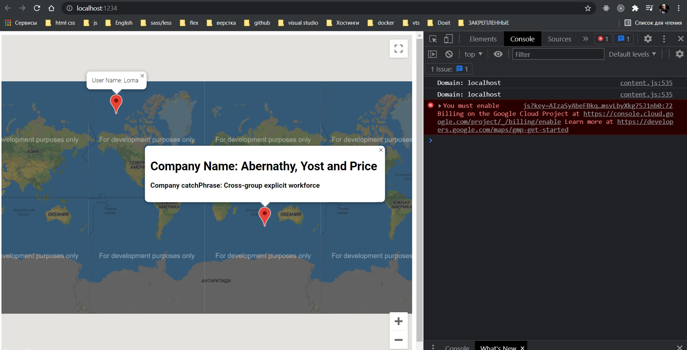

# 019_Обновление_определения_интерфейса

При кликанье на маркер я получаю всплывающее сообщение. Но не понятно что за меркеры User или Company.

И так я хочу что бы за отображаемый контент отвечал аргумент который мы передаем в interface Mappable



Мы бы могли это реализовать добавив в объект который мы передаем в качестве аргумента Mappable, какое-то свойство,
например метод, при вызове которого создавалась бы новая строка и мы бы передавали эту строку в качестве значения для
content



Т.е. мы должны добавить новое требование для interface Mappable.

Теперь мы говорим для того что бы имплементировать interface Mappable, что бы иметь возможность быть переданным в метод
addMarker в качестве параметра, класс должен иметь метод который при вызове должен возвращать строку, а возможно html
строку, которая будет помещаться в infoWindow в поле content при создании.

```ts
//src CustomMap.ts

//Instractions to other classes how be an arguments for 'addMarker'
interface Mappable {
    location: {
        lat: number;
        lng: number;
    };

    markerContent(): string;
}

export class CustomMap {
    private googleMap: google.maps.Map;

    //инициализирую карту и отображаю ее на экране
    constructor(mapDivId: string) {
        this.googleMap = new google.maps.Map(document.getElementById(mapDivId), {
            zoom: 1,
            center: {
                lat: 0,
                lng: 0,
            },
        });
    }

    addMarker(mappable: Mappable): void {
        // создаю маркер
        const marker = new google.maps.Marker({
            map: this.googleMap,
            position: {
                lat: mappable.location.lat,
                lng: mappable.location.lng,
            },
        }); // создаю новый объект класса т.е. здесь вызываеся constructor в который мы можем передать какие-то опции map position
        marker.addListener("click", () => {
            const infoWindow = new google.maps.InfoWindow({
                content: "Hello",
            });
            infoWindow.open(this.googleMap, marker); // Указываю карту и маркер
        });
    }
}

```

```ts
import * as faker from "faker";

export class User {
    name: string;
    location: {
        lat: number; // широта
        lng: number; // долгота
    };

    constructor() {
        this.name = faker.name.firstName();
        this.location = {
            lat: parseFloat(faker.address.latitude()),
            lng: parseFloat(faker.address.longitude()),
        };
    }

    markerContent(): string {
        return `User Name: ${this.name}`;
    }
}

```

```ts
// src Company.ts
import * as faker from "faker";
import {fake} from "faker";

export class Company {
    companyName: string;
    catchPhrase: string; // крылатая фраза
    // Это не объект. Это будет объектом после инициализации в конструкторе
    location: {
        lat: number;
        lng: number;
    };

    //Инициализирую все в конструкторе
    constructor() {
        this.companyName = faker.company.companyName();
        this.catchPhrase = faker.company.catchPhrase();
        this.location = {
            lat: parseFloat(faker.address.latitude()),
            lng: parseFloat(faker.address.longitude()),
        };
    }

    markerContent(): string {
        return `<div>
 <h1>Company Name: ${this.companyName}</h1>
   <h3>Company catchPhrase: ${this.catchPhrase}</h3> 
</div>`;
    }
}

```



```ts

//src CustomMap.ts

//Instractions to other classes how be an arguments for 'addMarker'
interface Mappable {
    location: {
        lat: number;
        lng: number;
    };

    markerContent(): string;
}

export class CustomMap {
    private googleMap: google.maps.Map;

    //инициализирую карту и отображаю ее на экране
    constructor(mapDivId: string) {
        this.googleMap = new google.maps.Map(document.getElementById(mapDivId), {
            zoom: 1,
            center: {
                lat: 0,
                lng: 0,
            },
        });
    }

    addMarker(mappable: Mappable): void {
        // создаю маркер
        const marker = new google.maps.Marker({
            map: this.googleMap,
            position: {
                lat: mappable.location.lat,
                lng: mappable.location.lng,
            },
        }); // создаю новый объект класса т.е. здесь вызываеся constructor в который мы можем передать какие-то опции map position
        marker.addListener("click", () => {
            const infoWindow = new google.maps.InfoWindow({
                content: mappable.markerContent(),
            });
            infoWindow.open(this.googleMap, marker); // Указываю карту и маркер
        });
    }
}

```



