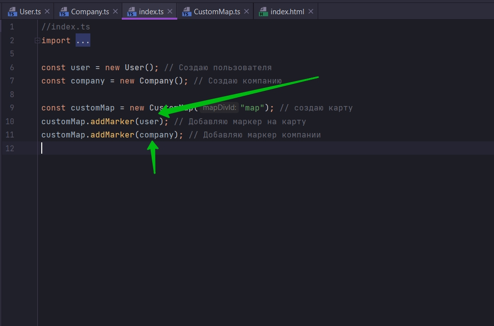
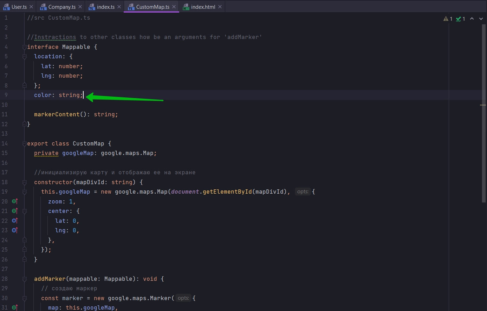
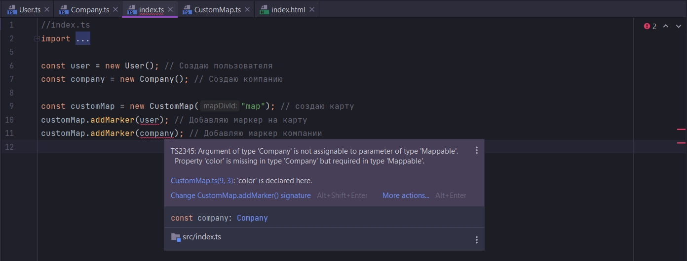
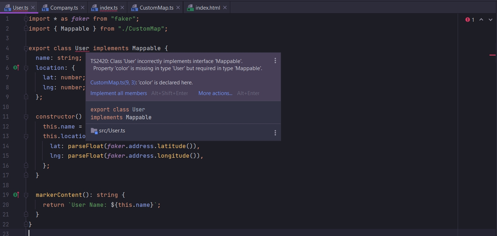
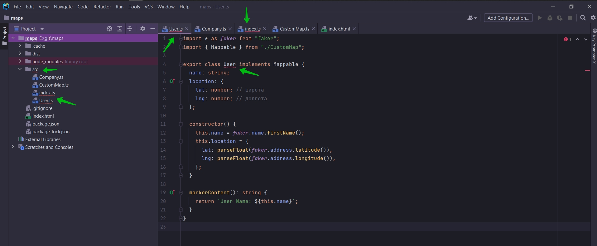

# 020_Добавляем_ключевое_слово_implements

Рассмотрим еще одну особенность interface. Мы с вами недавно добавили свойство markerContent

```ts
//src CustomMap.ts

//Instractions to other classes how be an arguments for 'addMarker'
interface Mappable {
    location: {
        lat: number;
        lng: number;
    };

    markerContent(): string;
}

export class CustomMap {
    private googleMap: google.maps.Map;

    //инициализирую карту и отображаю ее на экране
    constructor(mapDivId: string) {
        this.googleMap = new google.maps.Map(document.getElementById(mapDivId), {
            zoom: 1,
            center: {
                lat: 0,
                lng: 0,
            },
        });
    }

    addMarker(mappable: Mappable): void {
        // создаю маркер
        const marker = new google.maps.Marker({
            map: this.googleMap,
            position: {
                lat: mappable.location.lat,
                lng: mappable.location.lng,
            },
        }); // создаю новый объект класса т.е. здесь вызываеся constructor в который мы можем передать какие-то опции map position
        marker.addListener("click", () => {
            const infoWindow = new google.maps.InfoWindow({
                content: mappable.markerContent(),
            });
            infoWindow.open(this.googleMap, marker); // Указываю карту и маркер
        });
    }
}

```

Тем самым мы говорим что если class или объект хочет быть тип Mappable, то он должен иметь метод markerContent.

Когда мы с вами добавили этот новый метод в интерфейс мы то мы сразу обнаружили ошибки



Т.е. данные классы прошли проверку и ни в объекте user класса User, не в объекте company класса Company данного метода
не оказалось.

Добавим еще одно свойство в interface для того что бы увидить ошибки.





Наверное это не лучшее место где нужно отображать сообщение об ошибках. Для того что бы исправить эту ошибку нам
необъодимо открывать класс User, Company и добавлять соотвтетствующее свойство.

То что здесь показывается эта ошибка это правильно. Нам показывается что мы не можем передавать объекты user,company в
метод addMarker на данный момент.

Но нам не показывается где эти ошибки нужно исправить.

Посмотрим как еще немного добавить кода что бы TS нам указал направление куда мы должныдвигится для изменения кода что
бы ошибки исчезли.

К CustomMap классе мы к interface Mappable добавим ключевое слово export. И теперь мы можем импортировать этот interface
в разные классы.

```ts
//src CustomMap.ts

//Instractions to other classes how be an arguments for 'addMarker'
export interface Mappable {
    location: {
        lat: number;
        lng: number;
    };
    color: string;

    markerContent(): string;
}

export class CustomMap {
    private googleMap: google.maps.Map;

    //инициализирую карту и отображаю ее на экране
    constructor(mapDivId: string) {
        this.googleMap = new google.maps.Map(document.getElementById(mapDivId), {
            zoom: 1,
            center: {
                lat: 0,
                lng: 0,
            },
        });
    }

    addMarker(mappable: Mappable): void {
        // создаю маркер
        const marker = new google.maps.Marker({
            map: this.googleMap,
            position: {
                lat: mappable.location.lat,
                lng: mappable.location.lng,
            },
        }); // создаю новый объект класса т.е. здесь вызываеся constructor в который мы можем передать какие-то опции map position
        marker.addListener("click", () => {
            const infoWindow = new google.maps.InfoWindow({
                content: mappable.markerContent(),
            });
            infoWindow.open(this.googleMap, marker); // Указываю карту и маркер
        });
    }
}

```

Далее в классе User импортирую этот файл. И при создании класса, с помощью ключевого слава implements, имплементирую
interface Mappable.

```ts
import * as faker from "faker";
import {Mappable} from "./CustomMap";

export class User implements Mappable {
    name: string;
    location: {
        lat: number; // широта
        lng: number; // долгота
    };

    constructor() {
        this.name = faker.name.firstName();
        this.location = {
            lat: parseFloat(faker.address.latitude()),
            lng: parseFloat(faker.address.longitude()),
        };
    }

    markerContent(): string {
        return `User Name: ${this.name}`;
    }
}

```



Здесь мы хотим сказать TS что мы хотим что бы каждый объект класса User удовлетворял всем требованиям interface
Mappable. Это устанавливает прямую зависимость между классом User и CustomMap.



```ts
import * as faker from "faker";
import {Mappable} from "./CustomMap";

export class User implements Mappable {
    name: string;
    location: {
        lat: number; // широта
        lng: number; // долгота
    };
    color: string = "black";

    constructor() {
        this.name = faker.name.firstName();
        this.location = {
            lat: parseFloat(faker.address.latitude()),
            lng: parseFloat(faker.address.longitude()),
        };
    }

    markerContent(): string {
        return `User Name: ${this.name}`;
    }
}

```

```ts
// src Company.ts
import * as faker from "faker";
import {Mappable} from "./CustomMap";

export class Company implements Mappable {
    companyName: string;
    catchPhrase: string; // крылатая фраза
    // Это не объект. Это будет объектом после инициализации в конструкторе
    location: {
        lat: number;
        lng: number;
    };
    color: string = "white";

    //Инициализирую все в конструкторе
    constructor() {
        this.companyName = faker.company.companyName();
        this.catchPhrase = faker.company.catchPhrase();
        this.location = {
            lat: parseFloat(faker.address.latitude()),
            lng: parseFloat(faker.address.longitude()),
        };
    }

    markerContent(): string {
        return `<div>
 <h1>Company Name: ${this.companyName}</h1>
   <h3>Company catchPhrase: ${this.catchPhrase}</h3> 
</div>`;
    }
}

```

