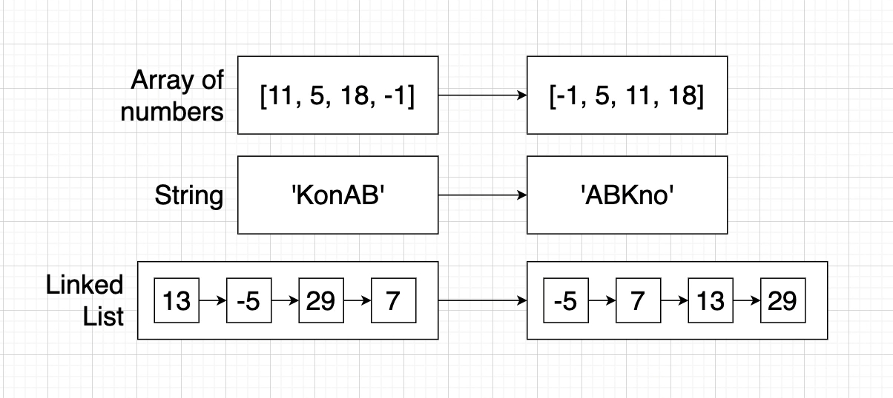

# 001_Краткий_обзор_приложения

Как видите на этой диаграмме изображены несколько структур данных.

Linked List - список состоящий из узлов в которых находяться так же числа.

Цель этого проекта это взять каждую из этих структур данных и отсортировать ее. Т.е. для массива из чисел мы должны
выстроить все числа в порядке возрастания.

Для строки мы должны выстроить в отсортированном варианте все символы в алфавитном порядке.

И в Linked List каждое число должно быть выстроено от самого меньшего до самого большего.

На примере этого приложения мы будем разбирать нюансы работы interface и class в TS.

Мы реализуем в этом приложении сортировочную логику. Если вы никогда не работали с сортировкой возможно вы не знаете что
иногда это может быть небольшой головной болью.

Наша цель написать сортировочный алгоритм всего один раз и потом использовать его для любой из этих структур. Т.е. мы
будем разбирать как использовать код повторно.